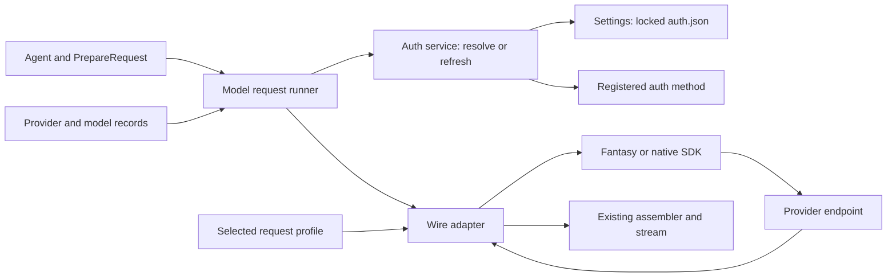

# H4 provider and authentication design

## Outcome and scope

Support API keys and subscriptions for Anthropic, OpenAI, and xAI without adding a wire adapter for each vendor or auth method.
Make a new compatible provider a data registration.
Allow users to add compatible API-key providers and models through user configuration without rebuilding Ask.
Make a new login protocol a small auth implementation.
Switch providers, models, and auth methods within one session through one shared selection operation.
Keep transcript semantics, tool execution, and credential storage independent from vendor request rules.
This document is a proposed design and execution plan; it does not implement Go behavior.

The user's current request expands the earlier API-key-only scope.
The [roadmap](../260930-2254-pi-feature-inventory-go-roadmap/plan.md) remains the prior decision record.
The accepted file-store choice, one adapter per wire API, vendor-as-data model, fantasy infrastructure boundary, and existing public hooks remain constraints.
Use the [source audit](../reports/researcher-261005-2139-h4-subscription-source-audit.md) with the four earlier OAuth reports.
Use the [Pi catalog and identity audit](../reports/researcher-261005-2151-pi-provider-model-catalog.md) for model sources, availability and name ambiguity.

Requirements include cancellation, cross-process refresh safety, secret redaction, model-specific compatibility, and identical use from headless and leader runtimes.
A normal request with a valid credential must not call an auth endpoint.
Concurrent requests must not each rotate the same stored refresh token.
Provider growth must not require a switch statement in the agent loop.
Authentication failure must not silently charge a different credential or provider.
No database credential store, generic plugin framework, or automatic account load balancing is needed for this scope.

## Architecture and patterns

Use the existing dewee capability packages with a small ports-and-adapters boundary around model access.
Compose services in `internal/app` and pass dependencies through constructors.
Do not impose a second framework or a new set of layers over every package.

| Pattern | Concrete use | Boundary |
|---|---|---|
| Adapter | Existing `providers.Provider` implementations for Messages, Completions, and Responses | Translates the harness transcript and stream; owns its SDK dependencies. |
| Strategy | Auth methods with login, refresh, and material derivation functions | Anthropic browser, ChatGPT browser, and xAI device flows have different protocols. |
| Registry | Validated provider, model, auth-method, and wire-profile records | Compiled implementations plus user provider/model data; duplicate and missing IDs fail validation. |
| Composition | Provider record selects an adapter, auth method, and request profile | Avoid a class or package for every vendor/auth combination. |
| Codec | Request-local tool-name mapping | Forward conversion before send, reverse conversion before stream events. |
| Transaction | Credential read, refresh, merge, and atomic replacement under a store lock | Prevent lost updates and refresh-token reuse between processes. |

These patterns solve observed differences in the three providers.
Do not add an abstract factory, inheritance tree, arbitrary middleware chain, or generic declarative OAuth engine.
Use ordinary Go structs, functions, maps, and the existing adapter interface.
New interfaces need multiple implementations or a real test seam.



The request runner is a small composed function, not a second provider hierarchy.
It resolves authentication after `PrepareRequest` has selected the final model and endpoint.
It then calls the existing wire adapter with one immutable auth snapshot.

## Independent identities

| Identity | Example | Meaning |
|---|---|---|
| Provider ID | `anthropic`, `openai`, `xai`, `tokenplan` | Model host and endpoint configuration. |
| API ID | `anthropic-messages`, `openai-completions`, `openai-responses` | Wire protocol selected by the model. |
| Auth method ID | `api-key`, `anthropic-oauth`, `openai-chatgpt`, `xai-oauth` | How a credential is acquired, refreshed, and presented. |
| Request profile ID | `anthropic-api`, `anthropic-claude-code`, `openai-api`, `openai-chatgpt`, `xai-responses` | Rules applied to the final request and response. |

A subscription is a billing/product relationship, not an authentication protocol.
Token Plan can use an API key, while an ordinary bearer token need not use a Claude Code profile.
Keep an explicit billing hint (`api`, `subscription`, or `unknown`) separate from credential kind.
Usage and estimated catalog cost keep their existing meaning.
An estimated cost is not an invoice or a guarantee that subscription inference has no extra charge.

Provider records declare allowed auth-method/profile combinations for each API and allowed endpoint origins for account-bound credentials.
Model compatibility records declare reasoning, tool changes, cache, and replay support.
The profile can narrow those capabilities for a subscription route.
An unsupported combination fails before the HTTP request.
Custom API-key endpoints use their configured provider record; account-bound OAuth is not automatically forwarded to them.

## Ownership and dependency rules

| Owner | Responsibility | Dependencies |
|---|---|---|
| `internal/settings` | Credential schema, provider/model configuration, selection defaults and favorites, locked read/merge/write, atomic file replacement | Standard library; retain its current internal import ban. |
| Proposed `internal/auth` | Auth methods, login interaction, refresh orchestration, resolution and account validation | `settings`, providers core runtime types, standard HTTP/crypto helpers. No wire adapters or agent import. |
| `internal/providers` core | Catalog and registry, target resolution, runtime auth snapshot, stream contract, request runner | Protocol and permitted core dependencies. No settings or auth-store reads. |
| `internal/providers/anthropic` | Messages profiles, tool-name conversion, native tool changes, replay and response conversion | Providers core, protocol, selected infrastructure. |
| `internal/providers/openai` | Completions and Responses profiles, model/request compatibility, replay and errors | Providers core, protocol, selected infrastructure. |
| `internal/providers/fantasykit` | Shared SDK stream folding, timeout, witness and error plumbing | Fantasy infrastructure only; no login or credential store. |
| `internal/app` | Static registrations and dependency wiring | Concrete owners. |
| Entry points and later TUI commands | Render login prompts and invoke auth operations | Never implement OAuth state or store tokens themselves. |
| Session runtime and agent owner | Serialize selection changes, apply request-boundary updates, record model changes | Catalog resolution and existing session/agent contracts; no vendor switches. |

Auth-method files can initially be `anthropic.go`, `openai_chatgpt.go`, and `xai.go` within the auth capability.
Vendor-specific auth protocols are real behavior; they do not justify separate vendor inference packages.
Share PKCE, bounded loopback callback handling, token HTTP parsing, and device polling only where the implementations actually use the same behavior.
An auth method can use typed function fields instead of another interface.
The existing `settings` schema is the single persisted credential model; auth does not create a duplicate DTO.
The runtime snapshot differs because it contains only the material and metadata needed for one inference request.

The provider README already describes target adapter packages that do not all exist yet.
Implementation must update actual depguard rules with these package boundaries; README text alone is not an enforced SDK import rule.

## Adding providers and models

Keep built-in provider/model definitions in versioned data owned by the providers package.
Load custom provider/model definitions from user `settings.json` through the settings owner and pass them to the registry at composition.
Secrets stay in `auth.json` or the process environment, never in provider/model definitions.
The same validator handles built-in and user records.
Initially require unique custom provider IDs; reject a duplicate built-in ID instead of silently changing its endpoint or auth profile.
Explicit built-in override support can be added with a documented merge contract if needed.
Project configuration may reference known model targets after trust checks; it cannot silently replace account-bound endpoint definitions or credentials.

| Addition | Required change | Rebuild Ask? |
|---|---|---|
| Model on a configured compatible provider | Add model metadata and verified capability values | No |
| Provider using a supported wire API and key auth | Add endpoint, API ID, key source, compatibility and models | No |
| Compatible provider needing an existing request profile | Select that registered profile and supply its allowed configuration | No |
| New nontrivial request/response behavior | Add a tested adapter-local profile transformation | Yes |
| New auth protocol | Register login/refresh/material functions and method/profile bindings | Yes |
| New wire protocol | Implement one adapter and register it | Yes |

This configuration example is proposed syntax, not an existing supported file contract.
The endpoint and model values are placeholders.

```json
{
  "providers": {
    "my-gateway": {
      "baseURL": "https://gateway.example/v1",
      "api": "openai-completions",
      "profile": "openai-api",
      "authMethods": ["api-key"],
      "apiKeyEnv": "MY_GATEWAY_API_KEY",
      "models": [
        {
          "id": "vendor-model-id",
          "name": "My model",
          "input": ["text"],
          "reasoning": false,
          "contextWindow": 32000,
          "maxTokens": 4096
        }
      ]
    }
  }
}
```

Prices and optional compatibility flags are separate validated fields; absent prices mean unknown cost, not zero cost.
Do not infer advanced capabilities from an OpenAI-compatible label.
One provider can expose several APIs when its model records select them explicitly.
Refresh user configuration by validating a complete replacement catalog, then atomically publish its immutable snapshot.
Invalid reloads leave the last valid catalog active and report the error.
An in-flight request retains the old definitions until it settles.
Do not mutate an adapter or endpoint underneath a running stream.
If a reload removes the selected target, let an already-started request settle and block the next request with an unknown-target error until a valid target is selected.

## Selection and convenient switching

### Model support and evidence

Keep each model record scoped to the provider that serves it.
Store API routing, context/output limits, input modalities, reasoning and compatibility on that offering, not on a global model-name record shared by all providers.
Metadata sources are built-in definitions, user configuration, or a registered discovery source.
Record source and refresh time for dynamic results; a cached record is not a fresh entitlement check.
Do not merge records across providers because their display names or model IDs match.

Track distinct evidence: known in catalog, auth configured, account access known/unknown, and last inference outcome.
A provider model-list response establishes only what that endpoint's documented listing semantics establish.
It does not automatically prove tools, vision, context limits, account allowance, or availability of every API route.
Use verified metadata and route/profile capabilities for those fields.
Represent unsupported and unknown capability values separately where a selection depends on them.
Use provider-specific discovery/filter functions only when the route supplies that evidence; no global assumption that `/models` has one schema.
Authenticated entitlement caches must be bound to provider, auth method, account identity and endpoint configuration; invalidate them on login/logout/account replacement.
Keep discovery caches separate from user definitions and secret-bearing credentials.
A discovery failure retains cached metadata with its freshness state and does not mark every provider unsupported.

Pi itself has generated baselines, a central `pi.dev` overlay and extension/configuration layers.
Ask adopts the catalog and refresh boundaries but does not need a hosted catalog service for this scope.
The detailed evidence and differences are in the linked catalog audit.

### Qualified identity

A model has a qualified identity `(providerID, modelID)`.
A selected inference target adds `authMethodID` and the effective reasoning preference.
The API and profile are resolved from validated definitions, not chosen independently by the user.
The same model ID on two providers therefore cannot select the wrong endpoint.
Treat `providerID/modelID` as a display/reference form; store the two fields separately because a model ID can contain slashes.
For example, `direct/model-x` and `gateway/model-x` are distinct offerings even if they serve the same underlying model.
Show provider and auth method next to the model name in search results, favorites and the active-session indicator.
Only explicitly verified mapping may group offerings as the same underlying model; such grouping never changes their runtime identity or copies capabilities between them.
For this chat-only scope the model type is implicit; add type to the identity when other operation types are implemented.
Switching `openai/model + api-key` to `openai/model + openai-chatgpt` is a target change even if the model name is unchanged.

Expose a shared catalog listing operation and a shared selection operation to TUI, headless and leader command handlers.
The proposed operations are `ListTargets`, `ResolveTarget`, and session-owned `SelectTarget`.
They are functions on existing owners, not three new service interfaces.
Headless startup selection and `PrepareRequest` model updates must use the same resolver and validation rules.

The catalog joins definitions with credential configuration and optional account entitlement.
Show configured, needs-login, unavailable, or entitlement-unknown status separately from verified endpoint success.
Opening a picker does not refresh every provider or require every vendor to be online.
Search uses model/provider display names; selection stores qualified IDs and method IDs.
Disambiguate short names when more than one target matches.
For an omitted method, use the preset/session choice or configured provider method default.
If neither exists, select the only configured allowed method; if several exist, require a method choice.
Do not choose between API billing and subscription allowance based on whichever token happens to resolve first.

For convenience, support named presets, an ordered favorites list, and the previous selected target.
A preset references a target and reasoning preference; it does not copy endpoint or model metadata.
The TUI picker can search the catalog and display provider, model, API/subscription method, and readiness.
Quick cycle uses the ordered favorites and skips targets known to need login or lack entitlement; unknown status remains visible and is validated before use.
The command layer can provide selection by preset and previous-target switching without implementing a second resolver.
These are requested switching capabilities; precise key bindings and command spelling are UI decisions.

Use this selection sequence:

1. Resolve the requested target from one catalog snapshot and validate the method/profile binding.
2. Prepare the destination credential and validate known entitlement and required capabilities.
3. Validate transcript compatibility and context budget for the destination model.
4. At a request boundary with no active stream or unfinished tool batch, commit the target and its effective request options.
5. Record the change in the session and emit the selection result; use the new target for the next request.

Requests to switch during streaming are pending until that boundary.
They do not change the provenance or decoder of the current response.
An explicit cancel action can stop the current run before a switch, using the existing cancellation contract.
If destination validation fails, retain the current target, report the reason, and do not silently send the intended next prompt through the old target.
Selection commands are serialized per session; concurrent sessions can select different targets.
Persist only target IDs and effective preferences, never the resolved token snapshot.

Reuse `providers.TransformMessages` for cross-provider replay and the existing `PrepareRequest` hook for per-request model changes.
Source: `internal/providers/transform.go` and `internal/agent/loop_run.go`, `prepareRequest`.
Rebuild the destination wire request from the canonical transcript.
Normalize tool-call IDs and paired results, strip incompatible signatures, and apply the destination tool-name codec without changing stored history.
No provider-specific replay logic belongs in the selection command.

Resolve effective capabilities as the intersection of model support, API support and selected profile restrictions.
Clamp reasoning preferences using the accepted Pi rule and show the effective level.
Do not carry unsupported sampling settings across targets.
If history exceeds the destination context window, return a clear compaction-required result rather than sending an invalid request or silently discarding history.
When the later compaction capability is available, the same result can invoke that explicit workflow.
Reuse existing image-omission projection for historical images with a visible compatibility notice; reject a new image-only prompt on a text-only target instead of sending an empty substitute.
Require the destination to support active tools when continuation depends on tool execution.

Session selection and global startup defaults are separate.
An ordinary switch changes only the current session.
An explicit save-default action updates user settings; a one-shot headless override does not rewrite them.
Resolve startup selection in this order: explicit invocation target, recorded session target when resuming, trusted project default, user default, then the configured built-in default.
Never fall through to another provider if an explicitly selected target is invalid or unauthenticated.

Pi provides useful selection evidence: `AgentSession.setModel` checks auth, records a model change, and persists a default only on request.
Its `cycleModel` uses scoped or available models and applies per-model thinking preferences.
Source: `packages/coding-agent/src/core/agent-session.ts:2430-2530` in the pinned Pi checkout.
Its runtime also has validated provider registration and immutable-style availability snapshots.
Source: `packages/coding-agent/src/core/model-runtime.ts:900-942`.
The target includes auth-method identity in Ask because the current scope requires convenient API/subscription switching.

## Runtime contract

Add a resolved-auth value to `StreamOptions` while retaining `APIKey` as a compatibility input.
The value contains provider ID, auth-method ID, credential source, selected profile ID, endpoint binding, billing hint, and request auth material.
Request auth material distinguishes API key, bearer token, and explicit header authentication.
It never contains refresh tokens, ID tokens, OAuth codes, or credential-store callbacks.
Secret-bearing values must be redacted by logging and must not use default struct formatting in diagnostics.

An explicitly supplied resolved value and a legacy `APIKey` must not compete.
Use the resolved value when present; otherwise adapt the legacy key through the selected provider's registered API-key method.
Retain `pipeline.Hooks.GetAPIKey` and its empty-value fallback contract.
A nonempty legacy hook override means API-key authentication, unless an explicit method-bound configuration selects another method.
Add an optional typed auth override only where a caller needs bearer or OAuth metadata.
Reject simultaneous nonempty typed and legacy overrides rather than guessing.
Do not infer OAuth from token prefixes.

The runner resolves one auth snapshot per request, after model switching, and passes it into the adapter.
Missing, expired, or invalid stored credentials produce a classified auth error.
Refresh failure does not fall through to an environment key.
An intentional user-selected method change can select a different credential.
Endpoint changes require a new resolution step before any credential is sent.
Bind legacy configured keys and request overrides to their intended provider; a model switch must not reuse the previous provider's `StreamOptions.APIKey` fallback.
Reject an unbound legacy key on a cross-provider switch and resolve the destination's own credential instead.
Reject redirects that would transfer credential material outside the allowed endpoint binding.

## Request construction and profiles

Each adapter keeps one explicit request-building sequence:

1. Copy and normalize the transcript using existing shared conversion and tool snapshots.
2. Apply model compatibility and build the wire document.
3. Apply ordinary supported request options and overrides.
4. Apply the selected auth-specific profile, including names, system blocks and headers.
5. Validate the complete wire body and headers, then send them with SDK retries disabled.
6. Decode vendor events, reverse names, and feed the existing assembler.

The sequence is ordinary adapter code, not six new middleware interfaces.
Profiles use typed compatibility data for simple field support and named local functions for nontrivial transformations.
Required method identity and auth headers are applied last and cannot be replaced by an unrelated override.
Optional user headers can override optional defaults.
Reject unsupported explicit options with a useful error; omit automatically generated defaults when a profile does not support them.
Final validation catches fields reintroduced through extra-body or sampling overrides.

| Provider/method | Adapter | Profile behavior |
|---|---|---|
| Anthropic API key | Messages | Standard API-key auth; common model/replay rules. |
| Anthropic OAuth | Messages | Bearer auth, Claude Code identity headers/system prefix, OAuth betas and tool-name codec. |
| OpenAI API key | Responses or Completions | Standard key auth and selected model capabilities. |
| OpenAI ChatGPT | Responses | Public endpoint, streaming, no server storage, documented subscription restrictions and account entitlement. |
| xAI API key or OAuth | Responses | Same wire profile; distinct auth lifecycle and billing hint; model-gated encrypted reasoning replay. |
| Other compatible vendor | Existing matching API adapter | Provider data and explicit compatibility flags; default API-key method when supported. |

The inspected fantasy fork exposes headers, HTTP-client injection, raw extra-body support, and SDK retry disabling.
These are useful infrastructure seams, but do not replace final profile validation.
Anthropic bearer auth must also disable ambient SDK key/token discovery and any unwanted `x-api-key` header.
Verify the actual outgoing HTTP request with conflicting environment credentials in a test.
Patch the approved fantasy fork only if its existing SDK-option seams cannot express the required behavior.
The adapter can use a native SDK when that is simpler and more reliable, as the accepted infrastructure decision permits.

### Tool-name codec

Build a codec from the immutable request tool snapshots.
Forward conversion covers definitions, historical assistant calls, additions, removals and forced tool choice.
Historical calls use the matching historical declarations; response names resolve against the current active tool set.
Unknown custom names stay unchanged.
Reject ambiguous name mappings before sending a request so a returned name cannot execute the wrong tool.
This is name ambiguity validation, not a change to the accepted tool-call ID policy.
Reverse conversion runs before any public `toolcall_start` event.
Persisted transcripts and tool registry names remain original.
Two concurrent requests can use different profiles without mutating shared tool declarations.

## Credential schema and lifecycle

Keep credentials in `~/.ask/auth.json` under the accepted `ASK_HOME` path rules.
Preserve existing API-key records and unknown fields on updates.
Add explicit OAuth method identity, access/refresh tokens, actual expiry, granted scopes, optional refresh-not-before time, and method-owned metadata.
ChatGPT metadata includes issued client ID, verified account identity and retained ID-token hint.
Bind those fields as one record; do not replace an account's credentials using an unrelated returned identity.
Keep credentials for each `(providerID, authMethodID)` so API keys and subscriptions can coexist without repeated login.
This refines the initial one-credential-per-provider proposal to satisfy convenient method switching.
Use one account per provider/method initially; replacing that account is explicit.
Retaining several accounts for the same method or adding an account picker is a separate feature.
Selection preferences live in settings/session state, not in the secret store.
Accept legacy provider-level API-key records as the provider's `api-key` method and migrate only on a successful locked update.
Use a tagged per-provider method collection for providers with several saved methods; keep existing single-method records readable.
Reject ambiguous legacy OAuth imports until their method can be established from explicit import configuration.
Method metadata can evolve without changing the agent or wire adapters.

Store actual expiry, not an expiry with a hidden margin already subtracted.
Use one method-specific refresh lead time: 10 minutes for Anthropic/xAI and 8 minutes for ChatGPT reproduce Pi's normal effective resolver behavior.
Respect a server-provided earliest-refresh time.
If required request validity cannot be satisfied before refresh is allowed, return a bounded retry-after/auth error rather than repeatedly refreshing.
Keep this scheduling rule in one resolver used by inference and authenticated model discovery.

Refresh procedure:

1. Read the selected credential and test its validity.
2. Acquire the cross-process credential-store lock with cancellation and a deadline.
3. Re-read the current record and recheck method, identity, deletion, and validity.
4. Refresh only if that current record still needs it, with a bounded HTTP deadline.
5. Validate the complete token response and merge the method metadata.
6. Persist the rotated credential before releasing the lock or allowing inference.

Cancellation can stop waiting or an in-flight token exchange.
After a successful token response rotates a refresh token, cancellation must not skip durable persistence.
Complete that short local commit with its own bounded context, then report the canceled inference request.
A save failure is an error, not a successful login or refresh.
Do not retry a rotation request blindly after an ambiguous network outcome.

Lock a stable sidecar path because atomic rename replaces the auth-file inode.
Write a same-directory temporary file with mode 0600, sync it, rename it, and sync the directory before success.
Use mode 0700 for the owner directory.
Read-merge-write preserves other providers and avoids stale whole-file replacement.
Never treat corrupt JSON as an empty store and overwrite it.
For this scope a bounded whole-file lock is sufficient; it serializes refreshes across providers in the same Ask home.
Per-credential coordination becomes useful only if measured contention justifies the extra commit protocol.

Browser login does not hold the store lock while a user signs in.
Capture a record revision at start and compare it under the final commit lock so a concurrent logout or replacement is not undone by an old login attempt.
Expose callback acceptance, token validation, and credential save as distinct states.
Only the last state means login complete.
Logout removes local credentials under the same lock; it does not claim server revocation.
Method-specific logout deletes only that method's credential; removing all provider credentials requires an explicit provider-wide operation.

## Auth protocols and discovery

Anthropic retains browser/copy-code flows, the exact registered redirect URI, state checks, and its JSON token exchange.
Validate token fields at the trust boundary even where Pi relies on a type assertion.
ChatGPT retains PKCE, a stable host identifier, issued-client registration, scope checks and the public Responses endpoint.
Implement ID-token verification and account binding rather than copying Pi's presence-only check.
Use a maintained JOSE/OIDC verifier for signature and claim validation; do not write a custom JWT verifier.
Select the smallest suitable library during implementation and record any new dependency in the owning package documentation.
Reuse the issued client for returning-account sign-in.
See [OpenAI registration](https://developers.openai.com/siwc/token-sharing-open-source/sign-in).
xAI retains device authorization with response validation, server polling intervals, slow-down handling, and optional refresh-token replacement.
Login prompts and browser launch use injected interaction functions shared by both runtimes.

Static provider/model records remain the default catalog.
Add authenticated discovery only where the selected route supplies account-specific access, initially ChatGPT.
Follow the route's documented model identifiers and visibility filter, rather than assuming the ordinary API-key catalog is the account's entitlement.
Source: [models and inference](https://developers.openai.com/siwc/token-sharing-open-source/models-and-inference).
Use the same auth resolver for discovery and inference.
Discovery narrows the usable catalog; it does not invent prices, context limits or reasoning support.
Keep verified model metadata separate from entitlement, and return a clear error when entitlement cannot be established.
Subscription profiles must track the current [preview contract](https://developers.openai.com/siwc/token-sharing-open-source/preview-limitations) and [token timing](https://developers.openai.com/siwc/token-sharing-open-source/token-reference).

## Errors and observation

Classify errors as missing credential, reauthentication required, unsupported request, exhausted allowance, rate limit, transient transport, or storage failure.
Use the existing stream error contract and add fields only where callers need a structured decision.
Exhausted subscription allowance must not enter the generic 429 retry loop.
A mid-stream failure must not transparently replay a request after public output or tool-call events.
Keep retry ownership with the existing provider/agent design; auth resolution is not another retry layer.
A request ID, provider ID, method ID, profile ID, duration and outcome are sufficient diagnostics.
Do not log token endpoint bodies or secret-bearing headers.

## Decisions and alternatives

### Decision: separate auth lifecycle from wire conversion

Context: three different auth protocols use two inference APIs.
Choice: add one auth capability and keep existing wire adapters.
Alternative: combine login and inference in vendor packages.
Consequence: a method can change without changing replay or the agent; composition must validate the selected method/profile pairing.

### Decision: explicit method and profile metadata

Context: Pi uses token-prefix heuristics and caller overrides can bypass shaping.
Choice: method-bound runtime snapshots and final request validation.
Alternative: detect subscriptions from token strings, vendor names or endpoint strings.
Consequence: callers must supply method identity for OAuth imports, and incompatible credentials fail before HTTP.

### Decision: static registration with targeted strategies

Context: many providers share an API, but some have real protocol differences.
Choice: compiled adapters/strategies plus validated built-in and user provider/model data.
Alternative: a generic pipeline DSL or runtime plugin system for all providers.
Consequence: unusual behavior needs small compiled Go functions; ordinary compatible vendors need only records and contract tests.

### Decision: qualified targets and one selection transaction

Context: model names overlap across providers and the same model can use API or subscription credentials.
Choice: qualified provider/model/method targets, method-scoped saved credentials and one session-owned selection operation.
Alternative: independent UI setters for provider, model, endpoint, and key.
Consequence: picker, shortcuts and headless reuse the same checks; changes wait for a safe request boundary and failed switches retain valid state.

### Decision: one file transaction for refresh

Context: leader and headless share rotating credentials.
Choice: bounded store lock, recheck, token exchange and durable commit.
Alternative: per-process mutex only, or network refresh outside a lock with an unchecked write.
Consequence: refreshes within one home serialize, but token rotation and logout ordering are correct.
The network-success/disk-failure boundary cannot be made atomic with a remote auth server.
Surface that failure and request reauthentication when recovery is not safe.

## Execution phases

| Phase | Scope and files | Exit condition |
|---|---|---|
| 1. Contracts | Providers catalog, target/runtime auth types, runner and registration; settings custom definitions; app wiring; focused hook compatibility tests | User-configured compatible providers need no rebuild; key-only callers retain behavior; final target chooses the correct resolver. |
| 2. Store and auth | `settings` credential/lock files; new `auth` capability and method implementations | Concurrent refresh, logout, cancellation, restart and failed-save tests pass. |
| 3. Wire profiles | Messages and Responses adapters; existing transcript/tool snapshot helpers; fantasy fork only if needed | Offline JSON/header/replay/name tests pass for all key/subscription pairings. |
| 4. Product integration | Shared login and selection operations, presets/favorites, headless/leader integration, session changes, subscription discovery and usage hints | Three provider flows and API/subscription switching are usable without repeated login; failed switches preserve state. |
| 5. Live acceptance and docs | Controlled account probes; smallest owning package docs, architecture import map and depguard rules | Endpoint behavior verified; no secrets in artifacts; source/version evidence recorded. |

Use the active H4 wire-API work as a dependency; do not overwrite the separate tool-snapshot or cassette-testing workstreams.
Login operation support is part of this expanded scope.
Full TUI dialog styling and the existing later-phase command UX can consume those operations without putting protocol logic in the UI.
Before implementation, update the owning roadmap's H4 and auth-command dependencies to reflect the new scope instead of retaining conflicting API-key-only statements.

## Validation and acceptance

- Table-driven adapter checks inspect the actual outgoing JSON and headers for every supported pairing, including conflicting environment credentials.
- Anthropic checks cover current and historical definitions, additions/removals, forced choice, reverse streaming names, and unchanged custom names.
- Requests in parallel prove that mappings and auth material never leak between providers or sessions.
- Store tests use two processes or equivalent OS-lock contention and establish one refresh, preserved unrelated records, and valid JSON after replacement.
- Cancel-after-rotation and save-failure tests establish that credentials are not silently lost and success is not reported early.
- ChatGPT checks cover identity/signature/nonce failure, client reuse, disallowed final fields, earliest-refresh timing, discovery and allowance exhaustion.
- xAI checks cover every device polling state, reasoning-model conditions and missing replacement refresh tokens.
- Headless and leader checks use the same services; live account checks confirm transport behavior after offline checks pass.
- Add a compatible provider and model using only user configuration; a validated reload makes the target selectable without recompilation.
- Duplicate IDs, malformed definitions and unsupported method/API combinations fail validation while the prior catalog stays usable.
- Switch Messages to Responses and back in one transcript containing tool calls/results and thinking; stored history stays unchanged.
- Switch API key to subscription and back on one provider without replacing either credential or leaking auth headers.
- Select during streaming and tool execution; apply only at the next safe boundary and retain original response provenance.
- Failed auth, unknown entitlement and smaller-context targets do not silently change the target or charge the previous one.
- Presets, favorites, previous-target selection and startup/default precedence use the same qualified target resolver.
- Two providers offering the same model ID remain separate choices with independent API routing, capabilities, prices, credentials and entitlement.
- Bare-ID ambiguity and model IDs containing slashes cannot select a provider by catalog order.
- Discovery failure, stale metadata and unknown capabilities are distinguishable from confirmed lack of support.
- Account replacement invalidates account-bound discovery results without deleting provider-wide metadata.
- Run focused tests first, then package tests, type/build and the existing import/lint gates for changed contracts.

No Go test execution is claimed for this design-only change.
Rollback during implementation keeps legacy key inputs and key-only registrations working; remove new method registrations before removing new runtime fields.
Preserve credential files and unknown records through rollback rather than rewriting the store into an older shape.

## Unresolved questions

- Live credentials are needed to prove account eligibility and endpoint acceptance for the three subscription paths.
- Anthropic integration permission is a separate provider-contract question recorded in the earlier research; successful wire compatibility does not resolve it.
- The current request specifies provider support and architecture, but does not select a complete login-command UX; shared operations are sufficient to keep that later decision independent.
