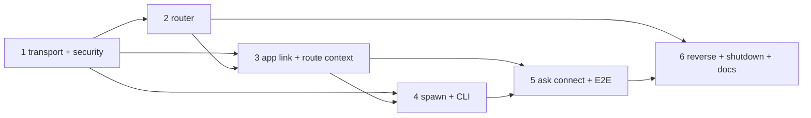

# H13b leader over Unix socket

## Outcome and boundaries

Mode: `--deep --tdd`, HOLD SCOPE, no `--yagni`.
Risk score: **High** (more than five critical assumptions about concurrent process and session lifetime).

Two separate built `ask connect` processes reach one auto-started `ask leader` over `~/.ask/leader.sock`.
They share session updates, keep independent views and request ids, and a client exit never cancels a run or disposes the shared host.
The leader is a router: it sees ACP bytes and routing fields, never prompts or tool calls.
Phase 1 is written in full.
Phases 2 to 6 are outlines; each gets its own scout pass before implementation.
This is a plan review, not completion evidence.
The leader package currently has no implementation or tests.

**Scope authority:** [roadmap H13](../260930-2254-pi-feature-inventory-go-roadmap/roadmap.md#h13-leader-acp-adapter-and-gateway-pis-rpc-mode-multi-client) (H13b row, session and driver rules, spawn rules, version rule, leader test list).
**Process contract:** [architecture 7.3](../../docs/ask-architecture-reference.md#73-process-model-leader-clients-and-headless-mode-acp).
**Predecessor:** [H13a](../261007-0700-h13a-acp-stdio/plan.md), completed, and its [independent review](../reports/code-review-261008-h13a-plan-compliance.md) (Follow write barrier, idempotent Unfollow, production-binary fixtures).
**Port research:** [Grok leader Xia report](../reports/xia-261008-0828-grok-leader-h13b-port.md), [evidence synthesis](../reports/claude-261008-h13b-evidence-synthesis.md), [requirements evidence](../reports/claude-261008-h13b-requirements-evidence.md), [Phase 1 scout](../reports/claude-261008-h13b-phase1-scout.md).
**Package contracts:** [leader](../../internal/leader/README.md), [ACP](../../internal/acp/README.md), [app](../../internal/app/README.md), [protocol](../../pkg/protocol/README.md).

### Constraints

- `internal/leader` imports only stdlib, `pkg/protocol`, `internal/logs` (and `golang.org/x/sys/unix` for peer credentials).
  Depguard enforces it.
- `internal/app` owns the internal ACP link, fx composition, native auth and lifetimes.
- Editor `ask acp` and headless `ask -p` stay listener-free and leader-free, each with its own `fx.ValidateApp` test.
- No SQL migration or unrelated dependency change.
Move `golang.org/x/sys` from indirect to direct.
The 64 MiB requirement also needs a reviewed SDK parser patch; Phase 1 must record its reproducible source before app integration.
- No test-only product flag.
  Typed leader config, no end-user flags.
  No aggregate or queue limits (as Grok).
- Code comments, file names, test names and commit messages carry no plan, phase, decision or finding labels.
  Comments use ASD-STE100 Simplified Technical English.
- Tests never attach to the maintainer's real leader.
  Every test uses a short isolated `ASK_HOME` under `/tmp` and stops only the processes it started.

### Non-goals

H13c gateway, token, Origin policy and daemon conversion; durable `session/load`, compaction (H8, H10); a direct-agent fallback in the client; T1a rendering; zombie eviction, acquire-slot guard, relay, auto-update relaunch; a leader cluster or registry; a monitoring subsystem; session TTL, GC or dispose; protocol compatibility beyond the hard gate.

## Decisions

### Maintainer decisions (2026-10-08)

| ID | Question | Answer |
|---|---|---|
| Other-UID evidence | How do we prove that a peer with another UID is rejected? | **A.** Real-socket test on macOS and Linux runs the real peer-credential syscall with the expected owner UID injected through typed config as a different value; plus a documented manual root check. Disclosed gap: no automated literal second-user connection. |
| Driver loss | May another client take a running session after its driver disconnects? | **B.** Explicit take is allowed whenever the session has no live driver, also when busy. Take is rejected while another live client drives a busy session. Take of an idle session with a live driver is allowed. No automatic promotion. |
| Write order | What does a prompt result guarantee on the leader socket? | **A, revised to B (user, 2026-10-08): as Grok.** Per-client FIFO with one ordered writer per socket and an **unbounded** queue, as Grok `server.rs:1564`. A client that receives a prompt result has received its preceding updates. A slow client is never closed for slowness; dead clients are found by `ping` and socket errors. Editor stdio keeps its physical-write barrier unchanged. |
| Version gate | Does a different build count as a mismatch? | **A.** Hard gate on the outer leader protocol integer only. Build identity shows in `ask leader status` and a one-line stderr hint. Automatic replacement only on protocol mismatch. |
| Stub command | Which command runs the client stub? | **A.** New subcommand `ask connect`: a line-oriented client. Bare `ask` stays the demo menu until T1a. |

### Recommendations verified from source (the maintainer can veto at plan review)

| Item | Resolution | Evidence |
|---|---|---|
| No direct fallback | `ask connect` uses only `ConnectOrSpawn` and reports failure visibly. Architecture 7.3 says the TUI "may" fall back; the T1a acceptance path forbids silent fallback. | `docs/ask-architecture-reference.md:279`, roadmap T1a |
| One internal ACP link | One app-owned `io.ReadWriteCloser` carries all clients to one `acp.Adapter`. An adapter per socket would create separate session stores. | `internal/acp/agent.go:90` (`NewAdapter` builds its own host), `:109` (`Bind` once), `internal/leader/README.md` main interfaces |
| Two codecs at the leader edges | Agent link stays NDJSON (SDK is newline-delimited). Socket uses 4-byte big-endian length plus a JSON envelope with raw nested ACP JSON. The leader owns both codecs; app only builds pipes. | `internal/acp/wire.go` `LineLimitReader`, `internal/acp/stdio.go:19` |
| Frame bounds | **As Grok (user, 2026-10-08):** 64 MiB maximum socket frame (Grok `protocol.rs:9`). The installed SDK parser has a hard 10 MiB cap. A reader wrapper cannot raise it. Keep the 64 MiB socket envelope; reserve 1 MiB on the internal link for rewritten ids and route metadata. Phase 1 proves a parser buffer of 65 MiB plus newline, and Phase 3 proves the complete path. Reject a transformed line above 65 MiB before the common link. A larger frame closes only the offending client. Editor stdio keeps its own 8 MiB limit. | Grok `protocol.rs:9`; `internal/acp/stdio.go:19` |
| Router-owned driver context | The router injects a typed private `_meta` route context (client id, driver generation, live-driver flag, driver capabilities) and replaces any client-supplied value. The adapter consumes it; stdio has none and keeps current behavior. The host is the only driver-generation authority: every take is forwarded and the router copies the returned generation. The leader runs one link-level `initialize` at startup and answers each client's `initialize` from that cached result. Phase 1 ends with a spike that proves SDK delivery of the meta. | `internal/acp/agent.go:201` (`Initialize` ignores the body), roadmap rule "passes only the driver's capabilities" |
| Live attach/take/detach/discovery | New `_ask/session/*` methods, because durable `session/load` stays unsupported until H8. **As Grok (user, 2026-10-08):** a client that sends any session-scoped message is also subscribed implicitly (Grok `server.rs:1821-1833`); `attach` is still used to observe without sending. Pending shared questions are cached and replayed to a client that attaches, and evicted when resolved (Grok `server.rs:519-545, 2141-2164`). | H13a `phase-02-session-adapter.md`; Grok source |
| `ask leader list` | One row for the single configured endpoint. No registry. Never spawns. | `docs/ask-architecture-reference.md:268` |
| Version identity | Outer protocol integer in `pkg/protocol`; build identity from `debug.ReadBuildInfo` (VCS revision, else `dev`); ACP wire and SDK identity unchanged. The literal ACP `Implementation.Version` uses the same source. | `cmd/tui/acp.go:82` (`Version: "dev"`), no ldflags in repo |
| Idle authority | App supplies a narrow callback through typed leader config: `QuiesceIfIdle() bool` closes admission atomically only when no run, pending question, admitted queue item or in-flight mutation exists. Route-table emptiness is never used. | `internal/acp/host.go` admission owns idleness |
| No aggregate limits | **As Grok (user, 2026-10-08):** no cap on clients, sessions or pending requests, and no queue bound. | Grok `server.rs:1564` |
| Skew test mechanics | Leader and client take their protocol version through typed config. In-process servers with a different version on a real socket cover rejection and replacement; disclosed as supplemental, not built-binary proof. | H13a rule: no production test flag |

### Proposed wire names (review verbatim)

All in `pkg/protocol/leader.go` unless noted.

- `LeaderProtocolVersion = 1`.
- Envelope `LeaderFrame{Type string; Payload json.RawMessage}`.
  Types: `register`, `registered`, `leader_ready`, `acp`, `control`, `control_result`, `ping`, `pong`, `disconnect`, `error` (`ping` and `disconnect` as Grok `protocol.rs:485-500`).
- `LeaderRegister{ClientKind string; ProtocolVersion int; Build string}`.
- `LeaderRegistered{ClientID string; InstanceID string; Build string; ProtocolVersion int; Ready bool; Controls []string}`.
- Controls: `status`, `shutdown`.
  `LeaderStatus{InstanceID, Build string; ProtocolVersion, PID, Clients, Sessions, ActiveRuns int; SpawnedByClient bool}` (no prompts, cwd, tool arguments, credentials).
- Error kinds: `leader_version_mismatch` (with `upgrade: "client" | "leader"`), `leader_peer_rejected`, `leader_frame_too_large`, `leader_not_initialized`, `leader_not_driver`, `leader_shutting_down`.
- ACP extension methods (in `pkg/protocol/acp.go`): `_ask/session/list_live`, `_ask/session/attach`, `_ask/session/detach`, `_ask/session/take`.
- JSON-RPC codes continue the existing block: `-32015` not driver, `-32016` not initialized on this client.
- Private route context key: `_meta["ask.dev/route"] = {clientId, driverGen, liveDriver, capabilities}`.
  Encode `driverGen` as decimal text, as for other Ask counters, because SDK `_meta` numbers decode as float64.
  Only the router writes it.
  The take result returns the host-assigned `driverGen`.

### Known limitations recorded at planning

- No session release path before H8: sessions remain in memory until leader stop.
  There is no live-session bound under the accepted decision.
- Reverse-request routing is proven with a disclosed transport peer fixture, because filesystem, terminal and permission tool owners do not exist yet.
- Other-UID rejection is proven with an injected owner UID and a manual root check (decision above).

## Phases

| # | Phase | Status | Effort | Depends on |
|---|---|---|---|---|
| 1 | [Transport and security foundation](phase-01-transport-security-foundation.md) | Pending | 2d | — |
| 2 | [Router: routes, drivers, ordered output](phase-02-router-routes-drivers-output.md) | Pending | 1.5d | 1 |
| 3 | [App link and ACP route context](phase-03-app-link-acp-route-context.md) | Pending | 1.5d | 1, 2 |
| 4 | [Spawn, version and leader CLI](phase-04-spawn-version-leader-cli.md) | Pending | 1.5d | 1, 3 |
| 5 | [`ask connect` and two-process E2E](phase-05-ask-connect-two-process-e2e.md) | Pending | 1d | 3, 4 |
| 6 | [Reverse requests, shutdown, regressions, docs](phase-06-reverse-shutdown-regressions-docs.md) | Pending | 1d | 2, 3, 5 |

### Dependency map

- Phases 2 and 3 share the route-context contract decided at the end of Phase 1.
- Phase 4 replacement depends on the Phase 3 idle callback.
- Shared files (`pkg/protocol/acp.go`, `cmd/tui/headless.go`, `.golangci.yml`) are edited sequentially; no parallel phase work.

## File inventory

C = confirmed by the scout, K = candidate until the phase's cook-time scout.

| Action | Path | Phase | Test impact | Status |
|---|---|---|---|---|
| New | `pkg/protocol/leader.go`, `leader_test.go` | 1 | protocol unit | C |
| Edit | `pkg/protocol/acp.go` (live methods, codes, route meta type) | 1, 3 | protocol unit | C |
| New | `internal/leader/frame.go`, `frame_test.go` | 1 | unit, fuzz | C |
| New | `internal/leader/handshake.go`, `handshake_test.go` | 1 | unit, real socket | C |
| New | `internal/leader/ids.go`, `ids_test.go` | 1 | unit | C |
| New | `internal/leader/paths.go`, `paths_test.go` | 1 | unit, filesystem | C |
| New | `internal/leader/lock.go`, `lock_unix.go`, `lock_test.go` | 1 | goroutine + child process | C |
| New | `internal/leader/peer_darwin.go`, `peer_linux.go`, `peer_other.go`, `peer_test.go` | 1 | real socket | C |
| New | `internal/acp/route_meta_test.go` (spike, test only) | 1 | acp unit | C |
| Edit | `.golangci.yml` (`leader-router-boundary` rule) | 1 | lint | C |
| Edit | `go.mod` (`x/sys` direct) | 1 | build | C |
| New | `internal/leader/server.go`, `router.go`, `writer.go`, tests | 2 | unit, race, goleak | C |
| Edit | `internal/acp/agent.go`, `host.go`, `ask_methods.go`, `updates.go` | 3 | acp unit, conformance, race | K |
| New | `internal/app/module_leader.go`, `module_leader_test.go`, `leader_routing_test.go` | 3 | `fx.ValidateApp`, real socket + real host routing | C |
| New | `internal/leader/client.go`, `spawn.go`, `spawn_unix.go`, tests | 4 | unit, child process | C |
| New | `cmd/tui/leader.go`, `version.go`, tests | 4 | built binary | C |
| Edit | `cmd/tui/headless.go`, `args.go`, `acp.go` (dispatch, usage, version source) | 4, 5 | cmd tests | C |
| New | `cmd/tui/connect.go`, `connect_test.go`, `leader_e2e_test.go` | 5 | built binary E2E | C |
| Edit | `internal/leader/README.md`, `internal/acp/README.md`, `internal/app/README.md`, `pkg/protocol/README.md`, `docs/ask-architecture-reference.md` 7.3, `CLAUDE.md`, roadmap H13b status | 6 | none | C |

## Function protection list

Do not change behavior of these without a failing test that proves the need:

- `acp.ServeStdio`: editor stdio EOF still disposes its own host; physical-write prompt barrier unchanged.
- `acp.Adapter.Fail`, `Adapter.Close`, `Host.latch`: never reachable from a client socket loss.
  Called only on internal link failure or leader stop.
- `acp.CheckedWriter`, `acp.LineLimitReader`: reused by app; signatures stable.
- Follow/Unfollow semantics, including idempotent repeated Unfollow (H13a review).
- `internal/settings` path and lock helpers: copy the rule into `internal/leader`; do not export or edit them.
- Headless `ask -p` output and exit codes; `ask acp` no-listener check (`TestACPE2ENoListener`).

## Runtime flow proof

These statuses describe planned coverage, not executed results.

| Feature | Actor | Trigger | Entry point | Internal path | Observable result | E2E test | External fixtures | Prepared data | Status |
|---|---|---|---|---|---|---|---|---|---|
| Auto-start + share | Two users' terminals | `ask connect` ×2 | built `ask` | ConnectOrSpawn → spawn → flock winner → register | one leader PID, same instance id, both see updates | `TestLeaderE2ETwoClientsShareLeader` | none (faux) | short `/tmp` ASK_HOME | PLANNED |
| Spawn race | Two clients at once | concurrent `ask connect` | built `ask` | two spawns, one flock owner | loser exits; both adopt winner | `TestLeaderE2ESpawnRace` | none | empty home | PLANNED |
| Independent sessions | Two clients, two cwds | `/new` each | `ask connect` | router → link → adapter → Agent | distinct session ids/cwd | `TestLeaderE2EIndependentSessions` | none | two cwds | PLANNED |
| Attach + observe | Client B | `/attach <id>` | `ask connect` | attach + Follow cut + pending-question replay | B receives A's updates and any open shared question, no prompt resend | `TestLeaderE2EAttachObserve` | none | A session running | PLANNED |
| Driver disconnect | Client A killed mid-run | SIGKILL A | built `ask` | router detach; no `Fail` | run settles; B sees `agent_settled`; host alive | `TestLeaderE2EDriverKilledRunSurvives` | paced faux (`ASK_FAUX_TPS`) | running prompt | PLANNED |
| Take | Client B | `/take` | `ask connect` | take with driver generation | B prompts; stale A gen rejected | `TestLeaderE2ETakeAfterDriverLoss` | paced faux | orphaned busy session | PLANNED |
| Version mismatch | Old leader | register v≠ | real socket, in-process server (supplemental) | handshake gate | `leader_version_mismatch` with upgrade side | `TestHandshakeRejectsVersion` | none | config override | PLANNED |
| Other UID | Non-owner peer | connect | real socket | peer-credential syscall | `leader_peer_rejected` | `TestPeerRejectsOtherUID` + manual root | none | injected owner UID | PLANNED |
| Slow client | Non-reading client | flood updates | real socket | unbounded FIFO | healthy client completes; slow client still connected and receives all frames in order when it reads | `TestServerSlowClientDoesNotBlockOthers` + E2E | paced faux | reader paused | PLANNED |
| Leader stop | User | `ask leader stop` | built `ask` | shutdown control → close admission → dispose → release flock | socket removed, lock inode kept | `TestLeaderE2EStop` | none | running leader | PLANNED |
| Two binaries | `ask-server` caller | ConnectOrSpawn from a helper | helper binary, other cwd | sibling `ask`, then PATH | leader starts; missing `ask` gives clear error | `TestConnectOrSpawnFindsSiblingAsk` | none | temp bin dir | PLANNED |
| No regression | Editor / script | `ask acp`, `ask -p` | built `ask` | unchanged | no listener, no leader | existing H13a E2E + `TestHeadlessNoLeader` | provider fixture | as H13a | PLANNED |

## Test matrix

| Level | Scenarios |
|---|---|
| Critical | Other-UID peer rejected (injected owner, real syscall). Dir 0700, socket/lock/log 0600, symlink refused. Version mismatch rejected before any ACP frame. Raw ids (number, string, > 2^53, separator-bearing) round-trip exactly. Client loss never calls `Fail`/`Close`/`latch` and never cancels a run. Follow events go to the owner only. Lock inode stable across stop/start. Only the flock owner removes a stale socket. |
| High | Equal ids from two clients never collide. `$/cancel_request` rewrites only through the sender's pending table. Observer mutation rejected. Take rules (no driver → ok; live foreign + busy → reject; live foreign + idle → ok). `/new` changes only the caller's view. Driver loss cancels the open question; late answers ignored. Frame above the limit closes only that client. A slow client keeps an unbounded FIFO; socket writes never block another client. Stop sends shutdown before any signal; PID identity checked. |
| Medium | Spawn race starts one leader. Sibling `ask`, then PATH. Log rotation by size. Stale PID not signalled. `sun_path` length check. goleak after close. |

## Exit gate

1.
  Every leader test on the roadmap H13 list passes, mapped in the runtime flow table.
2.
  Two built `ask connect` processes share one auto-started leader and the same session updates.
3.
  Client disconnect never cancels a run or disposes the host; leader stop closes admission, disposes, cleans up, in that order.
4.
  `ask acp` and `ask -p` stay listener-free and leader-free; all H13a E2E tests pass.
5.
  `go build ./... && go vet ./...`, `go test -race ./internal/leader/... ./internal/acp/... ./internal/app/... ./cmd/tui/...`, `go test ./... -count=1`, and golangci-lint (with the new depguard rule) pass.
6.
  Docs match final behavior (docs impact: major, written after behavior exists).
7.
  The SDK cap gate in Phase 1 passes with reproducible dependency provenance; both directions of the real shared link accept the allowed frame sizes.
8.
  Every row in the roadmap coverage map has executed evidence.
  Supplemental fixtures cannot certify a production tool path.

## Rollback

- No database rollback: no migration.
- Code rollback is a revert of the H13b changes; editor and headless stay usable without the leader at every phase boundary.
- Binary rollback: `ask leader stop` on an owned leader, then start a compatible binary.
  Never delete a live socket or lock file as a shortcut.
- Public contract rollback: the new `_ask/session/*` live methods and leader frames are additive; removing them affects only `ask connect`.

## Red-team record (2026-10-08)

An independent four-persona review checked the plan against live source and SDK v0.13.5.
Applied: one driver-generation authority in the host (High); spike restated as proof of SDK delivery; agent-to-client `$/cancel_request` rewrite and fan-out in Phase 6; one link-level `initialize` at startup; `id: null` rejection; byte-exact claim narrowed to response ids.
Not applied: "observers must not answer permission requests".
Architecture 7.3 item 4 and the roadmap shared-question rule accept that any subscriber may answer, so Phase 6 now defines "eligible" and keeps the rule.
No maintainer decision was changed.

## Grok alignment revision (user, 2026-10-08)

The user chose to follow Grok more closely: restore `ping`/`disconnect` frames, implicit subscribe on session traffic, and replay of pending shared questions on attach; drop the queue bound, aggregate limits and the 8 MiB socket bound (64 MiB as Grok).
This supersedes the earlier bounded-queue and 8 MiB recommendations.

## Unresolved questions

- With no queue bound (as Grok), a client that stops reading grows leader memory until it disconnects or `ping` fails.
  Accepted by the user on 2026-10-08.
- Grok's pending-response dependency does not establish first-answer semantics; the pending reverse table is an Ask-native design.
- If the Phase 1 route-context spike fails, the fallback (one adapter per client around one host) changes the app-to-leader boundary and needs a plan revision before Phase 2.

## Review checkpoint (2026-10-08)

Review: [findings and verification](../reports/code-review-261008-1627-h13b-leader-plan.md).
The user confirmed that 64 MiB must remain supported.
The SDK buffer change has an isolated runnable probe in [artifacts/verify-sdk-frame-limit.py](artifacts/verify-sdk-frame-limit.py).
It is a prototype, not a production dependency patch or leader acceptance test.
Do not mark H13b complete while any phase or dependency gate is pending.

## Roadmap leader coverage map

All rows below are requirements for execution; none has passed as H13b evidence yet.

| Roadmap requirement | Owning phase | Required evidence |
|---|---|---|
| Two stubs, one leader, same updates | 5 | Two built `ask connect` processes, same instance, both receive the same settled cursor |
| Different cwd and capabilities | 3, 5 | Real host and two wire clients with different initialize bodies; two actual stub processes prove cwd isolation |
| Driver loss during a question | 6 | Socket fixture plus real host run; agent gets cancellation, late answer ignored, run continues |
| Server caller from another cwd; missing ask | 4 | Built caller helper, sibling and PATH cases, absent and incompatible candidates; no daemon conversion |
| Version mismatch during a tool | 4, 6 | Real host with controlled started tool; skewed socket peer cannot stop or replace the busy leader |
| Reused PID never signalled | 4 | Live unrelated process plus identity-change seam between check and signal |
| Client ids never collide | 1, 5 | Same request id concurrently in two clients, exact restored ids and scoped cancellation |
| Protocol mismatch rejected | 1, 4 | Real Unix socket, both mismatch directions, no ACP forwarded, isolated compatible management controls |
| Other UID rejected | 1 | Real credential syscall on macOS and Linux with injected owner; literal second-user check stays manual |
| Stale socket replaced by flock winner | 1, 4 | Competing child processes and stale endpoint; loser never unlinks winner artifacts |
| Disconnect never cancels a run | 3, 5 | Kill built driver mid-run; observer receives settled event; zero-client run also survives |
| Stale frames fenced after attach | 2, 5 | Detach with events in flight, reattach and resume; old subscriptions cannot deliver after detach acknowledgment |
| Resume has no gaps | 3, 5 | Compare event sequence to source cursor through disconnect, reset and resync; prompts admitted once |
