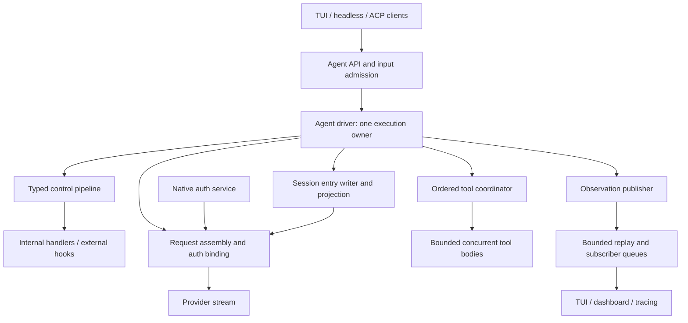
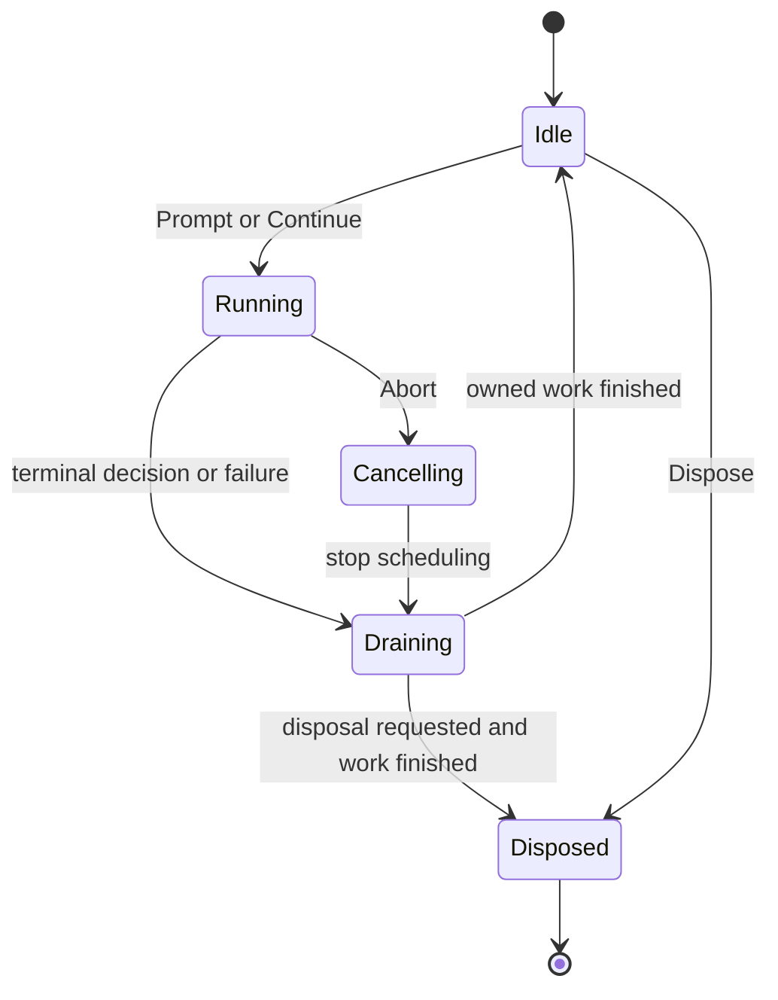
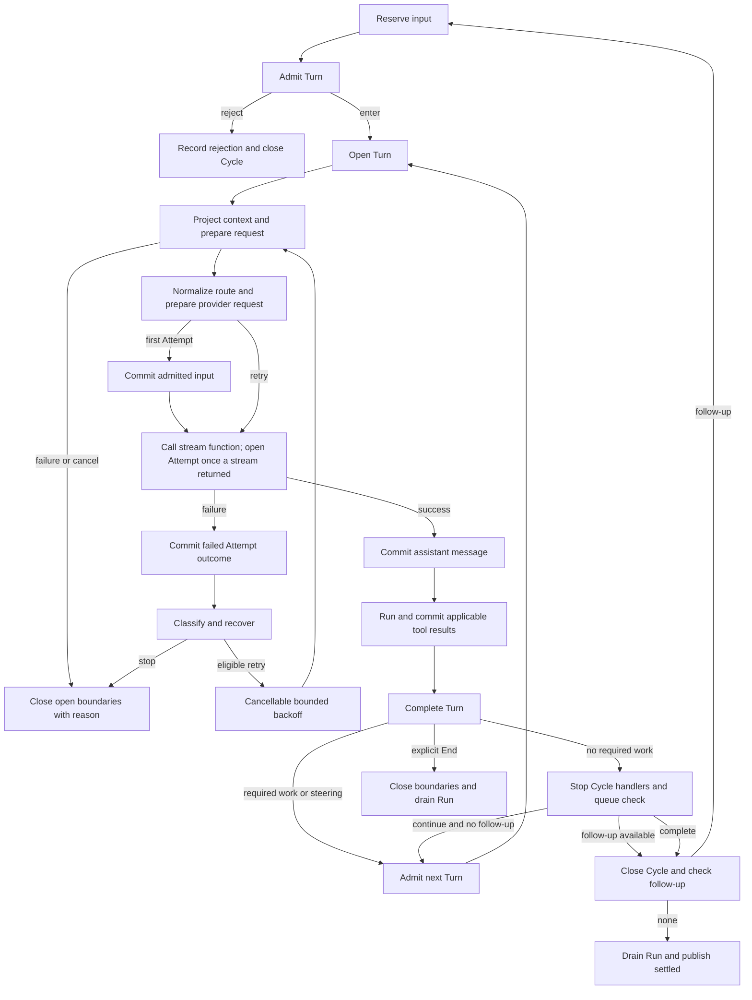

# Ask lifecycle and Event Pipeline architecture

Date: 2026-10-06.
Status: implemented by plan `261006-0933-lifecycle-event-pipeline-redesign`.
Scope: lifecycle, control pipeline, input delivery, model recovery, tool execution, history, events, and concurrency.
The user requested a direct redesign of internal contracts, without compatibility adapters for the current `Hooks` API.
No runtime code changes are part of this document.
DeepSeek ground truth: `deepseek-harness` at `5badb15009ae1756c3afe0ae0cef1faafc290ccc`. Every behavior is compared with it, row by row, in `plans/261006-0933-lifecycle-event-pipeline-redesign/conformance-matrix.md`.

Rule (D25, user, 2026-10-06): Ask follows DeepSeek by default. A difference needs a listed exception and its own Ask test.
The "Provenance" column of the tables in sections 7.3, 9, 11 and 13 uses these values:

- `DeepSeek`: Ask does what DeepSeek does.
- `Pi exception (D-number or name)`: Ask keeps Pi behavior or an earlier user decision.
- `Ask divergence (reason)`: Ask changes what an upstream run can do, for the stated reason.
- `Ask new`: Ask adds a capability. An upstream run would see the same outcome.

## 1. Architecture in one view

Keep Ask as a modular Go application.
Keep `internal/agent` as the execution owner.
Replace `pipeline.Hooks` and its merge rules with typed dispatch contracts for each control point.
Use middleware only when a handler must surround an operation or inspect the downstream decision.
Use ordered handlers for completion decisions and a separate observation path for monitoring.
Use goroutines and channels for concurrent work, while one driver controls lifecycle and history order.



The arrows show runtime calls and data flow, not Go imports.
`internal/app` supplies dependencies and binds the capabilities.
The leader routes requests and observations; it does not own a second copy of the agent loop.
Headless mode calls the same Go runtime directly.

The architecture must provide these properties:

- One input cycle can contain several model-and-tool rounds.
- A model retry cannot repeat input admission or completed tool work.
- A control handler can block an operation, surround it, or inspect its result under a typed contract.
- A failed passive observer cannot stop the run. A slow synchronous listener still delays the driver.
- Concurrent tool bodies cannot write shared agent state.
- Cancellation drains work started by the run before the run becomes settled.
- History, live streaming, and transport replay have different identities and guarantees.
- Request routing and credentials remain bound together for each model attempt.

These are behavior goals, not promises of better model answers or lower cost.

## 2. Current foundation and proposed changes

| Area | Current source | Proposed change |
|---|---|---|
| Driver | Six ordered ReAct stages in `agent` | Keep private stages; add explicit Cycle, Turn, and Attempt state (vocabulary in section 3.1) |
| Hooks | Typed function fields and `Compose` merge rules | Replace with typed middleware and ordered decision dispatch. External hooks (`internal/hooks`) are a decided design (D4), not code: the package has only `doc.go` and `README.md` |
| Context | Completed messages through `ContextSource` | Add lifecycle entries and derive model context from a projection |
| Retry | No model-attempt recovery loop in the agent driver | Add bounded, classified recovery inside a Turn (DeepSeek numbers, no jitter per D11) |
| Tools | Whole batch serial, or one goroutine per call | Ordered coordinator, concurrency bound, exclusive barriers |
| Observation | Listener failure can stop execution | Listeners run inline on the driver and a listener failure is contained (section 11); separate passive publication from control and required writes |
| Auth | Per-request credential binding after the final request configuration exists today. It runs inside the stream function (`internal/app/module_auth.go:14-42`) and stays there | Keep the binding in the stream function. New: a billing pin on a retry (section 8.1) |
| Queues | No queue exists. Only two poll hooks exist, with no non-test implementation (`internal/agent/agent.go:15-18`, `internal/pipeline/hooks.go:162-167`) | Agent-owned steering and follow-up queues (section 6) |
| Bus and scheduler | Package scaffolds | Give each a concrete owner and contract before implementation |

The current stages and tool registry snapshot are useful foundations.
The proposed pipeline must preserve the snapshot that connects declared tools to executable tools.
The redesign does not require Cordis, a generic plugin container, a distributed broker, or a new agent protocol.

Current source owners: [Agent](../../internal/agent/agent.go), [stages](../../internal/agent/loop_stage.go), `internal/pipeline/hooks.go` (historical source), `internal/pipeline/hooks_compose.go` (historical source), [tools](../../internal/agent/loop_tools.go), [events](../../internal/agent/emit.go), and [provider stream](../../internal/providers/stream.go).

## 3. Domain model and identity

### 3.1 Session, Run, Cycle, Turn, Attempt, and Stage

Ask words differ from DeepSeek words, so this document uses one vocabulary:

| DeepSeek | Ask Go | Ask wire (JSON, Pi-compatible) |
|---|---|---|
| turn (one input cycle, many model calls) | cycle | `cycle_start` / `cycle_end{reason}` (new, additive) |
| step (one model answer and its tools) | turn | `turn_start` / `turn_end` (Pi meaning, unchanged) |
| attempt (one model request) | attempt | `attempt_start` / `attempt_end` (new, additive) |

Go names match the wire names. DeepSeek test and source references in this document keep DeepSeek words only inside quoted evidence.

| Concept | Meaning | Ends when |
|---|---|---|
| Session | Conversation history and its selected context | The Session is removed or archived |
| Agent | Live runtime that works on a Session | The Agent is disposed |
| Run | An execution handle with context, cancellation, and completion | Its owned work has drained |
| Cycle | One admitted user work cycle, including tool rounds and steering | Completion, rejection, error, cancellation, or explicit stop |
| Turn | One logical model-and-tool round | Its model outcome and applicable tool outcomes are settled |
| Attempt | One dispatched model operation within a Turn | The consumed provider operation settles |
| Stage | A private part of the Turn implementation | Control moves to the next stage |

**Run is not Session.**
The current Run already supplies a useful cancellation and completion boundary.
A Session can contain many Runs.
A Run can process more than one Cycle when follow-up input is admitted.
An explicit `Continue` creates a new Run and Cycle against the selected history; it does not reopen a settled Cycle.

```text
Session S
  Run R1: execution handle, not a history tier
    Cycle C1: initial prompt
      Turn T1
        Attempt A1: eligible failure
        Attempt A2: success
        Tool calls K1 and K2
      Turn T2
        Attempt A3: final answer
    Cycle C2: follow-up input
      Turn T3
        Attempt A4
  Run R2
    Cycle C3: explicit Continue
```

Open a Cycle before admission so rejected input has a recorded terminal reason.
Open a Turn only after admission succeeds.
A rejected Cycle has zero Turns.
A Turn that fails during request preparation has zero Attempts.
An Attempt is live, and `attempt_start` is published, only after the stream function returned a stream and the context is not cancelled (DeepSeek `packages/core/agent-loop/src/agent.ts:434-439,445-446`).
A prepared request, with its request log entry, can exist without a started Attempt.
A stream that fails on its first event is a started Attempt.
An Attempt does not open when an input arrives or when a backoff starts.
Tool executions use tool-call identities; they are not model Attempts.

### 3.2 Separate identifiers and cursors

| Identity | Use | Scope |
|---|---|---|
| `sessionId` | History selection and ownership | Session |
| `runId` | Cancellation, completion, and execution correlation | Unique execution |
| `cycleId` | Semantic work cycle | Unique Cycle |
| `turnId` | Logical model-and-tool round | Unique Turn |
| `attemptId` | One dispatched model operation | Unique Attempt |
| `inputId` | Admission, rejection, and queue acknowledgement | Unique input delivery |
| `toolCallId` plus assistant entry identity | Tool/result matching | A committed assistant message |
| Session entry identity and parent | History order and branching | Session history |
| `(epoch, seq)` | Transport replay cursor | Publisher process |
| `(attemptId, frameIndex)` | Transient stream order | Attempt |

Generate opaque lifecycle IDs once at their boundaries.
Do not use a process-local attempt counter as a persisted global identity.
Do not interpret a bus sequence as a Session entry sequence.
A Session branch is a history selection; it does not reset the process replay cursor.
The entry writer returns a commit reference that public terminal observations can carry.

## 4. Package responsibilities and import boundaries

| Package | Owns | Must not own |
|---|---|---|
| `agent` | Driver, lifecycle state, input claims, Turn stages, tool coordination, recovery decisions | Transport protocol handling or provider HTTP code |
| `pipeline` | Typed control inputs, decisions, middleware composition, dispatch validation | Driver loop, Session writes, or worker pool |
| `providers` | Model normalization, adapter dispatch, stream production, provider error facts | Agent queues, Cycle state, or tool execution |
| `tools` | Definition snapshots, validation, tool body execution, output invariants | Session commits or Cycle scheduling |
| `sessions` | Entry writer, selected history, model-context projection | Agent execution or transport fan-out |
| `hooks` | External hook process/protocol invocation and its existing error policy | The central loop or middleware ordering |
| `auth` | Credential resolution and refresh | Lifecycle events or model request retries |
| `bus` | Process cursor, replay buffer, bounded subscriber delivery | Policy decisions, Session mutation, or command replay |
| `scheduler` | Cross-Agent job admission where the daemon requires it | The inner Turn or tool loop |
| `tracing` | Observation export | Decisions that alter execution |
| `app` | Constructors, registration, capability wiring | Agent behavior |

Retain the capability-package model and current import rules.
`pipeline` can use provider and tool value types without making those packages import `pipeline`.
The Agent invokes tool middleware and supplies a terminal function that calls `tools`.
This avoids `pipeline -> tools -> pipeline` cycles.
The provider stream remains a provider capability; the Agent supplies its full consumption operation as the model middleware terminal.
The bus receives protocol values and a composition-supplied resync callback; it does not import Session internals.

Replace old `Hooks` fields and repository callers together when this design is accepted.
Do not add an adapter that translates old hooks into new middleware.
A boundary that invokes an external hook process is still necessary integration code; it is not a compatibility layer for the old Go API.
Preserve the existing external-hook failure policy, including fail-open behavior except at the blocking tool-call and user-bash seams.
Compiled-in handlers get no deadline. Out-of-process hooks keep the D4 deadline (X1).
Do not add permission prompts while changing composition.

## 5. State ownership and execution model

### 5.1 One driver owns mutable execution state

The goroutine running `Prompt` or `Continue` owns the active driver state.
There is no need for an additional permanent actor goroutine per Agent.
Public methods use a short mutex-protected gate for active Run selection, input enqueueing, and cancellation.
Never hold that mutex while calling middleware, a provider, a tool, persistence, or a subscriber.

Only the driver can:

- Open or close a Cycle, Turn, or Attempt.
- Change the selected model and request configuration.
- Claim queued input and acknowledge its outcome.
- Commit assistant messages and tool results.
- Decide whether to retry, continue a Turn, start a Cycle, or stop the Run.

Provider producers and tool workers return detached values.
They cannot mutate the shared context, publish durable commits, or decide the next Cycle.
Passive observers receive copied values and no mutable Agent pointer.
Control handlers receive a narrow scope and typed input rather than the whole runtime.

### 5.2 Run state



`AgentSettled` means execution cleanup is complete.
It is later than the logical final answer and later than the cancellation request.
It does not wait for every passive viewer to acknowledge every event.
Cancellation does not make an Agent idle while tool bodies still run.
A new Run cannot overlap the drain of the previous Run.
`Dispose()` is separate from `Abort()` (D29, DeepSeek `packages/core/agent-loop/src/index.ts:526-556`).
It is memoized and closes the public admission gate first (`ErrDisposed`).
It then cancels active work with cause `disposed`, with no wake latch, and clears the queues (DeepSeek cancels without `keepInbox`, `index.ts:544`, and `cancel` clears the inbox, `agent.ts:176-177`; user, 2026-10-06).
It waits for the drain of started tool bodies (D19), closes the writer, and publishes `agent_disposed` to Agent listeners.
The headless JSON writer does not write `agent_disposed`, so `agent_settled` stays the last JSON record (D18).
A disposing Agent moves to Disposed after drain instead of accepting another Run.
Headless mode runs `Dispose()` in a goroutine for SIGINT and SIGTERM, bounded by `abortGrace`.
Go code that ignores cancellation can delay drain; do not claim a context can forcibly stop a goroutine.
External hook processes (a decided design, D4, not yet code) need their process-stop mechanism, while in-process tools must honor context cancellation.
Started tool bodies drain with no time bound (D19, DeepSeek `packages/core/agent-loop/src/tool-calls.ts:221-234`).

## 6. Input delivery and Cycle admission

No queue exists today.
Only two poll hooks exist, and no non-test code implements them (`internal/agent/agent.go:15-18`, `internal/pipeline/hooks.go:162-167`).
This redesign takes these H9 items: the queues, retry, and the placement of `agent_settled` (D18: the last record, after retries and queued work).
The Pi `all` and `one-at-a-time` queue modes are removed (D25 over D1, inside the lifecycle only).

Keep two delivery classes, as DeepSeek (`docs/agent-lifecycle.md:25`, `packages/core/agent-loop/src/inbox.ts:103-108`):

- Steering input becomes eligible at the next Turn boundary of the current Cycle. A turn claim takes all queued steering.
- Follow-up input becomes eligible when the current Cycle can stop, and opens a new Cycle. A cycle claim takes one queued follow-up.
- Added context from `AfterTool` is staged for the next Turn and does not wake the Agent (D27).

Do not insert steering into an in-flight Attempt.
A retry sees the same admitted Turn input.
A follow-up cannot silently become steering because a request failed.
Queue ownership belongs to the Agent, not to a set of dequeue-on-read hooks.
`Agent.Remove(inputID)` takes back a pending input (D27). A removal after the claim changes nothing.
A queue holds at most `MaxQueuedInputs` (100) messages. A further send returns an error (Ask divergence BOUNDS: DeepSeek has no bound, `agent.ts:158`).
`Prompt` on an active Agent returns `ErrBusy` (Pi exception BUSY, user instruction 2026-10-06). `Steer` and `FollowUp` queue, as DeepSeek.

The driver opens the Cycle before the claim, so rejected input has a recorded terminal reason.
A rejected first claim closes the Cycle `blocked` with no Turn.
An enter decision that a handler rewrites to empty closes the Cycle `completed` with no model call (DeepSeek `agent.ts:316-325`, `contract-regressions.spec.ts:187`).
The driver reserves a batch with stable input IDs before dispatching admission.
Reservation prevents duplicate claims but does not yet add the input to model history.
Admission returns a typed decision: enter with accepted messages, reject with a reason, or fail with an error.
A rejected input is acknowledged as rejected and is not repeatedly offered to the next handler.
On write failure, retain the reservation until cleanup resolves it; do not return the same input to concurrent consumers.

**Commit timing (D26, user, 2026-10-06; as DeepSeek).**
Admitted input is committed after the first Attempt's request preparation succeeds.
A preparation failure or a cancel commits nothing.
The D20 error events are still published, but the error message is not saved.
This is the one difference from Pi on the JSON stream: Pi saves the prompt before the failure, and Ask does not.

**Abort (as DeepSeek, `agent.ts:154-160,214-233`).**
An aborted run claims nothing more.
A `Steer` or `FollowUp` that arrives after the abort goes to the next Cycle and wakes a new run after the aborted run ends.
`Abort()` clears both queues by default. `Abort(KeepQueued)` keeps them.
`Dispose()` clears the queues (section 5.2).

Record the difference between original input and the accepted projection where needed for audit.
Rejected input must not enter model context.
Record IDs and decisions without copying private credential material into history.
An admission handler cannot directly append input to the Session.
It returns a decision for the owner to commit.
This keeps queue acknowledgement, context mutation, and retry boundaries in one place.

## 7. The Event Pipeline

### 7.1 Four event domains

| Domain | Purpose | Can change execution? | Error contract |
|---|---|---|---|
| Control dispatch | Admission, request preparation, execution wrapping, recovery, stopping | Yes, through typed results | Explicit per-point failure rules |
| Session entries | Accepted input, lifecycle facts, model outcomes, tool outcomes | Only the driver writes | Write failure stops further side effects |
| Live frames | Model and tool progress before commit | No | Best-effort with visible gaps |
| Passive observations | Committed outcomes, lifecycle summaries, metrics | No | Observer failure is contained; a slow synchronous listener delays the driver |

Do not put these domains behind one `Emit(name, any)` API.
A monitor must not become a policy handler by returning an error.
A policy decision must not depend on the dashboard consuming a channel.
A required Session write must not become a best-effort subscriber callback.

### 7.2 Dispatch modes

Use three modes, each with an explicit contract:

1. **Around middleware:** a handler receives typed input and `next`, can stop, delegate, or inspect the returned result.
2. **Ordered decision handlers:** every registered handler runs in order, and the driver applies a defined decision rule.
3. **Observation publication:** listeners run inline on the driver, cannot return control decisions, and a failure is contained (section 11.2).

Do not add `next()` to every event.
An `AttemptEnded` observation does not need it.
Model execution and tool execution do need it because timeout, result inspection, and instrumentation must cover the operation lifetime.
Admission and recovery benefit from it because a handler can preserve a downstream denial or retry decision.

### 7.3 Typed control points

Names below describe the proposed contract, not final exported API spelling.

Control point names keep the DeepSeek word: `AdmitStep` runs once for each Ask turn and `StopTurn` once for each Ask cycle.

| Point | Scope | Dispatch | Terminal default | Provenance |
|---|---|---|---|---|
| `AdmitStep` | Once for a proposed Turn | Around | Enter with reserved messages | DeepSeek |
| `PrepareRequest` | Before each Attempt | Around | Return the seeded request configuration | DeepSeek |
| `ExecuteModel` | Entire dispatched and consumed Attempt | Around | Dispatch provider, consume stream, return outcome | DeepSeek |
| `RecoverModel` | After an eligible failed Attempt | Around | Stop with the original failure | DeepSeek |
| `BeforeTool` | Once for each recorded call | Around | Allow the validated call. A decision is allow, deny, or cancel. Arguments are frozen after validation (`packages/core/tools/src/index.ts:598-611`) | DeepSeek |
| `ExecuteTool` | Tool body lifetime | Around | Call the captured tool definition | DeepSeek |
| `AfterTool` | Executed result before commit | Around | Keep the result | DeepSeek |
| `CompleteStep` | After model and applicable tool outcomes | Ordered decisions, `End > Continue > Proceed` | Proceed | Pi exception (PRECEDENCE; DeepSeek is data-driven, `packages/core/agent-loop/src/agent.ts:316-363`) |
| `StopTurn` | When the Cycle has no required Turn work | Ordered decisions, `End > Continue > Proceed` | Complete | Pi exception (PRECEDENCE) |

Model context projection and provider conversion stay distinct from request configuration.
Run admission once, build one admitted Turn context, then prepare a fresh request for each Attempt.
A transient request projection is not saved as conversation history, but it is logged (D23, user, 2026-10-06; two levels, section 10).
For each Attempt, the entry writer records the changes that request and context hooks made against the selected history, so the selected history plus these entries rebuild the exact request.
These entries are not model messages and never contain credentials.
Persistent context changes require an explicit owner-applied result.
`PrepareRequest` cannot smuggle a credential change through a model-only field.

`CompleteStep` and `StopTurn` keep the current `End > Continue > Proceed` precedence (Pi exception PRECEDENCE). DeepSeek instead reads the decisions as data (`packages/core/agent-loop/src/agent.ts:316-363`).
`Continue` requests another model round; required tool work, steering, or follow-up input can satisfy it.
If no tool work or steering remains, check follow-up input before forcing an empty Turn.
A follow-up opens a new Cycle and satisfies the continuation request, preserving current scheduling precedence.
`End` stops the Run without polling input, as the current contract states.
`StopTurn` cannot override that explicit End.
Stopping handlers return typed requests rather than calling back into a mutable Agent.
After dispatch, the driver checks newly queued input before committing the stop decision.
The diagram below shows the normal continuation path; a pending follow-up takes priority over an otherwise empty forced Turn.
A Cycle ends after 3 consecutive empty continuations (Ask divergence CONT-BOUND). DeepSeek has no loop guard, so a hook can make an unlimited empty loop there. A `Continue` that carries new input resets the count. The reason is `continuation-limit`.

### 7.4 What `next` means

```text
Handler A: before
  Handler B: before
    Terminal operation
  Handler B: inspect or transform result
Handler A: inspect or transform result
```

For example, an admission handler may add context only after `next` returns an enter decision.
If a downstream handler rejects admission, the outer handler must preserve that rejection.
A tool post-handler may decorate a result while preserving a downstream block or replacement.
A recovery handler may use a fallback only when downstream recovery declined.
These are useful behaviors that a forward-only field merge cannot express clearly.

Middleware runs in explicit registration order.
The dispatcher uses a registration snapshot for one operation.
Registering a handler does not change a chain that is already running.
The continuation can be called at most once, synchronously within the handler invocation.
Reject repeated, concurrent, or retained calls after the invocation ends.
Calling `next` zero times is valid only when the handler returns a valid terminal decision or outcome for that point.
The driver validates the result before it commits or starts side effects.

This at-most-once continuation rule is Ask new. DeepSeek enforces one dispatch only for a prepared model call (`packages/llm/llm/src/index.ts:946-960`) and nowhere else.
It protects a tool body and provider dispatch from accidental duplicate execution.
Middleware that intentionally retries the terminal operation is prohibited.
Only the driver can create a new Attempt.

Go does not make slices, maps, or pointed-to values immutable through a type name.
Clone nested message blocks and raw data at ownership boundaries.
Keep the captured tool identity and auth binding inaccessible to replacement by an unrelated handler.

### 7.5 Registration and handler lifetime

Use typed slices of handlers at each point rather than a global string-keyed dispatcher.
Give a registration an owner, a stable order, and a disposer.
Disposal removes future registration snapshots.
If a registered handler owns external work, disposal cancels its lifetime and drains that work.
An in-flight snapshot must still check its owner's lifetime before starting an external operation.

Start with application-wide and Agent-specific registration scopes.
Do not implement nested plugin scopes or hot module replacement merely because DeepSeek has them.
A handler scoped to one Agent must not run for a sibling Agent.
A passive observer uses the observation API, not a control registration with an ignored result.

## 8. Turn and Attempt flow



Every retry remains inside the same Cycle and Turn.
It receives a new Attempt ID and a new request-local configuration and auth snapshot.
It does not repeat input admission, publish a second accepted user message, or run a tool batch from a failed model outcome.
A successful assistant message commits before its tool calls become executable work.
The admitted input is committed once, after the first request preparation succeeds (D26, section 6).

The model terminal operation must include stream consumption, not only the call that returns `*providers.Stream`.
Otherwise an around timeout ends when stream construction returns and does not cover generation.
Use the current provider producer and bounded channel.
The driver consumes frames, assembles the final outcome, drains the channel, then returns through the middleware result path.
A result that settled before cancellation retains the current provider contract; the driver still checks cancellation before scheduling more work.

**Attempt boundary (as DeepSeek `agent.ts:434-439,445-446`).**
`attempt_start` is published only after the stream function returned a stream and the context is not cancelled.
A prepared request can exist without a started Attempt.
A stream that fails on its first event is a started Attempt.

**Max-tokens (as DeepSeek `agent.ts:336-341,530`, `packages/llm/llm/src/assembler.ts:137-138`, `loop.spec.ts:1291-1430`).**
The tool-call blocks of a truncated message are removed before the commit.
No call runs and no tool result is written.
The Turn ends with reason `max-tokens`, and the Cycle stops unless steering is queued.
The Cycle reason `max-tokens` is sticky for the Cycle: a later Turn that completes normally does not replace it.
It does not leak into the next Cycle.
A truncated message with no content left is committed, because it holds usage, but it is not sent to the model again (`packages/core/session/src/surface.ts:136-142`).
The Pi truncation path (`internal/agent/loop_tools.go:60-78`) is removed.

**Cancel mid-stream (as DeepSeek `cancel.spec.ts:571-605,664`).**
The interrupted message keeps the completed text and reasoning prefix and drops every tool-call block.
The next request sends it to the model.
An unsigned thinking block of an interrupted message is sent as plain text, because a provider rejects a thinking block without a signature (Ask divergence PROVIDER; DeepSeek replays it as reasoning, `cancel.spec.ts:640`).
A cancel before any visible content still commits one aborted assistant message, because the D20 wrapper and Pi JSON readers expect it (Pi exception D20).

### 8.1 Request binding and native auth

Order request preparation as follows:

1. Read the admitted Turn context and captured tool definitions.
2. Apply the transient context projection and model-message conversion.
3. Run request configuration middleware.
4. Normalize and validate the final model, provider API, endpoint, and options.
5. Resolve credentials through the existing native auth capability.
6. Check the credential binding against the final destination.
7. Capture the request and binding for this Attempt.
8. Dispatch the model operation with the captured values.

Steps 5 and 6 run inside the stream function, as today (`internal/app/module_auth.go:14-42`), and stay there.
The provider `Prepare` step computes the safe effective request values once, between steps 4 and 5 (D28).
The request log takes its values from that result (section 10).

A retry resolves a fresh binding after its final request configuration.
It must not reuse a token against a new provider or endpoint.
Preserve subscription billing and quota behavior.
Do not automatically fall back from subscription auth to a billed API-key route. A retry keeps the billing route of the first Attempt (billing pin; Ask new).
Never persist access tokens, refresh material, or account identity in ordinary event payloads.
Export only the safe fields already permitted by `AuthSnapshot` diagnostics.

Owners: [auth composition](../../internal/app/module_auth.go), [auth snapshot](../../internal/providers/auth.go), and [registry](../../internal/providers/registry.go).

### 8.2 Recovery policy

Recovery consumes a structured failure with origin, provider facts, visible-output state, and cancellation state.
Cancellation wins over a proposed retry.
Admission, request validation, middleware failure, and Session write failure do not become provider retries.
Auth failures require explicit classification; an expired credential is different from missing credentials or quota exhaustion.

A recovery decision has an action, reason, and optional delay.
The driver owns the attempt limit and the cancellable wait.
A handler cannot create another Attempt by recursively calling `ExecuteModel`.
Recovery that changes context must prove progress and remain bounded.
Do not copy DeepSeek's compaction policy into Ask's current no-proactive-midturn-compaction decision (Pi exception H10, out of scope).
Retry numbers are DeepSeek's (`packages/llm/llm/src/retry-policy.ts:14-24`): at most 5 retries, first delay 500 ms, delay cap 10 s, retryable codes `EMPTY_RESPONSE`, `RATE_LIMIT`, `SERVER`, `TIMEOUT` and `TRANSPORT`. `QUOTA`, `AUTH`, `UNKNOWN`, `HTTP_<status>` and a `Retry-After` above the cap never retry. DeepSeek adds jitter (ratio 0.1); Ask adds none (D11).

A retry after visible output happens, as DeepSeek (D25), and it is visible on the wire: the failed message is closed and the retry starts a new message.
A failed Attempt keeps its identity and visible failure state.
Usage accounting includes failed Attempts when the provider supplies usage; it must not count only the final successful answer.
Missing usage is unknown, not zero.
Measure model duration, retry delay, tool-body duration, and commit wait separately.
A user-requested restart is a separate action.
Provider-internal connection work is not an additional harness Attempt unless the harness actually dispatches another model operation.

## 9. Tool execution and concurrency

### 9.1 Ordered coordinator, concurrent bodies

DeepSeek supplies the ordered coordinator, the rolling pool and the exclusive barrier (`packages/core/agent-loop/src/tool-calls.ts:85-241`).
DeepSeek also supplies the checkpoint before model dispatch and before a tool body (`packages/session/session-checkpoint-policy/src/index.ts:63-83`).

Keep the tool definition snapshot captured for the Turn (Pi exception SNAPSHOT; user decision 2026-10-05, `plans/261005-2059-tool-registry-snapshot/plan.md:20`; DeepSeek reads the live registry, `tool-calls.ts:199-205`).
Resolve every model call against that snapshot, even if the registry changes while the model runs.
Process preparation and pre-control in source order.
Run only approved tool bodies and their `ExecuteTool` wrappers in worker goroutines.
Those wrappers receive only detached call data and a body-local context.
They must not mutate control state shared with other calls.
Admission, pre-control, post-control, and scheduling remain on the driver.
Process post-control and commits in source order on the driver.

Use a bounded rolling window of active bodies. The default is 10 (`packages/core/agent-loop/src/constants.ts:6`).
The concurrency limit applies to active bodies, not to the number of completed results waiting for commit.
A later body can start when a slot becomes free while an earlier body is still running.
Retain result storage bounded by the size of the admitted batch.

The default mode of a call is exclusive.
A call runs in parallel only when its tool declares itself safe for these arguments.
An unknown, hidden, undeclared, invalid or throwing classifier gives exclusive mode (DeepSeek `packages/core/tools/src/index.ts:1295-1311`).

An exclusive call is a barrier:

- Drain earlier active bodies.
- Execute the exclusive body alone.
- Resume later parallel-safe bodies after it finishes.

Worker results include source index, call identity, execution outcome, and detached output.
Only the coordinator writes results into Session history.
Live tool progress can interleave; committed results remain ordered.
A slow first tool can delay later commits, but it does not consume a worker slot after it finishes.

### 9.2 Channel and goroutine ownership

| Resource | Sender / closer | Receiver | Shutdown rule | Provenance |
|---|---|---|---|---|
| Provider event channel | Existing provider producer | Driver model terminal | Cancel and drain to closure | Ask new (Go mechanics) |
| Tool result channel | Started worker bodies; coordinator closes after join | Coordinator | Drain all started workers with no time bound (D19) | DeepSeek (drain, `tool-calls.ts:221-234`) |
| Follower buffer | Follow publisher | One follower writer | Detach with `resync` on overflow | Ask divergence (BOUNDS) |
| Run completion channel | Driver cleanup | Waiters | Close only after owned execution drains | Ask new (Go mechanics) |

No worker closes a shared result channel.
A worker returns exactly one result even when its body panics.
A worker never blocks on the driver: its progress goes through a per-call buffer with latest-wins coalescing.
Use `sync.WaitGroup` and context cancellation; no new concurrency library is needed.
Do not add a goroutine for each middleware stage.
Do not let a subscriber send back into the driver's result channel.

### 9.3 Tool guards and result validity

Control middleware is not the sole protection for tool execution.
The final owner boundary validates tool identity, arguments, cancellation, and the captured definition.
A permissive hook cannot bypass required schema or execution invariants.
Ask still has no built-in permission popup or default policy layer in M1.
External hooks (a decided design, D4) can block under the existing product decision.

A pre-tool decision is allow, deny or cancel.
Arguments are frozen after validation, so a pre-tool handler cannot rewrite them (forbidden rewrite; DeepSeek `packages/core/tools/src/index.ts:598-611`).
The start event shows the arguments that run, after the one D21 coercion table.
An unknown tool goes through `BeforeTool`, `ExecuteTool` and `AfterTool`; the body stage gives the unknown-tool error (DeepSeek `tools/src/index.ts:1400-1406`, `:1578-1579`; D25).
`BeforeTool` gets no tool definition and the raw arguments for such a call.
A `BeforeTool` or `ExecuteTool` error skips `AfterTool` (`tools/src/index.ts:1536-1537,1628-1629`).
A deny or cancel decision runs `AfterTool` (`:1516-1530`).

`AfterTool` moves from the tool goroutines (`internal/agent/loop_tools.go:316-334`) to the coordinator loop, in source order.
The coordinator runs `BeforeTool` and `AfterTool` itself and cannot interrupt them.
A cancel during either handler takes effect when the handler returns.
The drain of started bodies starts after that.
No timer covers a control call.

Apply output normalization after post-control so a handler cannot commit an invalid tool result.
Replacing textual content must not retain stale structured content unless both are explicitly consistent.

Keep the current rule that a batch terminates only when all its results request termination (Pi exception ALL-RESULTS).
DeepSeek aggregates the stop request differently.
Do not copy it without a separate decision.

### 9.4 Cancellation and uncertain outcomes

Three facts are separate:

1. The assistant request: the tool-call block in the committed assistant message.
2. The recorded call intent: a `ToolCall` entry that the coordinator writes before `BeforeTool` (DeepSeek `tool-calls.ts:168-170`).
3. The body invocation: a flag set just before the body starts (DeepSeek `tools/src/index.ts:1580`).

Normal abort classifies each call by fact 3.
Repair classifies by fact 2 (DeepSeek `packages/core/session/src/repair.ts:131,166`).
A recorded call precedes preparation and does not prove that the body ran.

Stop scheduling new bodies after cancellation.
Cancel started bodies and wait for them to return, with no time bound (D19).
Do not assume a cancelled body had no side effects.
Abort records an outcome for every call.
Do not automatically repeat a tool because its result is missing.

The user selected DeepSeek as the model for this part of the design (D19 revised, user, 2026-10-06, recorded in the roadmap).
The architecture therefore replaces D19's replay-only placeholder strategy with recorded cancellation outcomes and shared missing-result recovery.
Unexpected live failure tracks assistant requests, recorded calls, and appended results within the owning Turn and Session.
Missing requests receive conservative not-started or unknown error results before closing the Turn.
An aborted body does not prove that external side effects were rolled back.
Crash and fork repair balance only the open tail; fork messages account for possible parent execution after the selected cut.
Repair appends facts and never automatically re-executes tools.
If repair writes fail, expose unresolved tool debt; do not describe boundary closure as complete history.
The current runtime still implements the Pi behavior of the original D19 until this redesign lands.
See the [detailed outcome and edge-case research](research-261006-0836-deepseek-tool-outcome-recovery.md).
No midturn crash-resume or automatic tool re-execution is introduced here.

## 10. Session history and model context

The Session entry writer is a required execution dependency.
For headless mode it can be in memory; it must not force database or leader startup.
This redesign defines the in-memory entry types, including `SystemSnapshot`, `ToolCall`, the retry entries and `AttemptSettled`.
H8 makes them durable.

The request record (D23, D28) has two levels:

- The logical request: messages, system prompt, tools and the model reference. It is logged from the entry writer phase.
- The exact wire body: rebuilt from the provider `Prepare` result and the safe `AuthBinding`. It is added with the provider `Prepare` step.

These values are never logged: the API key, the OAuth access token, the account ID, and the values of the `Authorization`, `x-api-key`, `Cookie` and account headers.
Persistent Sessions use the existing store boundary when that capability is implemented.
A logical append in memory is not a promise of disk durability.
A persistent writer must define transaction and flush guarantees separately.

The entry stream records facts such as:

- Cycle and Turn boundaries with their reasons.
- Input reservation outcomes and accepted messages.
- Attempt identity, the request record of D23 (two levels, above), outcome, and recovery decision.
- Successful assistant messages.
- The recorded tool call, written before `BeforeTool`, and tool execution facts where the existing event contract permits them.
- Tool results and failure summaries.

Do not save every transient chunk as a durable entry.
A failed Attempt can retain its compact settled output and failure facts without entering the normal model conversation.
A successful assistant message enters the context projection once.
Lifecycle entries, rejected input, failed request diagnostics, and credentials are not ordinary model messages.
Use recorded outcomes for handled execution paths rather than relying on provider-only placeholders.
Provider projection still validates pairing and needs an explicit policy for historical incomplete data.
It must not interpret an unknown result as proof that an operation had no effect.

Append related logical facts atomically where the writer supports transactions.
For example, accepted input and its admission outcome must not disagree after a successful commit.
Publish a committed observation only after the writer returns its commit reference.
On append failure, cancel further side effects and report the failure through the Run result.
Do not claim that a failed writer can reliably write its own terminal error.

A persistent multi-process Session requires one writer and the existing planned lease/generation boundary.
The in-process driver gate alone does not protect two remote Agents writing the same Session.
For persistent execution, checkpoint the accepted request before model dispatch and recorded tool intent before body entry.
A failed checkpoint prevents that operation from starting.
Define flush guarantees in the store contract rather than treating an in-memory append as disk durability.
A stale owner cannot commit with an old generation.
Cross-Agent scheduling does not substitute for that storage check.

## 11. Observation and replay

### 11.1 Commit and publication order

For a successful model operation:

```text
Attempt opened
  live frames: attemptId + frameIndex
  provider and middleware settle
  Session append succeeds
  committed assistant / Attempt outcome observation: commit reference
Attempt closed
```

For a failed append, live output may already exist.
Publish an abandoned or uncommitted outcome if the observation path remains available.
The client must not show that output as saved history.
A process crash before settlement can lose transient output.
No event scheme can remove that fact without durably writing the stream itself.

For a tool operation, the public committed result follows post-control, normalization, and Session append.
This is an intentional Ask boundary: DeepSeek's tool capability result notification can occur before the driver appends the result.
An internal execution notification and a public committed outcome must not share an ambiguous name.

### 11.2 Listeners and the follow path

`Agent.Subscribe` stays synchronous.
Listeners run inline on the driver, and a listener failure or panic is contained: the run continues and later listeners still run (DeepSeek `packages/core/agent/src/dispatch.ts:120-137`).
A slow synchronous listener delays the driver. This document does not claim that observers never stall the run.
Observer failure is not an execution error. Trace export failure is an observation failure.

Remote clients use a follow path, not a direct subscription (DeepSeek `packages/api/session-controller/src/history.ts:114-275`):

| Property | Rule | Provenance |
|---|---|---|
| Replay ring | Append an event to a bounded ring (count and bytes) before fan-out | Ask divergence (BOUNDS; DeepSeek has no bound) |
| Follower buffer | One writer per follower. Overflow detaches the follower with `resync`; a follower never blocks execution | Ask divergence (BOUNDS; DeepSeek never sends `resync`) |
| Cursor | `(epoch, seq)`, monotonic per process. Replay and live delivery register atomically | DeepSeek |
| Follow cut | One Agent-owned pair: the last published seq and the commit index at that publication | DeepSeek |
| Baseline | A follower that joins during a model stream gets an assistant-stream baseline (the partial message so far). Its watermark is the cut seq (DeepSeek `history.ts:185-192`, `:219-223`) | DeepSeek |
| Old or future cursor, new epoch after `Reset`, other session | `resync` with a state snapshot. A payload above the size cap gives `resync`, never a truncated payload. A follower of one session never gets another session's events | Ask new |
| Commands | Never replayed through this path | DeepSeek |

Request a snapshot outside the driver's state mutex through a composition-supplied callback.
The snapshot cursor lets the client resume without mixing an older snapshot with newer events.
No ring entry holds a credential value.
Keep execution counters for gaps, detached followers, failed exports, retry causes, and tool concurrency.
Do not invent latency targets before measuring the actual workload.

## 12. Failure and terminal contracts

| Failure | Owner action | Retry? | Result visibility |
|---|---|---|---|
| Admission rejects input | Record rejection; close Cycle without Turn | No | Typed rejection |
| Request preparation or middleware fails | Close only boundaries already opened | No provider retry | Run error and lifecycle reason |
| Invalid or unavailable auth | Stop before dispatch, or classify a dispatched auth failure | Only explicit eligible recovery | Safe auth diagnosis |
| Provider fails before visible output | Settle Attempt and evaluate recovery | Bounded eligible retry | Attempt failure retained |
| Provider fails after visible output | Settle failed Attempt, close its message on the wire, then evaluate recovery as for any failure | Bounded eligible retry, visible on the wire (D25) | Failed partial output retains identity |
| Tool validation, pre-hook, body, or post-hook fails | Convert to the existing tool error outcome | No automatic body retry | Ordered tool result |
| Session write fails | Cancel and drain; stop new side effects | No | Run error; durable terminal not guaranteed |
| Listener fails or panics | Contain it; later listeners run | Not applicable | Runtime continues |
| Follower overflows | Detach with `resync` | Not applicable | Runtime continues |
| Cancellation | Stop scheduling, cancel, drain, close open boundaries | No | Cancelled outcome |
| Process crash | Recover committed history only | No automatic tool replay | Missing outcome remains uncertain |

Keep D20's distinction between tool failures and request/driver failures.
The failure rule of each control point:

| Control point | Error or panic | Result |
|---|---|---|
| `AdmitStep`, `PrepareRequest`, `ExecuteModel`, `RecoverModel`, `CompleteStep`, `StopTurn` | Ends the run through the D20 wrapper | Cycle reason `error`; the next `Prompt` runs normally (DeepSeek evidence for `StopTurn`: `contract-regressions.spec.ts:346`) |
| `BeforeTool`, `ExecuteTool`, `AfterTool` | Becomes an error tool result (D20) | A `BeforeTool` or `ExecuteTool` error skips `AfterTool`. A deny or cancel decision runs it |

Errors from credentials, request preparation and the stream reach the Agent wrapper, which builds the error assistant message (D20).
Move synthetic lifecycle closing into the owner that knows which boundaries opened.
Do not emit `CycleEnd` or `TurnEnd` for a scope that never started.
A synthetic assistant error message, where the existing client contract requires it, must be clearly separate from a real model Attempt.
Preserve the original error when cleanup also fails; report both without replacing the cause.

An accepted explicit End retains its current priority and stops queue polling.
Successful provider settlement does not permit new work after cancellation.
`AgentSettled` is the last record, after retries and queued work (D18), and follows execution drain even when logical terminal publication failed.
Waiters also have the Run completion channel, so they do not rely on a best-effort observer event.

## 13. Decisions, alternatives, and trade-offs

All decisions in this section have proposed status unless they restate an accepted product constraint.
They are recorded here rather than creating a separate ADR surface.

| Decision | Alternative considered | Reason | Cost or limit | Provenance |
|---|---|---|---|---|
| One driver owner | Shared mutable state across workers | Deterministic transitions and commits | One Agent serializes control work | DeepSeek |
| Typed dispatch per point | Generic string event dispatcher | Compiler-visible contracts and failure rules | More explicit point definitions | DeepSeek |
| Around only where useful | `next()` on every event | Clear control versus observation | Requires choosing the mode for each point | DeepSeek |
| One-shot `next` at every around point | Allow a repeated call | Protects a tool body and provider dispatch from duplicates | Handlers cannot retry the terminal operation | Ask new |
| Direct internal API replacement | Old-hook compatibility adapter | User rejected unsupported legacy assumptions | All in-repo callers change together | Ask new |
| Full model-operation wrapping | Wrap stream construction only | Correct timeout and cover of generation | Middleware waits through stream consumption | DeepSeek |
| Bounded bodies, ordered commits | Unbounded goroutines or completion-order commits | Resource control and stable context | Earlier slow work delays later commits | DeepSeek |
| Ordered decisions, `End > Continue > Proceed` | Data-driven decisions | Keeps current Pi behavior | Differs from `agent.ts:316-363` | Pi exception (PRECEDENCE) |
| Per-turn tool registry snapshot | Live registry read | User decision 2026-10-05 | Differs from `tool-calls.ts:199-205` | Pi exception (SNAPSHOT) |
| Batch ends the Cycle only when all results ask | DeepSeek stop aggregation | Keeps current Pi behavior | A mixed batch continues | Pi exception (ALL-RESULTS) |
| `Prompt` on an active Agent returns `ErrBusy` | Queue the prompt | Pi API; user instruction 2026-10-06 | A caller must handle `ErrBusy` | Pi exception (BUSY) |
| External JSON stream keeps Pi names, meaning and order | Emit DeepSeek events | Existing JSON readers | New events are additive only | Pi exception (JSON) |
| At most 3 empty continuations | No loop guard | A hook cannot create an unlimited empty loop | A fourth empty continuation is not sent | Ask divergence (CONT-BOUND) |
| Bounded follow ring, follower buffer and queue | Unbounded as DeepSeek | Memory bound of a long-lived daemon | A slow follower gets `resync`; the 101st queued input fails | Ask divergence (BOUNDS) |
| `Dispose()` closes admission before the drain | Cancel only | Memoized disposal with `ErrDisposed` (the queues are cleared, as DeepSeek) | Callers handle `ErrDisposed` | DeepSeek (D29) |
| Unsigned interrupted thinking sent as text | Send as reasoning | A provider rejects a thinking block without a signature | Differs from `cancel.spec.ts:640` | Ask divergence (PROVIDER) |
| In-memory and persistent entry writers | Database required for all execution | Keeps headless mode independent | Memory history has no crash durability | Ask new |
| Separate replay cursor | Reuse Session order for all events | Live streams and multiple Sessions need process order | Clients handle two identity domains | DeepSeek |
| Recorded outcomes and shared repair | D19 replay-only placeholders | D19 revised by the user to the DeepSeek model (2026-10-06, roadmap) | Changes abort events and requires an incomplete-history policy | DeepSeek |
| D23 credential allowlist and error-text cleaner | Log full request copies | No secret in the log | Allowlist upkeep | Ask new |
| Session-unique tool-call IDs | Trust the ID the provider sent | A call that reuses an ID from an earlier Cycle gets an error result and does not run; repair matches by assistant entry and call ID | An ID check | Ask new |
| Bounded signal drain of the headless output | Wait for the writer | A full pipe cannot hold the exit | A blocked write is not interrupted | Ask new |
| Existing package model | Cordis or a new framework | Fits Ask imports and composition | Ask must define its own dispatch contracts | Ask new |

No new dependency is required by this architecture.
Use contexts, mutexes, goroutines, channels, and wait groups from the Go standard library.
Keep the current provider stream and native auth implementation.
A distributed queue is not required for a Turn or a tool batch.

### 13.1 Design patterns used

| Pattern | Where it applies | Why it belongs there |
|---|---|---|
| State machine | Driver lifecycle and terminal reasons | Makes valid transitions and cancellation boundaries explicit |
| Template Method structure | Existing private Turn stages | Keeps the round order visible without publishing a stage framework |
| Chain of Responsibility with around composition | Admission, preparation, execution, and recovery | Supports delegation, short-circuiting, and downstream inspection |
| Strategy | Recovery classification and tool concurrency classification | Makes the real policy alternatives explicit |
| Single owner | Agent state and Session commit order | Removes shared-state races from parallel bodies |
| Bounded concurrent execution | Tool bodies | Controls resource use without serializing all safe calls |
| Observer / publish-subscribe | Monitoring and trace export | Prevents observations from controlling execution |

A channel is a Go communication primitive, not the lifecycle architecture.
A goroutine is an execution mechanism, not a Cycle or Turn.
Use them at the concurrent boundaries in section 9, not as a replacement for typed synchronous control flow.
No permanent actor framework, global event broker, or generic workflow engine is required.

## 14. Decisions closed and decisions that remain open

Closed (D25, 2026-10-06 unless a source is named):

| Choice | Resolution | Provenance |
|---|---|---|
| Effective argument validation | Forbidden rewrite: pre-tool decisions are allow, deny or cancel, and arguments are frozen after validation (`packages/core/tools/src/index.ts:598-611`) | DeepSeek |
| Retry defaults | DeepSeek numbers, no jitter (D11) | DeepSeek, Pi exception (D11) |
| Event names | Pi `turn_*` meaning kept; `cycle_*` and `attempt_*` added (additive) | Pi exception (JSON) |
| Pending input on Abort | `Abort()` clears the queues, `Abort(KeepQueued)` keeps them; `Dispose()` clears them | DeepSeek |
| Empty continuation bound | 3 | Ask divergence (CONT-BOUND) |
| Subscriber overflow UX | Detach with `resync` (section 11.2) | Ask divergence (BOUNDS) |

Open:

| Choice | Recommended direction | Why it is still open |
|---|---|---|
| Failed repair writes | Expose unresolved debt and prevent silent use of incomplete history | Exact store transaction and projection policy need design |
| Durable entry granularity | Minimum entries needed for causality and context projection | H8 owns the store; this redesign defines the in-memory types only |

The proposed architecture fits the package model.
It intentionally changes lifecycle vocabulary, hook composition, and passive observation semantics.
Those changes require updated contracts and clients when implementation is accepted.
The architecture does not grant permission to replace other accepted Pi behavior.

## 15. Verification criteria for a future implementation

These are architecture invariants, not evidence that runtime tests have run for this document.

- Two Prompts cannot own one Agent at the same time. `Prompt` on an active Agent returns `ErrBusy`.
- `attempt_start` is published only after the stream function returned a stream and the context is not cancelled.
- A preparation failure or cancel commits no admitted input (D26).
- A truncated message runs no tool call and the Cycle reason `max-tokens` is sticky.
- `Dispose()` is memoized, closes admission, clears the queues and waits for the drain.
- `Remove(inputID)` takes back pending input; after the claim it changes nothing.
- A rejected Cycle opens no Turn and dispatches no provider.
- A preparation failure opens no Attempt.
- Retry retains Cycle and Turn identity but gets a new Attempt identity.
- Retry neither re-appends input nor executes tools from a failed model outcome.
- A middleware continuation cannot execute its terminal operation twice.
- An outer handler preserves a downstream admission rejection or tool block.
- Model middleware covers consumption and drain, not only stream construction.
- Auth routing changes cannot reuse a credential against a different destination.
- A retry after visible output closes the failed message on the wire and starts a new message.
- Tool bodies never exceed the configured active-body limit.
- Exclusive tool bodies overlap with no other body.
- Pre-control, post-control, and committed tool results follow source order.
- A registry change cannot alter definitions already declared for a Turn.
- Cancellation drains started work before AgentSettled and Run completion.
- Normal cancellation records an outcome for every call (D19 revised).
- Unknown-outcome repair never re-executes a tool and never overwrites a committed result.
- Persistent model dispatch and tool body entry occur only after their required checkpoint.
- D20, End priority, and all-results termination behavior remain covered.
- Failed subscribers and tracing exporters cannot stop the Run.
- Replay has no gap at the replay/live handoff and detects a changed epoch.
- A Session write failure stops new side effects and cannot be reported as a successful commit.
- Headless execution works without database or leader startup.

Use focused contract tests, race checks for ownership boundaries, and goroutine-leak checks for cancellation.
An end-to-end fixture should include a retry followed by concurrent tools, steering, a follow-up Cycle, and a slow observer.
A separate failure fixture must cover a write failure and an uncertain tool outcome without re-executing the tool.

## 16. Evidence and source references

The Ask baseline is `fc8dd22c20363c42a11f3125f0a4af19c0236a40` plus the inspected working tree, including native auth changes.
DeepSeek was inspected through the refreshed GitNexus index and source at `5badb15009ae1756c3afe0ae0cef1faafc290ccc`.
Source and test assertions establish current behavior; this document proposes Ask behavior.
No live provider calls or runtime tests were run for the architecture document.

- [Implementation plan](../261006-0933-lifecycle-event-pipeline-redesign/plan.md) and its [conformance matrix](../261006-0933-lifecycle-event-pipeline-redesign/conformance-matrix.md).
- [Source audit](review-261006-1104-deepseek-lifecycle-source-audit.md).
- [Earlier source research and comparison](xia-261006-0247-deepseek-lifecycle-event-pipeline.md).
- [Ask architecture and import rules](../../docs/ask-architecture-reference.md).
- [Ask package map](../../internal/README.md).
- [Accepted roadmap constraints](../260930-2254-pi-feature-inventory-go-roadmap/roadmap.md).
- [Current hook contract](../../internal/pipeline/README.md).
- [Current protocol events](../../pkg/protocol/events.go).
- [DeepSeek architecture](https://github.com/deepseek-ai/deepseek-harness/blob/5badb15009ae1756c3afe0ae0cef1faafc290ccc/docs/architecture.md).
- [DeepSeek lifecycle](https://github.com/deepseek-ai/deepseek-harness/blob/5badb15009ae1756c3afe0ae0cef1faafc290ccc/docs/agent-lifecycle.md).
- [DeepSeek agent dispatch](https://github.com/deepseek-ai/deepseek-harness/blob/5badb15009ae1756c3afe0ae0cef1faafc290ccc/packages/core/agent/src/dispatch.ts).
- [DeepSeek driver](https://github.com/deepseek-ai/deepseek-harness/blob/5badb15009ae1756c3afe0ae0cef1faafc290ccc/packages/core/agent-loop/src/agent.ts).
- [DeepSeek external-hook middleware](https://github.com/deepseek-ai/deepseek-harness/blob/5badb15009ae1756c3afe0ae0cef1faafc290ccc/packages/hooks/hooks-codex/src/index.ts).
- [DeepSeek tool coordinator](https://github.com/deepseek-ai/deepseek-harness/blob/5badb15009ae1756c3afe0ae0cef1faafc290ccc/packages/core/agent-loop/src/tool-calls.ts).
- [DeepSeek tool recovery](https://github.com/deepseek-ai/deepseek-harness/blob/5badb15009ae1756c3afe0ae0cef1faafc290ccc/packages/core/session/src/repair.ts).
