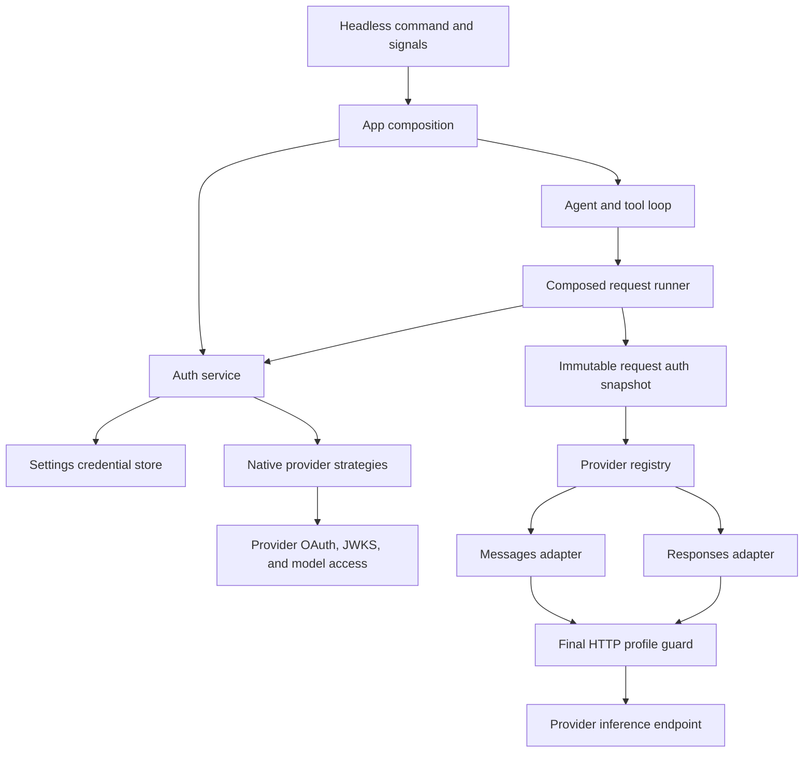

# H7a implementation and architecture report

## Result

Native subscription authentication works for Anthropic, ChatGPT, and xAI through the ordinary headless command.
All three live accounts passed login, a real echo tool loop, a final assistant reply, usage events, exactly one run settlement, and local logout.
H7a is complete: all six phases and all 22 criteria are checked through the plan CLI.
The exact CLI signal-during-local-commit acceptance gate also passed in Linux with race instrumentation and two complete repetitions.
No credential, private identity, authorization code, or private auth URL is included in this report.

The implementation follows the accepted one-account-per-provider and local-only logout decisions.
All six approved corrections are implemented.
The [live acceptance record](./tester-261006-0835-h7a-live-acceptance.md) and [final actor proof](./tester-261006-0835-h7a-final-proof.md) record executed checks, including the original proof gap and its closure.
The [detailed architecture study](./xia-261006-0143-h7a-subscription-auth-architecture.md) records the original PI source comparison and design rationale.

## Architecture

`internal/settings` owns the credential file, revision, lock, and durable transaction.
It imports no other internal capability.
`internal/auth` owns provider login, refresh, verified identity, model readiness, and auth work registration.
It imports neither the agent nor the wire adapters.
`internal/app` composes the real store and auth service with the existing agent and provider registry.
The agent keeps its existing stream, tool, and public lifecycle ownership.
The wire adapters receive an immutable access snapshot and have no credential-file access.

These boundaries match the Ask package model.
They avoid a provider switch in the agent and a second subscription-specific inference stack.
The same composition supports Prompt and SetModel readiness.
Future runtime consumers can use the app constructor without implementing another resolver.

## Patterns and ownership

| Pattern | Owner | Reason |
| --- | --- | --- |
| Strategy functions | Native auth methods | Each provider has a different OAuth protocol, but shares persistence and lifecycle rules. |
| Composition root | App | Build real dependencies once and inject the runner and readiness function. |
| Adapter | Existing provider wires | Convert canonical messages and tools to each provider wire. |
| Immutable snapshot | Request binding | Keep one request's provider, method, profile, account generation, origin, and access material together. |
| Compare-and-swap transaction | Credential store | Prevent a stale login or refresh from restoring deleted or replaced credentials. |
| Durable refresh fence | Credential store | Refuse reuse of a rotating grant after an uncertain exchange or commit. |
| Final HTTP guard | Wire profile | Check the actual outgoing origin, headers, and body after SDK conversion. |

The implementation uses existing stream and registry seams.
It adds no plugin framework, SQL credential store, account collection, or remote model catalog.
The provider method functions are the extension point for another native protocol.
The store and request contracts stay shared.

## Credential transaction and recovery

The owner directory uses mode 0700.
Credential and temporary files use mode 0600.
A stable sidecar OS lock protects a fresh read, revision check, merge, and commit.
The transaction preserves unrelated providers and unknown fields.
The durable store revision also exists when a provider record is absent.

A commit writes a same-directory temporary file, syncs it, closes it, renames it, and syncs the owner directory.
A failure before rename preserves the previous bytes.
A failure after rename is classified as indeterminate.
Unsafe or corrupt stores fail closed.

Before a rotating token request, the store commits a pending attempt for the current generation.
A validated replacement clears that fence only through a durable transaction.
Forced process death, a lost response, or a failed replacement write leaves recovery guidance and forbids automatic grant reuse.
A later process does not send another refresh request or use an ambient API key as a fallback.
Explicit login or local logout supplies the recovery path.

This design cannot make a remote token exchange atomic with local disk writes.
It makes that limit explicit and prevents unsafe retries.

## Request and shutdown flow

Resolve auth after the final model preparation and the existing key hook.
Repeat resolution for the next model request after a tool result.
A supported explicit key wins; otherwise a saved credential wins over environment keys.
Only an absent saved record permits environment-key resolution.
A saved OAuth failure stops the request.

Snapshots contain no refresh token, ID token, callback code, or store handle.
They are not persisted in agent history or public events.
The final HTTP guard checks the fixed inference origin and profile.
It rejects competing auth headers and SDK metadata that can change the destination or billing route.

Auth work is registered before a rotating exchange and remains registered through replacement commit.
The first signal stops new work, cancels inference, and drains auth work through an independent bound.
A second ordinary signal cannot replace that bound with the old two-second inference grace.
The maximum exchange budget is 15 seconds and the independent commit budget is five seconds.
The command uses a 20-second auth drain.
A context cannot interrupt an OS sync call that the kernel has blocked.
The fence remains the restart safety boundary for forced exit or uncertainty.

## Provider behavior

### Anthropic

The native flow adapts the pinned PI public-client OAuth flow.
Browser and copy-code interactions use PKCE and state validation.
The loopback callback is bound before the authorization notice is displayed.
Wrong-state or oversized callbacks do not consume the pending attempt.
Callback and private input limits are 16 KiB.

The Messages profile uses the required bearer, system, and beta metadata.
Tool names use a request-local codec for active declarations and historical tool blocks.
Results remain canonical in the agent history and tool events.

### ChatGPT

The native flow uses dynamic client registration and a stable non-secret host ID.
A returning login reuses the saved issued client and verified subject.
Explicit `--new-account` permits a new registration and replaces the record only after success.
Local logout removes the entire provider record, including issued client metadata.

OIDC verification checks signature, issuer, audience, expiry, authorized party, and subject.
Initial login also checks nonce.
Refresh keeps the saved client and identity binding.
Strict earliest-refresh parsing prevents an early rotating request.
Discovery caches model access by method, client, subject, issuer, and credential generation.
An unavailable discovery response is unknown; a known denial blocks inference.

The live account hid GPT-5.5 and listed GPT-5.6 Sol.
The hidden model was correctly rejected before inference.
A static GPT-5.6 Sol row was added through the existing compiled catalog using [official metadata](https://developers.openai.com/api/docs/models/gpt-5.6-sol).
The acceptance command selected it explicitly.
No automatic model substitution or default change was introduced.

The Responses profile sends the supported subscription body and complete canonical history.
Named tool choice is encoded or rejected before HTTP.
Request restrictions are checked after the SDK builds the final request.

### xAI

The native device flow displays the provider verification link and device code through the command notice.
It waits before the first poll, handles monotonic slowdown, and bounds each request by the remaining authorization lifetime.
Both `access_denied` and `authorization_denied` terminate the attempt.
A failed login preserves the previous record.
Refresh retains an omitted refresh token only for the xAI strategy, following PI behavior.
The Responses profile applies the xAI body and reasoning rules at the final HTTP boundary.

## Maintainability and scale limits

Each package owns one capability and has an owning README.
Existing wire adapters and the installed OIDC dependency are reused.
There is no production endpoint, TLS, issuer, or signature bypass for tests.
Command tests run the real parser, app composition, native flow, store, resolver, agent, and adapters.
Only external HTTP and time are supplied by the test harness.

The file store supports several processes on one authoritative local home with reliable OS locks and atomic rename.
It does not claim coordination across independent hosts or network filesystems.
The store-wide lock serializes credential mutations and bounded refresh exchanges.
It is not held during model streaming or tool execution.
The current three-provider, one-account contract does not require a distributed credential service.
A multi-host or multi-account product would require a new storage and coordination contract.

## Verification

- Full `go test ./...`: passed after the final model and CLI test changes.
- Required race suite for settings, auth, app, agent, providers, and CLI: passed.
- Final changed app/catalog race checks: passed.
- Final signed ChatGPT model-selection CLI race check: passed.
- Actual forced-death, lost-response, and replacement-write-failure restart checks: passed.
- CLI first and second signal checks with a token-exchange barrier beyond two seconds: passed.
- Exact mounted-filesystem commit actor with `-race -count=2`: all ten cases passed in 38.186 seconds.
- `go vet ./...`: passed.
- Full `golangci-lint`: zero issues.
- Final CLI lint with the `fsfault` build tag: zero issues.
- `git diff --check`: passed.
- Anthropic, ChatGPT, and xAI live login/tool-loop/local-logout checks: passed.

The live prompt used a fixed non-personal test string.
The controller removed all three test provider records through local logout.
An earlier test run overlapped the live Anthropic callback listener and failed on the fixed port.
A clean full rerun after the listener closed passed.
No test failure was hidden or weakened.

A pre-existing Responses tool-call folding defect was also fixed.
A terminal metadata-only tool-call delta had discarded the accumulated arguments.
The shared fold now preserves them, and the actual CLI echo loop verifies the result.

## Exact filesystem commit acceptance

The user chose to retain the exact planned commit actor on 2026-10-06.
A test-only libfuse3 passthrough filesystem and a tagged compiled CLI actor were added.
The [actor report](./tester-261006-0855-h7a-fsync-actor.md) records the test and executed results.
The [fixture report](./worker-261006-0855-h7a-fsync-fixture.md) records the external mount and control protocol.
The owning [test support README](../../internal/testsupport/README.md) gives the reproducible runner command and cleanup requirements.

The fixture blocks the second regular-file sync after arming.
The first sync durably publishes the pending refresh fence.
The blocked second sync contains the validated replacement credential.
The CLI receives SIGINT, SIGTERM, or SIGHUP, then a second ordinary signal.
It remains alive while actual replacement file sync is held for more than two seconds.
Release before the five-second commit budget permits real backing file sync, rename, and directory sync.
A second gate holds the directory-sync reply after that real sync succeeds.
An independent compiled observer then verifies the entire saved replacement through the owned backing path while the CLI remains alive.
The CLI exits with the expected signal code only after this observation and release.

Two more cases hold sync beyond the commit budget or send actual SIGKILL.
Both preserve the committed pending fence byte for byte.
The next compiled prompt refuses grant reuse and sends zero further auth or inference requests.
No production I/O hook, endpoint bypass, or identity bypass was added.

The final Linux command used `-tags fsfault`, `-race`, and `-count=2`.
All five cases passed in each repetition, for ten successful cases.
The two matrices took 18.55 and 18.60 seconds; the package reported 38.186 seconds and exit code 0.
Successful signal cases held replacement sync for 2.362 to 2.375 seconds.
The budget cases held it for approximately 5.204 seconds.
No race diagnostic or cleanup failure was reported.

## Test environment diagnosis

The first Linux run found an observer error.
Reading the temporary file through its FUSE inode waited behind the blocked sync on that inode.
The observer now reads the same owned backing bytes directly; product operations still use the mounted filesystem.
The next run passed one complete matrix, then encountered I/O errors while the host had only 123 MiB free.
A concurrent tagged lint build also failed with an explicit no-space error.
The controller removed reproducible Go build cache and the owned cross-compile artifact, restoring approximately 5.9 GiB of free space.
The affected Linux build cache then failed at link time; removing only the owned fixture cache and rebuilding produced the clean repeated pass above.
These failed attempts remain in the actor record and were not counted as successful acceptance.

The final runner used an owned isolated Podman Linux VM and a read-only checkout mount.
The container had the FUSE device and mount capability, with no host ports or live account credentials.
The runner removed its container and stopped the owned VM after success.
The controller then removed that owned VM, its disk image, test cache, and connection entries.
No fixture process or mount remains.
The original `podman-machine-default-root` connection remains the default.
The original Podman default connection and the user's existing Docker processes were unchanged.
No unresolved product decision or acceptance gap remains.

## Final review and advisory decision

The independent final review approved the implementation and acceptance evidence, with a score of 9.5/10.
The final tagged lint check then passed with zero issues.
The final `kongming` advisory checkpoint gave go for full H7a completion.
It found no blocking defect or unresolved product decision in the reviewed evidence.
It retained the accepted local filesystem, local-only logout, and unavoidable OS sync uncertainty limits.
No additional scope change or permission gate is required for delivery.
The full plan CLI status is completed, with six of six phases and 22 of 22 criteria, or 100 percent.
