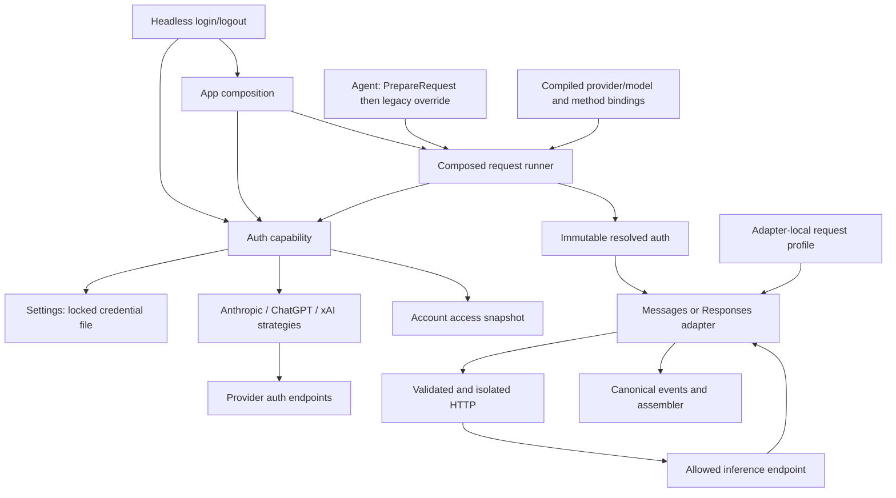
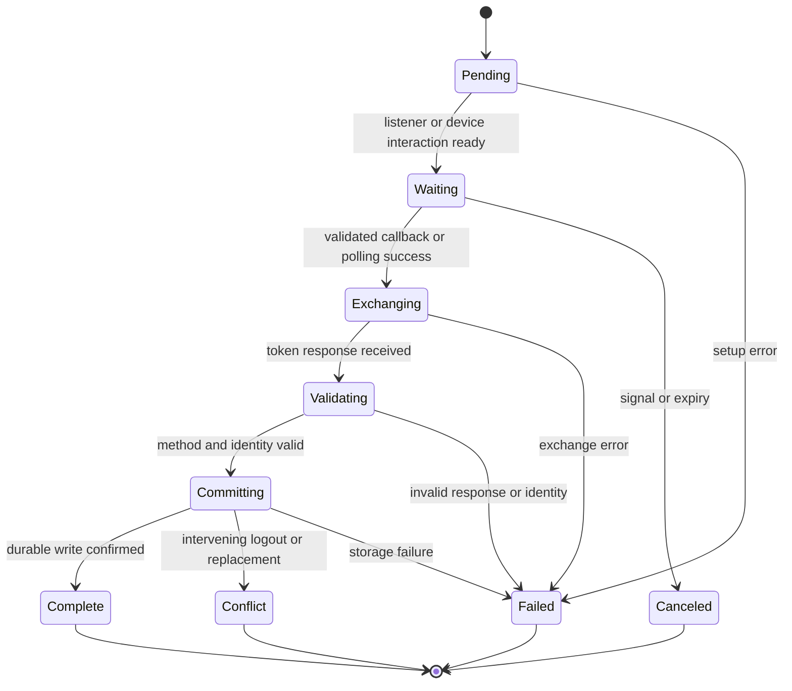

# H7a subscription auth: Pi analysis and proposed Ask architecture

Date: 2026-10-06.
Mode: `ak:xia --port`.
Status: source analysis complete; six-phase deep TDD plan drafted; all six review corrections approved and applied.
This report does not claim implementation, test execution, or live subscription access.
The report is for the maintainer who will review and implement H7a.
Use simple English for the technical record.

## 1. Outcome and authority

Deliver native headless login, logout, refresh, and subscription inference for Anthropic, OpenAI ChatGPT, and xAI.
Preserve API-key callers and canonical transcript and tool contracts.
Prevent an auth failure from sending the prompt through a different account, method, endpoint, or billing route.
Keep the design within Ask's modular monolith, with capability packages and adapters at external boundaries.

The [roadmap](../260930-2254-pi-feature-inventory-go-roadmap/roadmap.md), revision 7, owns phase scope and order.
The [H7a detail](../260930-2254-pi-feature-inventory-go-roadmap/phase-h7a-subscription-auth.md) owns the phase exit.
The [provider design](../261005-2139-provider-auth-design/plan.md) records accepted product decisions and proposed contracts.
The [architecture reference](../../docs/ask-architecture-reference.md) owns package rules.
This report adds evidence and tests those contracts; it does not replace those authorities.

H7a can start after H3 and H2.
OpenAI and xAI inference depend on H4 Responses; auth and storage work do not need full H4 completion.
Full H5 tools, H6 settings, and H7 remote catalogs are not prerequisites.
Use compiled provider/model records and existing tool snapshots.
All three subscriptions are required for completion; the first live prompt is an early checkpoint.
Gateway auth transport stays in H17, full TUI login stays in T2, and public session switching stays in H13.
H7 must reuse this store and resolver.
No SQL migration, database credential store, account load balancing, or client-to-server token transfer is part of this proposal.

## 2. Source manifest and evidence limits

| Item | Evidence |
|---|---|
| Source | Local Pi checkout at `/Users/dale/Desktop/workspace/opensources/pi` |
| Resolved revision | `4c6fb7cfe8c538a668726f6f8b3554098c39faee`, Pi 1.0.1 |
| Source working tree | Only `AGENTS.md` and `CLAUDE.md` differ; feature source is at the pinned revision |
| Target baseline | Ask HEAD `fc8dd22c20363c42a11f3125f0a4af19c0236a40`, branch `master-2` |
| Target working tree | Includes unfinished or uncommitted H4 adapter, catalog, agent, and roadmap work; HEAD alone is not the inspected state |
| Source scope | `packages/ai/src/auth/`, Messages and Responses adapters, `packages/coding-agent/src/core/auth-storage.ts`, related tests |
| Packaging | Repomix succeeded; security scan found no suspicious files; pack is `/tmp/askcore-h7a-pi-source.xml` |
| Live evidence | None; no user token, credential file, OAuth grant, or paid inference was used |

The pack includes extra auth providers because the shared auth folder was selected.
Only the three H7a methods and shared contracts inform this proposal.
The pack is a temporary research artifact, not a required build input.
Source code proves implementation behavior; it does not prove account eligibility or provider approval.

Read the [previous subscription audit](./researcher-261005-2139-h4-subscription-source-audit.md) for earlier line citations and identified source gaps.
The present report checks current Ask files and current OpenAI documentation as well.
Documentation for the preview can change independently from the pinned Pi revision.

## 3. Source anatomy

All Pi paths in this section are relative to the pinned checkout.

| Layer | Source owner | Role to port |
|---|---|---|
| Method types | `packages/ai/src/auth/types.ts` | Method metadata, interaction, stored credential and resolved auth contracts |
| Auth selection | `packages/ai/src/auth/resolve.ts` | Override/store/environment precedence; refresh with a lock and recheck |
| Storage port | `packages/ai/src/auth/credential-store.ts` | Read and locked update contract |
| File implementation | `packages/coding-agent/src/core/auth-storage.ts` | File permissions, lock, fresh read, provider merge and direct write |
| Anthropic strategy | `packages/ai/src/auth/oauth/anthropic.ts` | Browser or copy-code login; JSON exchange and refresh |
| ChatGPT strategy | `packages/ai/src/auth/oauth/openai-chatgpt.ts` | Dynamic public-client registration; PKCE; issued client/scopes; refresh |
| xAI strategy | `packages/ai/src/auth/oauth/xai.ts` | Device grant, polling and refresh |
| Shared interaction | `packages/ai/src/auth/oauth/callback-server.ts`, `pkce.ts`, `device-code.ts` | Cancellable callbacks, PKCE and device waits; Ask adds required deadlines |
| Anthropic profile | `packages/ai/src/api/anthropic-messages.ts` | Bearer auth, identity, beta headers, tool-name conversion |
| Responses profiles | `packages/ai/src/api/openai-responses.ts` | ChatGPT body restrictions and xAI model-specific reasoning |
| Catalog consumers | `packages/ai/src/models.ts`, coding-agent model runtime | Login publication, catalog refresh and target availability; Ask adds documented ChatGPT account discovery |

### 3.1 Shared resolution and refresh

Pi resolves a runtime override first, a saved credential next, and an environment key last.
A saved OAuth error does not fall through to an environment key.
The inference resolver checks expiry, enters the store lock, reads again, checks again, exchanges a refresh token, and commits the new record.
The local refresh HTTP limit is 15 seconds in this resolver.
File updates merge the selected provider into the data read inside the lock.
Logout uses the same store coordination.
These contracts are in `resolve.ts`, `resolveStoredOAuth`, and `auth-storage.ts`, `withLockAsync` and credential update methods.
Pi's file backend uses `proper-lockfile` and direct `writeFileSync`; it does not use a temporary file and atomic rename.
Ask's stable sidecar OS lock and durable atomic replacement are deliberate improvements required by the accepted design.

Pi stores expiry with a margin already subtracted, then the inference resolver adds its own margin.
The normal effective lead time is 10 minutes for Anthropic/xAI and 8 minutes for ChatGPT.
Its catalog-refresh path does not use exactly the same timing path.
Ask should store actual expiry and calculate one method-specific refresh threshold in one resolver.
This makes inference and authenticated discovery agree.

In Pi, a cancellation check after a refresh callback can run before file persistence.
This ordering gives a possible rotated-token loss window; it is source evidence, not a reproduced defect.
Ask must commit a validated rotation before it returns a cancellation result.
Do not copy a cancellation boundary that can discard a replacement refresh token.

### 3.2 Anthropic native login

Pi offers browser and copy-code methods.
Browser login uses a loopback listener, PKCE, and a registered `localhost:53692/callback` redirect.
The listener binds to loopback by default; the redirect and bind host are distinct values.
Copy-code uses `https://platform.claude.com/oauth/code/callback`.
The token endpoint is `https://platform.claude.com/v1/oauth/token`.
Pi requests Claude Code inference and related scopes through its native client registration.
Do not invent another callback URI or claim that Ask owns Pi's client registration.

The interaction can accept the browser callback or manual code/redirect input.
Pi accepts a bare code and substitutes pending state when state is absent.
Ask should validate returned state on callback and full redirect inputs.
For bare-code input, use only the explicit provider-supported copy-code mode and its attempt-bound PKCE contract.
Do not treat a pasted arbitrary URL as a trusted callback.
Close the listener and cancel the unused input waiter when one input path completes.
Pi's shared callback timeout is optional and Anthropic does not supply it here.
Ask should bound the total login operation explicitly, as well as each exchange.

Pi's token JSON uses type assertions for some response fields.
Ask must reject empty tokens, invalid expiry, malformed JSON, wrong token kind where supplied, and invalid scope data before commit.
Login failure must retain the prior saved record.
Refresh metadata and replacement tokens must be committed together.
Pi can fall back to manual browser-code input after a listener bind error.
Ask should report that error and use only an explicitly selected supported interaction; do not claim that Pi always switches to the hosted copy-code redirect.

### 3.3 Anthropic inference profile

The Messages adapter detects OAuth from token text in Pi.
An injected SDK client can bypass that detection.
The OAuth branch uses bearer auth, Claude Code CLI identity headers, OAuth/Claude Code beta values, and an identity system block.
Pi's pinned CLI identity is `claude-cli/2.1.280`; it is versioned compatibility data, not an eternal protocol constant.
Keep required profile values in the adapter owner with a wire test and a clear update path.

Pi converts known tool names case-insensitively to its Claude Code compatibility list.
Unknown names stay unchanged.
Conversion covers declarations, historical tool calls, additions, and removals.
Response names are restored against current declarations before public tool events.
The pinned forced tool-choice path does not apply the same forward conversion.
Ask must cover named tool choice too.
This preserves the requested behavior without copying a source mismatch.

Canonical names, argument schemas, argument values, results, and stored history must remain unchanged.
The profile operates on request-local copies.
Use the matching historical tool snapshot for historical calls and the active snapshot for response names.
Reject a codec collision before HTTP; for example, two declarations that both map to `Read` cannot be decoded safely.
Do not alias `find` to `Glob` or change custom/MCP names without a semantic contract.

### 3.4 OpenAI ChatGPT native login

The current Pi flow uses Sign in with ChatGPT and the public Responses API.
It is separate from legacy `openai-codex`; no `chatgpt.com/backend-api` port is proposed.
Pi uses PKCE, state, nonce, a loopback callback on port 1455, a host identifier, and dynamic client registration.
The callback provides an issued client ID for token exchange.
Refresh uses that issued ID.
In this revision, login starts dynamic registration again and ID-token validation checks presence rather than verified identity.
Ask must add the required identity boundary instead of treating Pi parity as sufficient.

For a new registration, use the dynamic entrypoint; for returning sign-in, reuse the saved issued client.
Keep one stable host ID for the inference runtime.
Verify the ID-token signature, issuer, audience, expiry and nonce with a maintained verifier.
Bind verified subject and issued client to the pending attempt and saved record.
Check granted inference scopes from the token response.
Reject a changed client ID or mismatched identity during returning sign-in.
Preserve the exact attempt callback URI in authorization and token exchange.
Current documentation permits loopback port variation, with the same scheme, host and path. [OpenAI sign-in](https://developers.openai.com/siwc/token-sharing-open-source/sign-in).

These are additions to pinned Pi, not existing Ask behavior.
The current dependency manifest contains `golang.org/x/oauth2` indirectly, but no evident general JOSE/OIDC verifier.
Do not implement signature validation by hand or decode an unsigned JWT as proof of identity.
Select and pin a maintained verifier during the approved implementation work.
Keep that dependency inside auth; no JOSE type enters providers or the agent.

### 3.5 ChatGPT discovery and request profile

Authenticated discovery uses the same resolved account credential as inference.
This is an Ask addition: the pinned three Pi provider constructors use static catalogs and do not register authenticated account discovery.
The current route returns a `models` array with display visibility, slugs and names.
Use visible slugs for selection and retain the server order.
Do not parse it as the ordinary API-key model-list schema.
Refresh the account view after replacement. [OpenAI models and inference](https://developers.openai.com/siwc/token-sharing-open-source/models-and-inference).

Join discovery with compiled model metadata; discovery does not prove context limits, prices or reasoning capability.
An unknown account-access state permits inference only when auth and required capabilities are valid, as accepted in the roadmap.
Known denial blocks selection.
An unknown metadata capability is a separate state; do not manufacture support from an entitlement response.
Cache account access by provider, method, issued client and verified identity, with credential-generation invalidation.
A stale discovery result cannot authorize the next account.
Discovery failure must not select an API-key route.

The ChatGPT profile requires HTTP streaming, local history and disabled server storage.
It must reject unsupported final fields and use instructions or developer messages instead of explicit system items.
It also needs the documented function/custom tool grouping form.
The existing flat function-tool encoding needs a specific compatibility check before this profile can be declared ready. [OpenAI preview limits](https://developers.openai.com/siwc/token-sharing-open-source/preview-limitations).

The documented forbidden fields include `background`, `conversation`, `max_output_tokens`, `max_tool_calls`, `metadata`, `moderation`, `multi_agent`, `prompt`, `prompt_cache_retention`, `safety_identifier`, `temperature`, `top_logprobs`, `top_p`, `truncation`, and `user`.
Omit HTTP `previous_response_id` and send required context in `input`.
Validate after SDK serialization and all extra-body/sampling changes.
Omit unsupported generated defaults; reject an explicit unsupported user option with a clear error.
Do not silently discard a user request for a supported-looking option.
The restriction table must be owned and tested by the adapter, not copied into login code.

Respect server refresh timing, including `earliest_refresh_at`, and replace rotated tokens as a unit. [OpenAI token reference](https://developers.openai.com/siwc/token-sharing-open-source/token-reference).
Classify exhausted subscription allowance separately from retryable rate limiting.
No transparent replay is permitted after public output or a tool-call event.

### 3.6 xAI native login and inference

Pi uses device authorization with Grok CLI access and API access scopes.
Its device endpoint is `https://auth.x.ai/oauth2/device/code` and token endpoint is `https://auth.x.ai/oauth2/token`.
It validates the device response and HTTPS verification URL.
It waits for the server interval before the first poll.
Pending waits again; slow-down increases the interval; denial and expiry stop the attempt.
Cancellation stops waits and network requests.
Pi checks device-code expiry between polls.
Ask should additionally enforce an overall operation deadline and bound each HTTP call by remaining device lifetime.
Missing replacement refresh tokens retain the prior refresh token for this method.
Do not generalize that rule to a method whose contract requires rotation.
Pi does not establish verified xAI account identity or retain granted scopes here.
Keep that absence explicit; do not decode an opaque access token to invent an account ID.
Use the stored credential generation as the replacement boundary when the method has no verified account identifier.
Ask should bound each poll HTTP call by the remaining device lifetime; Pi checks expiry between calls and a hanging call can exceed it.

xAI key and OAuth inference both use `https://api.x.ai/v1/responses`.
They can share one xAI Responses profile with different auth provenance and billing hints.
Encrypted reasoning inclusion remains conditional on the model's reasoning support.
No Anthropic name codec is used.
The auth method owns device state and refresh; the Responses adapter owns request/response behavior.

## 4. Target map and dependency matrix

The target source is the working tree inspected on this date.
Do not interpret an untracked file as a completed or reviewed phase.

| Component | State | Ask owner and evidence | Needed adaptation |
|---|---|---|---|
| Capability architecture | EXISTS | `docs/ask-architecture-reference.md` | Retain modular monolith and edge adapters |
| Tool transcript | EXISTS | `providers.NormalizeRequest`, `CurrentTools`, `TransformMessages` | Reuse; add profile-local names only |
| Final model hook | EXISTS | `internal/agent/loop_run.go`, `prepareRequest` | Resolve auth after this hook |
| Legacy key hook | EXISTS | `internal/agent/loop_stream.go`, `apiKey`; `providers.ResolveKey` | Preserve nonempty override and empty fallback semantics |
| Auth-aware selection | CONFLICT | `internal/agent/agent.go`, `SetModel` currently checks key-only readiness | Use the shared readiness/auth seam; do not pass OAuth as an untyped key |
| Runtime auth value | NEW | `providers.StreamOptions` has only `APIKey` | Add explicit provider/method/profile/account/endpoint snapshot |
| Credential store | NEW | `internal/settings` contains a README and `doc.go` only | Implement file contracts without full settings loader |
| Auth capability | NEW | No implemented `internal/auth` service | Method strategies and shared lifecycle |
| Provider records | EXISTS, incomplete | `internal/providers/api.go`, `catalog.go`, `model.go` | Add compiled Anthropic and xAI records and validated method/profile bindings |
| Wire registry | EXISTS | `internal/providers/registry.go` | Reuse API dispatch; validate static auth registrations separately |
| Anthropic wire | EXISTS, partial fit | `internal/providers/anthropic/provider.go`, `document.go` | Remove Token Plan-only auth/default assumptions on resolved-auth path |
| Responses wire | EXISTS, partial fit | `internal/providers/openai/responses.go`, `responses_prompt.go` | Remove OpenAI-only ambient auth on resolved path; add profiles and final validation |
| HTTP isolation | EXISTS, partial fit | `internal/providers/openai/isolate.go` | Protect final credential headers and origins; add required profile headers explicitly |
| Stream assembly | EXISTS | `internal/providers/assembler.go`, `fantasykit` | Preserve settlement contract; reverse names before fold/publication |
| Headless setup | EXISTS, scattered wiring | `cmd/tui/headless.go`, `headless_faux.go` | Route login/logout and inference through a shared app constructor |
| Composition root | EXISTS, server-oriented | `internal/app/app.go` | Add focused provider/auth composition without requiring DB or servers |
| Import enforcement | CONFLICT | `.golangci.yml` enforces SDK boundaries but not every new settings/auth ban | Add explicit capability bans for new contracts |
| Cassettes | EXISTS | `internal/providers/cassette`, `cmd/tui/capture.go` | Ensure OAuth exchanges and token material are never recorded |

The current Anthropic adapter resolves an empty key with Token Plan environment names regardless of the supplied model provider.
The Responses adapter resolves an empty key with OpenAI environment names.
That code is not a safe destination for typed subscription requests without adaptation.
The resolved-auth path must never invoke those fallback branches.
Retain tested legacy behavior for direct key-only calls through a separate explicit compatibility path.

The installed fantasy fork is `08976763bfea`, as selected in `go.mod`.
Its Anthropic provider has header/client injection and `WithMaxRetries(0)` in client setup.
It does not expose a direct auth-token option in the inspected provider options.
`WithSkipAuth` serves the Vertex path; it is not proof that ordinary Anthropic SDK environment auth is disabled.
Use a supported native SDK seam if needed; do not add a dummy API key to bypass SDK validation.
Keep final HTTP credential isolation within the adapter and verify the real request with conflicting environment values.
A final transport validator can assert serialized headers/body and binding, but must not become an undocumented general body-rewrite engine.

## 5. Proposed high-level architecture



The diagram shows runtime calls; it does not authorize reverse package imports.
The request runner is a small composed function around the existing stream function.
Auth resolution is injected; providers core does not import auth or settings.
Auth returns one snapshot and adapters consume it.
The agent has no provider switch and never reads the credential file.

### 5.1 Package ownership and import direction

| Owner | Owns | Allowed outward dependency |
|---|---|---|
| `internal/settings` | Persisted credential model, host metadata, lock, revisions and atomic merge | Standard library; platform lock code under build tags |
| `internal/auth` | Method registry, login interaction, precedence, refresh, identity validation, account discovery | Settings, provider core types, HTTP/crypto and selected verifier |
| `internal/providers` | Runtime snapshot, binding data, catalog and API dispatch | Protocol/core dependencies; no auth-store reads |
| `internal/providers/anthropic` | Messages profile, names, final validation, event conversion | Providers and its SDK/fantasy boundary |
| `internal/providers/openai` | Responses/Completions profiles and route errors | Providers and its SDK/fantasy boundary |
| `internal/providers/fantasykit` | Common stream and transport support | No login, credential store, or method selection |
| `internal/app` | Compiled registrations, constructors, resolver injection and resource lifecycle | Concrete capability owners |
| `cmd/tui` | Parse command, show interaction, map exit status | Shared app/auth operations; no token protocol logic |

Enforce settings' internal import ban and providers' auth/settings import ban with depguard.
Also prevent auth from importing agent, transport handlers, wire adapters or config.
Entry-point constructors must not start SQLite or a gateway for login or headless inference.
Share ordinary constructors between headless and later leader assembly; fx can register those same constructors.
Avoid a second hand-written provider wiring path in every runtime.

### 5.2 Patterns with concrete purposes

| Pattern | Use | Why it fits |
|---|---|---|
| Strategy | Typed login, refresh and material functions per auth method | Three different protocols share a lifecycle |
| Adapter | Existing wire implementations | Two protocols serve three vendors and more compatible providers |
| Registry and composition | Validated provider/API/method/profile combinations | New compatible provider is data; new protocol adds one implementation |
| Immutable snapshot | One request's resolved auth and target | Concurrent requests cannot change each other's credential or decoder |
| Codec | Request-local forward/reverse tool-name mapping | Changes wire names without changing tool semantics |
| Locked transaction | Fresh read, recheck, rotation, merge and durable replace | Headless and leader can share one Ask home safely |
| State machine | Login, device polling, refresh and failure transitions | Makes cancellation and partial success explicit |

Use ordinary structs, functions and maps.
Use an interface only for a real implementation boundary or test seam.
No abstract factory, provider-per-auth hierarchy, generic OAuth DSL, event-sourced auth store, or new middleware framework is needed.
The designs above address existing contracts rather than future possibilities.

### 5.3 Contract shape

Keep provider ID, model ID, API ID, auth-method ID and profile ID distinct.
Model API remains model-owned.
A runtime target adds method and effective options to the qualified provider/model identity.
The snapshot contains credential source, account binding, allowed endpoint, billing hint and access material.
It contains no refresh token, ID token, auth code, store handle or login callback.
Redact its string/log representation and never serialize it into a session entry.
Use separate persisted credential and runtime material types because they hold different data.

The persisted provider record is a tagged API-key or OAuth value, not a collection of saved methods.
An OAuth record binds method, access/refresh tokens, actual expiry, scopes, refresh-not-before and method metadata together.
ChatGPT metadata binds verified identity, issued client and retained sign-in hint.
Do not use email as the account identity.
Use one owner for the persisted schema and preserve unknown fields during updates.
Fail closed on malformed or ambiguous credential types.

Explicit resolved auth takes precedence over legacy `StreamOptions.APIKey` at the adapter boundary.
At the caller boundary, reject competing nonempty typed and legacy overrides.
A legacy nonempty key hook means supported API-key auth; an empty hook lets normal stored/env resolution continue.
Do not turn every credential string into an API key or detect OAuth with a prefix.
Bind a CLI key to its intended provider; a final model change requires fresh destination resolution.
For key-only compatibility, keep existing fallback behavior where no provider change occurred.

## 6. Runtime and state flow

### 6.1 Request resolution

```mermaid
sequenceDiagram
    participant Agent
    participant Runner
    participant Auth
    participant Store
    participant Wire
    Agent->>Agent: PrepareRequest selects final model
    Agent->>Runner: Model, canonical transcript, request options
    Runner->>Runner: Validate method/API/profile and endpoint binding
    Runner->>Auth: Resolve final target and explicit override
    Auth->>Store: Read selected provider record
    alt Valid unfenced saved credential
        Auth-->>Runner: Bound access snapshot; no auth HTTP
    else Refresh required
        Auth->>Store: Lock, read again, check current record
        Auth->>Store: Durable pending-attempt fence
        Auth->>Auth: Bounded method refresh and response validation
        Auth->>Store: Durable replacement and matching fence clear
        Auth-->>Runner: Snapshot from committed generation
    else Auth invalid
        Auth-->>Runner: Classified error; no billed fallback
    end
    Runner->>Wire: Transcript and immutable snapshot
    Wire->>Wire: Copy, build, apply profile, validate final request
    Wire-->>Agent: Canonical events and one settled result
```

Resolution must run once per model request, including each subsequent tool-loop request.
A valid credential does not call an auth endpoint.
Do not resolve at startup and then reuse access material across later model changes.
Readiness checks and request resolution share binding rules, but a readiness view is not proof of a successful inference.
Auth errors use the existing terminal stream contract; an early failure must still settle once.

### 6.2 Login and replacement



The old record stays active until validation and durable commit succeed.
Do not hold the store lock during human interaction.
Capture a provider generation at login start, then compare it under the commit lock.
A browser success page means callback received; only CLI completion after commit means login succeeded.
Failed login or pre-commit persistence failure retains the prior saved record.
An explicit new-account login may replace the one saved account; a returning-account flow cannot change identity silently.

Deleting a provider record is not enough to detect an intervening logout.
For example, login can start while the record is absent, logout can leave it absent, and a late login can then recreate it.
Use a durable generation marker even for an absent provider, or a store-wide generation with a safe conflict result.
This is an ABA problem; comparing token text or presence alone does not solve it.
The smallest safe starting choice is a store-wide revision in nonsecret metadata under the same lock.
An unrelated provider write can then cause a retryable login conflict; this favors correctness over hidden overwrite.
Per-provider durable generations can reduce such conflicts later without changing the public operation contract.
Unknown credential fields and unrelated provider records must survive either representation.

### 6.3 Refresh transaction and cancellation

Acquire the stable sidecar lock, not the replaceable `auth.json` inode.
Read fresh data under the lock and recheck generation, method, account, deletion, scopes and expiry.
If another process already refreshed the current record, use that record without another exchange.
If it was deleted or replaced, do not refresh the stale token or resurrect the old record.
Hold the lock across the bounded network rotation and durable commit.
This serializes rotations across all providers in one home, as the accepted design allows.

Use actual expiry with method lead time and server refresh-not-before.
If refresh is not yet permitted and access is still valid, keep the valid token.
If required validity cannot be met, return a bounded retry-after/auth result.
Do not loop against the token endpoint.

Cancellation can stop a lock wait, a device poll, or an unfinished exchange.
After a valid response rotates the token, finish the short local commit with an independent bounded context.
Then return the inference cancellation result.
After commit failure, do not return success or use old-token fallback.
If the server may have rotated but the response is lost, report an ambiguous auth outcome and require safe recovery or reauthentication.
Do not blindly replay an uncertain rotating grant.
Before sending a rotating grant, durably mark its provider generation with a pending attempt under the held lock.
If that fence cannot be confirmed, send no exchange.
A later process seeing an unresolved fence must require explicit recovery or reauthentication, without grant reuse or billed fallback.
Clear it only with a validated durable replacement or an explicit successful login/logout transaction.
A crash before exchange can require conservative reauthentication; the fence does not make remote and local commits atomic.
Register potentially rotating work before exchange and let CLI shutdown wait for its remaining 15-second exchange and 5-second commit budgets.
A second ordinary signal does not shorten a validated commit.
Forced process death or an uninterruptible OS sync can still prevent completion; the prior durable fence protects the next process.
Preserve signal exit codes and test commit delays beyond the old two-second grace.

### 6.4 Storage durability boundary

Create the owner directory with mode 0700 and credential files with mode 0600 on Unix.
Use restrictive ownership and reject symlink or unexpected file-type paths at the credential boundary.
Write a unique same-directory temporary file, flush and close it, rename it, then sync the directory.
Check write, sync, close, rename and permission errors.
Never decode corrupt JSON as an empty store and overwrite it.
Merge one provider against fresh data and preserve unknown fields.
Bound lock waits and storage operations; use nonblocking OS-lock attempts with context-aware waits.
An OS lock is released on process death; do not use PID-only stale-lock deletion as proof of ownership.

Atomic visibility and crash durability are different guarantees.
Failure before rename preserves the prior file for that local transaction.
During refresh, that prior file can already contain the durably saved pending fence; it is not necessarily the original unfenced credential.
Failure after rename, especially directory sync failure, can leave the replacement visible with uncertain crash durability.
Report an indeterminate storage result; do not promise that every possible save error leaves the old bytes intact.
The roadmap's failed-save promise should mean no false success and preservation before the commit point, with explicit handling of this partial failure.
Auth-server success and local durable storage cannot form one atomic transaction.
This limit must be tested and documented rather than hidden by retries.

No database backup or migration is needed because this proposal changes no database.
Credential backups must not be created as unprotected report artifacts.
Keep live acceptance files in an isolated owner-only Ask home and remove test credentials through the reviewed logout behavior.

## 7. Headless and remote operation contract

Command spelling remains a proposal, not an existing CLI feature.
Use `ask auth login --provider <id> --method <id>` and `ask auth logout --provider <id>` for explicit operation routing.
If the method is omitted, require a Pi-style method selection; return a clear error when noninteractive input cannot select.
The exact IDs are `api-key`, `anthropic-oauth`, `openai-chatgpt` and `xai-oauth`.
An explicit ChatGPT `--new-account` attempt replaces the one saved record only after verified commit.
Use a shared constructor-injected command boundary for production and offline subprocess tests, with separate external auth/inference clients and controlled clocks.
Keep fixed logical origins, OIDC verification and real internal owners; add no production endpoint or security bypass.
Pi production exposes interactive `/login` and `/logout`; its headless `auth` namespace only checks or prints credentials.
These Ask commands adapt the Pi interaction lifecycle to the required headless surface; they are not existing Pi commands.
See the [Pi runtime proof](./researcher-261006-0157-h7a-pi-runtime-proof.md) for source evidence.
Dispatch auth commands before prompt/file parsing and before capture setup.
Do not route a login argument through `ask -p` as a model prompt.
The login interaction accepts an auth URL, a device code or manual callback data through injected functions.
Limit callback query/request-target and private input lines to 16 KiB before parsing; reject oversized values without echoing secrets or consuming a valid pending callback attempt.
Do not place access tokens, refresh tokens or callback codes in command arguments, diagnostic logs or JSON event output.
Print only provider/method and the operation result; sanitize server errors before display.

Login runs on the inference host and writes that runtime's `ASK_HOME`.
Anthropic supports its native copy-code method for a remote browser when that method is selected.
ChatGPT can use documented loopback forwarding; the callback URI must be the exact URI used in that attempt.
xAI's device interaction does not need browser-to-host loopback forwarding.
Do not expose a callback listener on all network interfaces to make cloud login convenient.
Do not kill a port owner or select a new Anthropic registered port silently.
Close every listener and input/poll goroutine on success, failure and cancellation.

Use the existing CLI signal exit convention for cancellation.
Successful logout means the saved local credential has been removed; it does not mean an environment key disappeared.
After local logout, ambient API-key resolution can become eligible because no record exists.
Make that behavior clear in the operation result so the user does not infer a global provider disconnect.
Logout does not cancel an already-issued request snapshot unless an explicit runtime cancellation operation does so.
There is no promise that local logout revokes access at the auth server.
The user confirmed Pi local-only logout; current OpenAI guidance remains a documented compatibility difference.

## 8. Security, errors and observation

The protected assets are refresh/access tokens, account/client identity, host identity, billing-route selection and canonical tool execution.
Provider catalog metadata is not a credential.
The main trust boundaries are callback input, token/discovery responses, local file paths, model/header overrides, redirects and SDK defaults.

Allow account-bound tokens only on registered HTTPS origins and expected API paths.
Validate the actual final request URL, not just a display base URL.
Reject credential-bearing redirects outside the binding; the simplest token-client policy is no redirects.
Reject endpoint credentials in URLs, userinfo and ambiguous URL forms.
Required Authorization and identity headers are profile-owned and applied after optional user/model headers.
Do not allow `m.Headers` to replace a credential selected by the resolver.
Do not let an injected SDK/client disable the selected profile.
Prevent bearer and `x-api-key` headers from competing.

Bound token response sizes, callback queries, discovery responses, token expiry arithmetic and network deadlines.
Validate token type and required granted scopes before activation.
Keep callbacks attempt-specific and single-use, with state/nonce/PKCE from cryptographic randomness.
Apply JWKS algorithm and issuer restrictions through the selected maintained verifier.
Cache verification keys with bounded refresh; do not trust arbitrary token-provided key URLs.

| Error class | Caller behavior | Forbidden behavior |
|---|---|---|
| Missing credential or method mismatch | Ask for supported login/override | Try another account/provider |
| Reauthentication required | Preserve record for explicit recovery | Fall through to an environment key |
| Unsupported profile/request | Reject before HTTP | Drop an explicit option without notice |
| Account denial | Reject selection | Infer permission from a public catalog |
| Exhausted subscription allowance | Return distinct terminal error | Enter a generic 429 retry loop |
| Transient transport/rate limit | Preserve classification for H9 | Add independent auth/inference retry layers |
| Concurrent login conflict | Retain current generation; report conflict | Overwrite a newer logout/login |
| Storage failure or ambiguous rotation | Stop inference; show sanitized recovery guidance | Report success or replay old refresh token |
| Cancellation | Stop interaction/stream; finish required rotated-token commit | Lose a validated replacement token |

Diagnostics need operation, provider, method, profile, duration, outcome and sanitized request ID.
No raw token endpoint response, auth URL with sensitive hints, token header, JWT, or persisted credential enters logs.
Disable OAuth endpoint cassette capture.
For inference cassettes, redact both standard bearer/key headers and profile-specific account/session values before storage.
Do not log default struct formatting of secret-bearing values.

## 9. Maintainability and scale

A new compatible vendor uses provider/model records and existing method/profile bindings.
A new auth protocol adds one strategy; a new wire protocol adds one adapter.
No vendor changes the agent loop.
Profile and auth changes have separate test owners and can be maintained independently.
Identity/profile versions belong to their adapter tests, not to command parsing.
Use one scheduling resolver for inference and discovery to prevent expiry-rule drift.

Normal requests do no auth network operation and hold no file lock while streaming.
Immutable request snapshots permit independent sessions and requests in parallel.
One home lock serializes only credential updates and refresh exchanges.
Its capacity limit is the combined refresh/login-commit rate and bounded exchange duration, not token generation throughput.
Measure lock wait time and exchange duration without logging secrets.
If contention is measured, first isolate runtime homes by account owner; then evaluate per-provider locks plus a shared short merge lock.
Do not add per-provider network locks without a commit protocol that still preserves unrelated records and logout generations.

The file store supports multiple processes on one host/home with reliable local locking and rename semantics.
It is not a distributed credential store for replicas on unrelated hosts or an unreliable shared filesystem.
Cloud mode can keep an owner-scoped home on the inference host, as accepted today.
Do not copy the same rotating credential into multiple replicas and call that horizontal scale.
A future distributed mode would need an authoritative credential owner or transactional lease/CAS store and a changed deployment contract.
The capability boundary permits that future adapter; no such backend is required for H7a.

## 10. Challenge questions and decision matrix

The following challenge exercise precedes a new implementation plan.
Existing accepted product choices stay in force unless the user changes them.
Recommendations are proposed where execution contracts were not yet approved.

| Question | Pi answer | Ask answer / recommendation | Risk if wrong |
|---|---|---|---|
| Is header-only OAuth enough? | Anthropic and ChatGPT shape more than auth headers | Explicit method/profile binding | Rejected requests, unintended auth or tool execution |
| Should a failed OAuth token use an environment key? | No saved-OAuth fallback | Preserve that rule | Unintended API billing |
| Can method identity come from token prefixes? | Several adapters use heuristics | Typed snapshot; no prefix inference | Wrong profile or leaked credential |
| Can a mutex alone protect refresh? | File storage coordinates across processes | Stable sidecar OS lock and fresh recheck | Rotating-token reuse and lost updates |
| Can cancellation skip a successful rotation save? | A possible source ordering window exists | Bounded independent commit after rotation | Lost renewable session |
| Can late login overwrite logout? | Source merge does not establish the proposed generation contract | Compare durable generation, including absence | Credential resurrection |
| Does a public model list prove account access? | Catalog and auth availability are separate | Account discovery joins verified metadata; unknown differs from denial | Incorrect readiness or wrong model |
| Is a present ID token enough? | Pinned ChatGPT checks presence | Verified OIDC identity/client binding | Account mix-up or untrusted identity |
| Can SDK overrides run after restrictions? | Some source overrides can reintroduce fields | Profile then final serialized validation | Preview rejection or credential overwrite |
| Do current OpenAI account/logout docs fit accepted Ask scope? | Pi has one provider record and local logout | User chose Pi for both; keep this scope and document the difference | False claim of documented-provider compliance |
| Can one file store serve distributed replicas? | Local process/home model | One authoritative host/home; document limit | Duplicate token rotation across hosts |
| Does every save failure preserve old bytes? | Remote and local commit are separate | Distinguish pre-rename failure from indeterminate post-rename durability | Misleading success/recovery promises |

| Decision | Source way | Proposed Ask way | Recommendation |
|---|---|---|---|
| Architecture | TypeScript packages and runtime composition | Dewee capability packages with edge adapters | Keep Ask architecture |
| Credential ownership | One tagged credential per provider | Settings owns that same single-record concept | Keep accepted choice |
| Auth behavior | Provider-injected methods | Typed strategy functions injected by app | Port idiomatically |
| Runtime presentation | String/header auth plus heuristics | Bound immutable method/profile snapshot | Adapt, do not transplant |
| Persistence | Locked read/merge/write | OS lock, revisions, durable atomic replacement | Keep mechanism; strengthen races and failure states |
| Anthropic names | Request mapping with forced-choice gap | One request-local codec for every name field | Fix local contract gap |
| ChatGPT identity | Presence-only validation | Maintained OIDC/JOSE verifier | Add required identity check |
| Responses profile | Pinned omissions and later overrides | Final contract validation after serialization | Use current verified route contract |
| Scale | Local auth file | Same owner-scoped deployment contract | No speculative distributed backend |
| OpenAI account/logout scope | One provider record and local logout | User confirmed the same behavior | Keep Pi semantics; no account picker or revoke call |

Three critical assumptions remain: provider acceptance of Anthropic integration, account eligibility/live endpoint behavior, and current ChatGPT tool-wire compatibility.
The account/logout product choices are resolved; they do not establish full compliance with current OpenAI guidance.
Risk score: Medium under Xia's 3–4 critical-assumption rule.
The proposed security and concurrency controls address known engineering risks, but do not count as executed proof.
Perform the planned compatibility checks before provider delivery is called complete; do not reopen the confirmed Pi scope without new evidence.

## 11. Validation and requirement traceability

This is a validation contract for the architecture, not a claim of completed tests.
Use Go's existing test patterns, `httptest`, subprocess execution and the current cassette boundary.
Mock servers test controlled protocol faults; live provider acceptance remains a separate gate.
Do not use fixtures as proof that a provider accepts a request.

| Requirement | Owning surface | Required evidence |
|---|---|---|
| H-AUTH-01 precedence | Auth resolver and legacy key seam | Explicit supported key wins; saved method wins over env; absent store allows ambient key; OAuth failure does not fall back |
| H-AUTH-02 secure file | Settings | 0700/0600, invalid file rejection, unknown-field preservation and atomic visibility |
| H-AUTH-03 coordination | Settings and auth | Two OS processes observe one rotation; unrelated records survive; canceled waiter exits |
| One record/provider | Login commit | Key→OAuth→key replacement leaves one record; failed attempt preserves current generation |
| Login/logout race | Generation transaction | Login starting with absent or present record cannot undo a later logout or replacement |
| Canceled rotation | Auth commit | Cancel after a valid rotated response still persists the replacement, then returns cancellation |
| Save failure | Settings/auth | Faults before rename retain prior bytes; post-rename sync fault is classified indeterminate; no false success |
| H-AUTH-06 Anthropic | Auth strategy plus Messages profile | Browser/copy-code login, refresh, logout and authorized subscription prompt |
| H-AUTH-06 ChatGPT | Auth strategy plus Responses profile | New registration, issued-client reuse, verified identity/scopes, discovery and live prompt |
| H-AUTH-06 xAI | Device strategy plus Responses profile | Pending/slow-down/denial/expiry/cancel, refresh-token retention and live prompt |
| H-AUTH-07 shared mechanics | Auth helpers | PKCE/state/nonce tests, bounded HTTP/parsing, listener cleanup and redacted failures |
| H-AUTH-08 extension | Composed runner | Final-model auth after PrepareRequest; legacy nonempty/empty-hook contracts remain valid |
| H-AUTH-10 headless | CLI handlers | Login/logout dispatch before prompt/capture; signal exits; no token output; inference-host home |
| H-AUTH-11 identity shaping | Adapters | Final headers/body match selected method/profile; injected client cannot bypass shaping |
| Anthropic names | Request codec and decoder | Declarations/history/add/remove/named choice round-trip; collision rejected; public events use canonical names |
| Canonical tool contracts | Shared transcript and adapters | Argument schema/value/result unchanged; concurrent profiles do not mutate shared snapshots |
| ChatGPT restrictions | Final Responses request | Prohibited fields absent after SDK/extra-body; system-role rejection; supported grouped tool form |
| Account access | Discovery/resolution | Unknown permits valid request; known denial blocks; account replacement invalidates cached view |
| Endpoint binding | Transport validation | Wrong origin/path, redirects and overriding Authorization rejected before credential send |
| No ambient SDK leakage | Adapter request probe | Conflicting Anthropic/OpenAI env keys do not appear; no competing bearer/key headers |
| Allowance classification | Error conversion | HTTP and streamed allowance errors remain distinct from transient 429; no silent replay |
| API-key compatibility | Existing package/CLI tests | Token Plan Messages/Completions and OpenAI key routes still behave as before |

Run the narrow changed test first, then settings/auth/provider/agent/CLI package tests.
Run race checks for concurrent auth/store/request paths, followed by build and depguard/lint gates for changed imports and contracts.
Subprocess tests must use isolated temp homes and deterministic barriers, not timing-only sleeps.
Crash/rotation tests must distinguish failure before response, after response, before rename and after rename.
Test login prompts and error wording as part of the headless flow.
Confirm a terminal event and process exit after each cancellation; do not leave listeners or helper processes running.

Live acceptance per provider must record a sanitized command, selected method/model/profile, terminal outcome, token/tool usage evidence and logout result.
One successful prompt alone does not prove tool mapping, concurrent refresh or account replacement.
Use authorized accounts and require all three live routes before marking the phase complete.
No live OAuth or product test was run to create this report.

## 12. Delivery boundary, affected files and rollback

Likely new implementation owners are settings credential/lock/path files, the auth service and three strategy files, and typed provider auth/profile contracts.
Likely changes are existing adapter builders/decoders, app composition, CLI parsing/dispatch, shared readiness seams and depguard.
Tests belong beside those owners, with subprocess cases for file coordination.
No database, protobuf, frontend or generated changelog change is required by this design.
These are integration surfaces for the [deep TDD implementation plan](../261006-0157-h7a-subscription-auth/plan.md).

Retain existing key-only APIs while introducing the typed path.
Disable new method registrations first if a route fails acceptance.
Preserve stored credentials, method metadata and unknown fields during rollback.
Do not let an older binary rewrite a schema version it cannot safely merge.
Keep credential files owner-only and do not delete unrelated provider records.
Stop callback listeners and command-owned test processes before removing an isolated home or ending a test.

The user resolved both challenge decisions with “Tham khảo PI” and then requested `kk:plan --deep --tdd`.
Use the linked implementation plan for execution order and runtime proof.
Its four-lens review found six corrections; see the [review decision record](../261006-0157-h7a-subscription-auth/reports/review-decisions.md).
The user approved all six corrections; the implementation plan records their propagation and final runtime design checks.
The planning request does not itself authorize product implementation.
The report is research evidence, not a second executable plan.

## 13. Verification performed for this report

Read the roadmap, existing H7a detail, accepted decisions, package READMEs, architecture reference and current working-tree integration points.
Verified the source and target revisions with Git.
Packed the scoped Pi source with Repomix and read the relevant auth and adapter owners.
Checked current OpenAI sign-in, model/inference, preview, token and account/session documentation.
The web tool could not parse the advertised `.md` pages; the HTML documentation supplied the evidence.
Inspected the installed fantasy fork's Anthropic options instead of assuming bearer configuration exists.
Document checks verify local link targets and balanced code fences.
No build, lint, Go tests, live login, provider grant or inference is claimed for this documentation-only work.

## 14. Confirmed decisions and remaining evidence

The user answered both questions with “Tham khảo PI” on 2026-10-06.
One tagged credential/account is saved per provider.
Successful login replaces it; failed login preserves the current record before commit.
Logout deletes the local credential and makes no server-revocation claim.
There is no account picker, saved registration collection, or client/account record retained after logout.
Returning ChatGPT sign-in reuses the issued client only while its current saved record exists.
After logout, a new login uses the new-registration flow, as Pi does.
These decisions preserve Ask scope; they do not claim full conformity with OpenAI's account/logout guidance.

## 15. Unresolved questions

- Anthropic native integration acceptance and account access need provider acceptance evidence; source parity does not prove them.
- Authorized Anthropic, ChatGPT and xAI accounts are needed during implementation validation.
  Actual allowance, model access and endpoint/tool acceptance cannot be inferred from source or public catalogs.
The command surface is resolved from the user's Pi-reference direction.
The implementation plan uses the Ask headless adaptation stated in section 7 and the Pi runtime proof.
