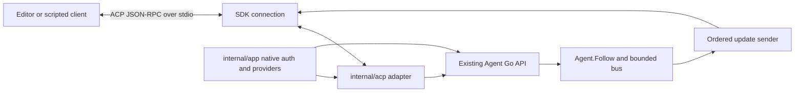
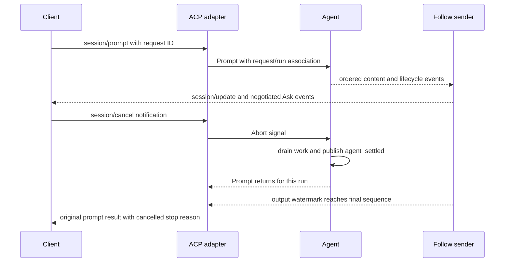

# Grok ACP: H13a port analysis

## Result and scope

Use Grok as a reference for protocol boundaries, session ownership, bidirectional dispatch, and ordered delivery.
Keep Ask's existing Agent, lifecycle, queues, event sequence, and native auth as the owners of those behaviors.
Build a thin ACP adapter over them.
Do not port Grok's full session runtime or leader into H13a.

This is a source study and port recommendation requested by the user.
It is not an approved implementation plan, an SDK conformance result, or an implementation change.
The user's `--port` flag selects an idiomatic Go adaptation analysis.
The explicit request for a report limits this delivery to research, mapping, and challenge decisions.
No new implementation plan is created.

H13a's runnable exit is `ask acp` over stdio, with prompt, cancellation, model selection, queues, and follow updates, and no network listener.
H13b owns the leader, Unix socket, client ID rewrite, driver routing, and process startup.
H13c owns the daemon gateway.
See the [accepted roadmap](../260930-2254-pi-feature-inventory-go-roadmap/roadmap.md#h13-leader-acp-adapter-and-gateway-pis-rpc-mode-multi-client).

## Source manifest and method

| Item | Evidence |
|---|---|
| Repository | [xai-org/grok-build](https://github.com/xai-org/grok-build) |
| Local checkout | `/Users/dale/Desktop/workspace/opensources/grok-build` |
| Branch and commit | `main`, `2bdd1d6a6369de0e8c68132ea4539e9abd9e14a8` |
| Monorepo source revision | `SOURCE_REV`: `559751fdcec02d413e4c57c8832ab275e4f44980` |
| Rust ACP dependency | `agent-client-protocol` 0.10.4, with `unstable`; Cargo.lock confirms the resolved version |
| License | Root LICENSE contains Apache-2.0 and SpaceXAI copyright; retain provenance and applicable notices for any later code adaptation |
| GitNexus | Index is current at the checkout commit; query and `run_stdio_agent` context used for navigation |
| Repomix | v1.9.2; narrowed pack succeeded: 16 files, 41,243 tokens, no suspicious files reported |
| Pack location | `/private/tmp/ask-h13a-grok-acp.xml`; temporary navigation aid, not a durable source archive |
| Validation | Read source and tests; did not build Grok, run its tests, or run an ACP conformance client |

The first pack includes `xai-acp-lib`, shell manifest, leader protocol/transport, README, LICENSE, and SOURCE_REV.
Direct reads extend it to agent startup, ACP handlers, session commands, and relevant tests.
GitNexus returns candidate symbols; direct code is the authority for behavior.
Its `run_stdio_agent` context includes unrelated same-name calls, so those edges are not treated as proof.
The checkout is a pinned snapshot, not a claim about the latest Grok release.

## Source anatomy

Paths in this section are relative to the pinned Grok checkout.
The [source research appendix](researcher-261007-1328-grok-acp-source.md) contains deeper handler and test citations.

| Layer | Source owner | Role |
|---|---|---|
| ACP types and connection | Workspace Cargo.toml:123; Rust ACP SDK | JSON-RPC request/response dispatch and standard ACP types |
| Typed internal messages | `crates/codegen/xai-acp-lib/src/message.rs` | Direction-specific message enums and request/response associations |
| Channel round trip | `crates/codegen/xai-acp-lib/src/channel.rs:29` | Linked channels plus a oneshot response for each request |
| Gateway | `crates/codegen/xai-acp-lib/src/gateway.rs:17` | Forward channel messages into an ACP connection or handler |
| Input framing | `crates/codegen/xai-acp-lib/src/line_reader.rs:26` | Complete-line buffering and a downstream 64 MiB line cap |
| Stdin compatibility | `crates/codegen/xai-acp-lib/src/normalize.rs:1` | Narrow escaped-slash normalization workaround |
| Agent composition | `crates/codegen/xai-grok-shell/src/agent/app.rs:129` | Build MvpAgent, SDK connection, and outgoing gateway |
| Stdio lifecycle | `crates/codegen/xai-grok-shell/src/agent/app.rs:220` | Dedicated stdin reader, pipe input, LocalSet, EOF and shutdown |
| ACP implementation | `crates/codegen/xai-grok-shell/src/agent/mvp_agent/acp_agent.rs:125` | Implement the ACP Agent interface and route extension methods |
| Session commands | `crates/codegen/xai-grok-shell/src/session/commands.rs` | Commands and typed completion/cancellation information |
| Session extensions | `crates/codegen/xai-grok-shell/src/agent/handlers/session.rs:25` | Parse and route session-related extension methods |
| Leader transport | `crates/codegen/xai-grok-shell/src/leader/protocol.rs:24` | Separate outer IPC framing; H13b reference only |

### Startup and transport flow

`run_stdio_agent` prepares stdout as an async writer and moves stdin lines into an internal pipe.
`spawn_agent_local` builds the Agent, wraps incoming data with `LineBufferedRead`, and creates `AgentSideConnection`.
An outgoing gateway task forwards Agent-originated notifications and reverse requests through that same connection.
The Agent and local gateway use `Rc` and `spawn_local` within Tokio's LocalSet.
That scheduling choice serves Rust's non-Send state; Go does not need to reproduce it.
Source: `agent/app.rs:129–159,220–280`.

The stdio entry tracks stdin closure separately because another sender, such as the skills watcher, can keep the input pipe alive.
EOF must still end the connection lifecycle.
Ask should use explicit connection ownership and shutdown, rather than copy the fixed 100 ms EOF delay.
The skills watcher and remote relay are not H13a dependencies.

The first stdin reader has a bounded 64-line channel but calls `read_until` before the downstream byte cap.
One line can therefore allocate without that cap at the first ingress stage.
Source: `xai-acp-lib/src/stdin_reader.rs:71–112,185–204`.
Ask should apply its chosen byte limit at the first reader and test over-limit input.
Do not interpret a bounded channel count as a bound on message bytes.

### Initialization and session ownership

The implementation returns ACP `ProtocolVersion::V1`, not a version inferred from the Rust crate number.
Source: `mvp_agent/acp_agent.rs:566`.
Session creation requires a stored initialize request and rejects an uninitialized connection.
It resolves cwd, MCP and trust inputs and validates a caller-provided vendor session UUID.
Source: `mvp_agent/session_setup.rs:388–422,469–481`.

Ask must keep connection capabilities separate from per-session execution state.
Create independently owned session Agents through a composition-supplied factory or the agreed session host.
A `session/new` request must not call Reset on an Agent still used by a different session ID.
Durable loading and richer trust behavior must wait for their existing roadmap owners.

### Channel and request flow

`acp_channels` creates two unbounded MPSC channels for the two directions.
`acp_send` wraps a typed request with a oneshot response sender, queues it, and waits for the response.
It distinguishes failure to enqueue from losing the response channel after enqueue.
Both currently use a JSON-RPC internal error, with a typed data discriminator.
Source: `channel.rs:29–60`, `common.rs:27–78`.

The gateway dispatches request work in separate local tasks.
A long prompt therefore does not force the reader to wait before dispatching cancellation or reverse-call responses.
This is concurrent transport dispatch, not permission to mutate session state from every task.
Source: `gateway.rs:143–170,177–223`.

`forward_fire_and_forget` confirms queue acceptance only.
`forward_with_completion` returns a receiver for handler completion.
Neither by itself proves that the remote application has applied an update.
Source: `gateway.rs:310–357`.

### Prompt and completion flow

The ACP Agent handler validates prompt metadata and sends work through the session command path with a oneshot result.
It later constructs a standard `PromptResponse` with the stop reason.
It also emits `x.ai/session/prompt_complete` with a prompt identifier and completion details.
Source: `mvp_agent/acp_agent.rs:1344,1542–1567,1742–1755`.

These are two reporting surfaces for a completed prompt, not evidence that standard ACP prompt returns only an admission acknowledgement.
Do not copy both as separate Ask state authorities.
Ask's `agent_settled` remains the execution boundary; the adapter projects it into ACP.
A queue admission response remains a different event from prompt completion.

The normal Grok path queues a human delivery envelope; a send-now path sends `SessionCommand::Prompt` directly.
The handler releases the session dispatch lock before awaiting its oneshot result.
Source: `mvp_agent/acp_agent.rs:1394–1475`.
Ask already has a different accepted policy: Prompt rejects busy execution while Steer and FollowUp admit queue input.
Keep that policy visible on the wire rather than silently queue overlapping standard prompts to imitate Grok.

### Cancellation, auth, and model flow

Grok's cancel handler enqueues a session Cancel command and returns; it even returns success for an unknown session.
The eventual prompt result reports cancellation.
Source: `mvp_agent/acp_agent.rs:1878–1946`.
Its session turn code maps completion, refusal, token limits, cancellation, and some runtime limits into ACP stop reasons.
Source: `session/acp_session_impl/turn.rs:1686–1736`.
Do not copy Grok's choice to map max-turn limits to Cancelled; define Ask's mapping from its own cycle reasons.

Auth uses Grok's method preferences, administrator policy, and credential flows.
Model and mode changes target a session and use existing runtime gates.
Source: `mvp_agent/acp_agent.rs:635–704,1948–1973`.
Ask should reuse H7a and its existing SetModel readiness check instead of porting Grok login or model-manager state.

### Event mapping and reverse calls

Grok maps text, reasoning, tool calls, and tool updates into standard session notifications stamped with session identity.
Source: `session/acp_session_impl/updates.rs:251–325,575–594`.
The reverse gateway dispatches permission, file, terminal, and extension calls while execution can wait for their replies.
Source: `xai-acp-lib/src/gateway.rs:239–301`.
The file and permission adapters include session IDs in the request.
Source: `xai-grok-workspace/src/file_system/adapter.rs:22–49`, `permission/prompter.rs:771–799`.
Ask must preserve this session routing and honor negotiated capabilities without making unimplemented tool capabilities part of H13a.

### Runtime retries and replay completion

Grok retries inference inside the session turn, not by replaying the JSON-RPC prompt.
Source: `session/acp_session_impl/turn.rs:3050–3064,3123–3298`.
Ask's Agent/provider retry policy already owns that behavior.
A lost transport response is not proof that a prompt was never admitted; do not auto-resubmit it.

Grok also persists a replayable TurnCompleted event separately from its transient prompt_complete notification and standard response.
It flushes buffered deltas before durable completion and uses a finalization lease to avoid duplicate terminal publication.
Source: `session/acp_session_impl/run_loop.rs:2326–2332`, `turn_end.rs:329–342,387–422`.
Ask should retain the existing Agent Follow sequence and settled authority, not copy Grok's durable event store into H13a.

### Extensions and compatibility

Grok routes application features through `x.ai/*` extension handlers and uses `_meta` for extra data.
The pinned source's custom method naming differs from the current ACP extension naming rule.
Ask already selected `_ask/*`; keep that decision and do not transplant `x.ai/*` names.
The standard ACP documentation reserves underscore-prefixed custom methods and `_meta` for extension data.
See [ACP extensibility](https://agentclientprotocol.com/protocol/v1/extensibility).

The escaped-slash workaround contains comments about ACP 0.6 although the manifest and lock resolve 0.10.4.
Treat the comments as historical context.
Test escaped JSON method names against the selected Go SDK before deciding that a workaround is needed.
The source regression test already says the newer borrowed-or-owned envelope accepts escaped slashes unchanged (`normalize.rs:86`).
Do not copy substring-based protocol inspection or a workaround merely because Grok has it.

## Protocol version and D17

Three versions must be recorded separately: ACP wire major version, schema release or commit, and SDK module version.
Grok's Rust SDK version 0.10.4 is not ACP wire major version 0.
Bubble Tea v2 has no relation to ACP v2.

The current [ACP v1 prompt contract](https://agentclientprotocol.com/protocol/v1/prompt-turn) returns a stop reason after the prompt finishes.
Cancellation must finish outstanding work and send pending updates before that response.
The [v2 draft migration](https://agentclientprotocol.com/protocol/v2/migration) changes prompt response to an acknowledgement with a message ID; later state updates report completion.
This study recommends preserving the roadmap's v1 completion contract for H13a.
Choosing draft v2 would require an explicit roadmap contract change and a separate compatibility review.

The official [coder SDK v0.13.5 connection source](https://raw.githubusercontent.com/coder/acp-go-sdk/v0.13.5/connection.go) already has concurrent request dispatch, ordered bounded notification handling, and response notification watermarks.
These mechanisms make it a candidate to test before building a second JSON-RPC engine.
They do not prove that Ask's custom metadata, cancellation, and event projection conform.
No SDK candidate or schema is selected by this report; D17 remains open until the executable conformance check.
The roadmap's fork activity claims are historical and must be checked before selecting a dependency.

Standard v1 now includes `usage_update` and configuration-option updates.
Use standard fields where the chosen pinned schema supports the required data.
Keep Ask attempt usage, retry facts, sequence, run ID, and queue control as separate extension data when they have no standard equivalent.
Do not substitute cumulative session usage for exact per-attempt accounting.
Source: [current prompt updates](https://agentclientprotocol.com/protocol/v1/prompt-turn).

## Local map and dependency matrix

| Behavior | Current Ask owner | State | Port action |
|---|---|---|---|
| Agent execution and lifecycle | `internal/agent/agent.go`, `lifecycle.go` | EXISTS | Call existing methods; no second loop |
| Server ACP adapter | `internal/acp` has README and doc.go only | NEW | Implement in the existing package |
| Stdio command dispatch | `cmd/tui/args.go`, main/headless dispatch | NEW | Add explicit `ask acp`; preserve headless parsing and behavior |
| Shared wire definitions | `pkg/protocol` | EXISTS / NEW | Add extension DTOs and metadata without duplicating internal event authority |
| Queue operations | `internal/agent/queue.go` | EXISTS | Adapt Steer, FollowUp, Remove and existing queue events |
| Follow and resync | `internal/agent/follow.go`, `internal/bus` | EXISTS | Consume the consistent cut; preserve epoch and gap semantics |
| Model resolution | `internal/providers`, Agent.SetModel | EXISTS | Reuse qualified resolution and idle-only mutation |
| Native auth composition | `internal/app/auth_native.go`, `module_auth.go` | EXISTS | Inject existing service functions; keep tokens out of wire data |
| ACP subprocess provider | `internal/providers/acp` scaffold | CONFLICT if reused | Different direction; do not put server adapter here |
| Multi-session host | Agent is one conversation; leader design holds many sessions | NEW boundary | Define factory/registry ownership once; do not pretend Agent.Reset creates an independent session |
| Leader socket and multiplexer | `internal/leader` scaffold | H13b | Do not implement in H13a |
| Database, durable resume, compaction | H8/H10 | Incomplete owners | Do not advertise support; return explicit unsupported errors |

The ACP README currently permits agent, sessions, bus, protocol, and the SDK imports.
Auth and provider integration must respect that boundary.
Inject typed functions or existing service-facing dependencies through `internal/app`, or explicitly review a boundary change.
Do not quietly add direct auth/config imports to the adapter.

## Recommended Go structure and state ownership

Use the existing `internal/acp` file owners: `agent.go`, `updates.go`, `meta.go`, `ask_methods.go`, and `stdio.go`.
Keep shared custom DTOs in `pkg/protocol`.
Use `internal/app` for the stdio composition and `cmd/tui` for command dispatch.
These are candidate file responsibilities, not instructions to scaffold every file before it has behavior.

The SDK connection owns framing, request IDs, response correlation, and serialized writes.
The adapter owns connection initialization, capability data, session lookup, and translation.
Agent owns retained state, queue admission, mutations, cancellation, and lifecycle publication.
The follow sender owns observation and output delivery; it must not mutate Agent history.

Use the SDK reader and concurrent request dispatcher if conformance checks pass.
Use one ordered sender per observation stream, with bounded buffering and a cancellation context.
Do not add a second writer that bypasses the SDK.
Do not put all handlers in one actor that waits for Prompt; that prevents cancel and reverse-call replies from progressing.
Do not recreate Grok's unbounded MPSC channels in Go.
The current bounded follow ring is the right existing owner for slow observers.
Inbound notification handlers must return promptly and must not wait for a complete run or a long-lived Follow stream.
Preserve progress for cancel and reverse-call responses when a data queue is full.
Use the SDK's existing dispatch behavior first; add separate control scheduling only if a contract test proves starvation.

Before returning a v1 prompt result, wait for the relevant `agent_settled` event and the adapter's output watermark through that event.
The watermark means all projected frames through that sequence have passed the SDK's serialized output write/flush boundary.
It does not mean that a remote UI acknowledged or displayed them.
Verify the chosen SDK's notification send semantics before choosing which completion primitive advances that watermark.
`Prompt` returning means its run settled; it does not mean the asynchronous follow sender delivered every update.
`WaitForIdle` also includes queued runs that start afterward, so it is not automatically the completion definition for one request.
Track request-to-run identity and the final sequence; do not use global idle as a substitute.
On sender failure, fail the connection explicitly; do not silently report successful delivery.
On `bus.ErrResync`, take an explicit new snapshot or terminate that observation with a documented resync requirement.
Do not wait forever for a watermark that the follow stream can no longer deliver.

This diagram describes the recommended Ask adapter contract.
The timing of Agent execution completion and output delivery can differ; both are required before a successful final response.

EOF in the standalone stdio process disposes the Agent it owns and closes followers and pending reverse calls.
A later leader-client disconnect must leave the leader-owned Agent running.
These are different ownership policies and must not share an unconditional disconnect-abort helper.

## M1 API projection

Names below are recommendations; only names already accepted in D16 are fixed.

| Existing Go surface | Candidate ACP surface | Required semantics |
|---|---|---|
| Prompt | `session/prompt` | Result after this run settles and its final updates are sent |
| Abort | `session/cancel` notification | Nonblocking signal; original prompt returns cancelled after drain |
| State | `_ask/state` | Safe display projection, not raw private session entries |
| SetModel | Standard config/model method supported by pinned schema | Reuse readiness; busy or failed selection leaves old target |
| SetThinkingLevel | Standard config option where supported | Reuse validation and current busy semantics |
| Steer | `_ask/steer` | Return input ID for admission, not a completion stop reason |
| FollowUp | `_ask/follow_up` | Keep existing cycle/run wake behavior |
| Remove | `_ask/remove_input` | Report whether removal happened; never retract admitted history |
| Continue | `_ask/continue` if no standard equivalent | Preserve current empty/assistant-tail rejection |
| Follow | `_ask/follow` plus updates | Snapshot/cursor cut, stream baseline, explicit resync |
| New independent conversation | `session/new` with correct session ownership | New ID must not redirect other sessions to a reset Agent |
| Reset existing Agent context | Negotiated Ask session-reset method | Retain session identity; replace epoch, invalidate old followers and require resync |
| Auth methods | initialize/authenticate plus negotiated Ask extensions | Reuse H7a; never expose access or refresh tokens |
| Lifecycle extras | Negotiated `_ask/*` notifications and `_meta` | Preserve run ID, epoch, sequence, retries, queue facts and settled boundary |
| Compact, durable load, fork/tree | Explicit unsupported result for incomplete owners | No fake empty response or advertised capability |

Map standard text/thought deltas to `session/update` and tool events to stable tool-call IDs and status changes.
Keep Ask lifecycle extras available to Ask clients without making standard editor clients depend on them.
When one source event produces several ACP messages, retain source sequence plus a projection index or equivalent documented ordering.
Do not claim that every projected frame has a distinct Agent sequence.

Raw Follow entries contain internal facts such as request preparation and binding metadata.
Use an explicit public projection instead of exporting `sessions.Entry` directly.
A candidate snapshot includes display messages, current model/thinking, queue state, epoch/cursor, and the partial assistant baseline.
Private request bodies, credentials, and provider capture facts stay with their existing owners.
Preserve unknown `_meta` values through decoding and forwarding without treating them as trusted control instructions.

## Challenge before planning

These recommendations are not new accepted product decisions.

| Question | Grok answer | Ask answer | Risk if wrong |
|---|---|---|---|
| Is ACP the internal runtime API? | ACP channels are used across several in-process boundaries | Direct Go API inside the process is already decided | A copied transport layer duplicates existing execution logic |
| Can the reader wait for a prompt? | Gateway spawns tasks and session commands return through oneshot | Reader must continue handling cancel and reverse responses | Deadlock during cancellation or permission requests |
| Does enqueue mean delivered? | Fire-and-forget checks only enqueue; completion handles are separate | Final result needs an output watermark | UI sees completion before its final content |
| Can channels be unbounded? | Core gateway uses unbounded MPSC | Existing bus is bounded and signals resync | A slow editor can grow memory without a bound |
| Is one Agent already a session registry? | MvpAgent has session registry and session handles | Current Agent owns one conversation | New-session resets can erase or reroute another session |
| Are custom method names portable? | Pinned source uses x.ai names | D16 uses underscore-prefixed `_ask/*` | Strict SDK ignores or rejects transplanted names |
| Can SDK version identify protocol semantics? | Rust SDK and unstable flags pin one implementation graph | Pin wire major, schema, and SDK separately | Draft v2 admission response is confused with v1 completion |
| Is disconnect always cancellation? | Stdio and leader have separate lifetimes | Stdio owns Agent; leader clients do not | Closing a subscriber kills another client's work |
| Can auth and reverse capabilities be copied? | Grok has its own auth and client capability stack | H7a owns native auth; capability omission means unavailable | Secrets leak or tool execution is delegated to an unsupported client |
| Can native events be sent twice? | Standard updates and Grok completion extensions coexist | One state authority, documented projections | Duplicate UI application and inconsistent replay |

### Decision matrix

| Decision | Source's way | Local way | Recommendation |
|---|---|---|---|
| Runtime owner | Session command runtime behind MvpAgent | Existing Go Agent | Adapt boundary; retain Go Agent |
| JSON-RPC | Rust SDK and gateway wrappers | D17 open | Test Go SDK before custom transport |
| Concurrency | Local tasks, MPSC, oneshot | Goroutines, contexts, existing locks/follow ring | Reuse SDK dispatch and one ordered sender |
| Queues | Rich session interjection commands | Steer/FollowUp/Remove already implemented | Adapt existing methods only |
| Completion | Standard stop reason plus prompt_complete | agent_settled and run sequence | One authoritative settled boundary plus delivery watermark |
| Compatibility patches | Complete-line buffering and escaped-slash normalization | Go SDK not yet tested | Reproduce failure before adding a patch |
| Protocol major | Pinned source semantics | Roadmap v1-style completion | Keep v1 for H13a; treat v2 separately |
| Session storage | Rich registry and persistence | Memory log now, H8 later | Define session lifetime; defer durable resume |
| Leader | Framed local multiplexer | H13b owns it | No leader code in H13a |

Risk is **Medium** under Xia's framework.
Three critical assumptions remain: completion/output ordering, session ownership, and bounded observation/disconnect behavior.
Each can cause data loss, incorrect completion, or a large contract rewrite if implemented incorrectly.
Resolve them with executable contract checks before approving an implementation plan.

## Conformance and E2E evidence needed for H13a

These are recommended checks, not test results from this research.
Use a built `ask acp` subprocess with a scripted client over real stdin/stdout pipes.
Use the real faux provider for deterministic end-to-end behavior; a controlled provider fixture is appropriate for held tool or retry boundaries.

| Check | Observable pass condition |
|---|---|
| Initialization and capabilities | Chosen wire version is explicit; unsupported capabilities are not advertised |
| Protocol hygiene | Every stdout line is a valid ACP frame; diagnostics go to stderr; no ANSI/banner |
| Prompt lifecycle | Text/tool updates and settled extension precede final stop reason; request/run identity matches |
| Cancellation while prompt is held | Reader handles cancel promptly; tool/provider drain completes before cancelled response |
| Reverse request during prompt | Client replies without nested-request deadlock; unsupported capability is not invoked |
| Queue control | IDs, removal, ordering, and wake behavior match direct API tests |
| Retry | Failed attempt is not final prompt completion; settled occurs after final recovery result |
| Model selection | Qualified target and readiness preserved; failed/busy switch keeps old target |
| Metadata and extensions | Unknown nested `_meta` survives; `_ask/*` requests and notifications round-trip |
| Framing | Partial reads, coalesced lines, escaped slash, Unicode, large legal frame and over-limit input handled explicitly |
| Slow consumer | No silent event gap or unbounded queue; resync/connection failure is explicit |
| Follow baseline | Snapshot plus open stream baseline and subsequent events has no duplicate or missing boundary |
| EOF and failure | Owned Agent disposed; pending calls/followers joined; broken output cannot report successful completion |
| Mode isolation | No database, leader, socket, HTTP/gRPC listener, or TUI renderer starts |
| Direct versus remote parity | Same contract cases run through Go API and ACP adapter |

The terminal E2E runner remains separate.
ACP subprocess tests do not require Terminal.app/iTerm2 or a PTY unless a test specifically exercises a terminal reverse capability.
H13a should not become dependent on visual TUI testing.

## Port inventory and rollback boundary

Expected implementation owners are `internal/acp`, shared protocol additions, `internal/app`, `cmd/tui`, and their tests.
One selected Go SDK dependency and its pinned schema provenance are expected after D17 conformance.
No database migration is needed for the in-memory H13a exit.
No leader, gateway, TUI dependency, or provider-runtime rewrite is justified by this study.

Keep the new command composition separate so it can be disabled without changing headless execution.
Avoid changing Agent behavior to fit an SDK limitation; fix the adapter or select another SDK after a failing reproduction.
Do not execute source-repository setup commands as part of the port.

## Open questions

1. Which SDK and exact schema pass D17, including metadata preservation and bidirectional ordering?
2. Does H13a create multiple independently retained in-memory sessions, or a single active session with an explicit limit?
   The multi-session roadmap must remain true before H13b; a single-session H13a limit needs an explicit scope decision.
3. What exact public Follow snapshot projection exposes sufficient UI state without exporting private request log facts?
4. What are the final stop-reason mappings for blocked input, preparation failure, continuation limit, and exhausted retry?
5. Which H7a authentication interactions can standard editors support, and which need negotiated `_ask/*` extensions?

Do not start implementation on unresolved session or completion semantics.
The report is ready for the H13a planning discussion.
