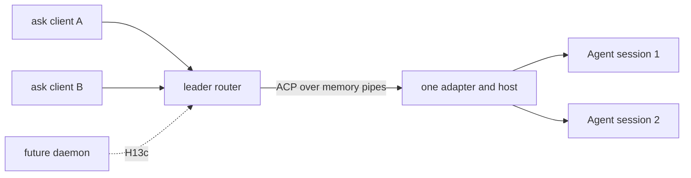

# H13b: Grok leader research and proposed Ask port

Date: 2026-10-08.
Mode: `ak:xia --port`, research and detailed design report.
Status: challenge complete; proposed contracts need review before an implementation plan.
Audience: the maintainer and the agent that will implement H13b.
This report changes no product code, roadmap status, dependency, or accepted architecture decision.
`--port` names the Xia mode; it does not request an `ask --port` TCP flag.

## 1. Outcome, scope, and authority

H13b must let two local `ask` TUI stubs connect to one automatically started leader.
Each client can create a session or attach to a live session.
Each session has subscribers and one driver.
A client disconnect must not cancel its active run or dispose its session.
The leader owns the shared host until the leader stops.

The scope authority is [roadmap H13](../260930-2254-pi-feature-inventory-go-roadmap/roadmap.md#h13-leader-acp-adapter-and-gateway-pis-rpc-mode-multi-client).
The accepted process contract is [architecture section 7.3](../../docs/ask-architecture-reference.md#73-process-model-leader-clients-and-headless-mode-acp).
The completed predecessor is [H13a](../261007-0700-h13a-acp-stdio/plan.md).
Read its [independent review](code-review-261008-h13a-plan-compliance.md) before changing host lifetime or write barriers.
The package boundaries are [leader](../../internal/leader/README.md), [ACP](../../internal/acp/README.md), [app](../../internal/app/README.md), and [protocol](../../pkg/protocol/README.md).

H13b excludes the H13c network gateway, remote token policy, WebSocket Origin policy, dashboard, and daemon conversion.
H8 owns durable session load; H10 owns compaction.
Keep direct headless execution and editor `ask acp` with no listener.
T1a owns the later chat UI; H13b needs real client stubs that prove the transport and lifetime contracts.

## 2. Source manifest and research method

| Item | Evidence |
|---|---|
| Source | `xai-org/grok-build`, local checkout `/Users/dale/Desktop/workspace/opensources/grok-build` |
| Branch | `main` |
| Source commit | `2bdd1d6a6369de0e8c68132ea4539e9abd9e14a8` |
| Monorepo revision | `SOURCE_REV`: `559751fdcec02d413e4c57c8832ab275e4f44980` |
| License | Root `LICENSE`, Apache-2.0 |
| Ask baseline | `213afbe264dddd8f269b670e79bbd0c079d9f328`, branch `design-tui-bubbletea` |
| GitNexus | Installed CLI; `grok-build` index commit matches current commit |
| Repomix | Scoped pack at `/private/tmp/h13b-grok-source.xml`; temporary research input |
| Source scope | Leader protocol, lock, spawn, client, server, transport, agent composition, pager startup and headless |

GitNexus MCP tools were not exposed in this session.
The installed CLI supplied query, context, and trace results.
These commands ran successfully:

```sh
gitnexus status # run from the Grok checkout
gitnexus query --repo grok-build 'connect_or_spawn leader flock readiness spawn' --limit 4
gitnexus context --repo grok-build connect_or_spawn --limit 12
gitnexus context --repo grok-build run_leader --limit 8
gitnexus context --repo grok-build spawn_leader_subprocess --limit 5
gitnexus trace --repo grok-build run_agent_command connect_or_spawn
```

The graph trace returned `run_agent_command → reconnect → connect_or_spawn` with inferred call edges.
A graph path is a navigation aid, not proof of a runtime branch or a complete caller inventory.
Context listed `reconnect` as a caller but did not list every pager entry path.
Some graph lines precede the source definition by one line; source definitions are the citation authority.
Direct source reads verified the behavior below.
A read-only researcher also checked routing, driver, capability, and reverse-request paths.
No Grok binary, install script, provider call, or source test ran.
No Ask product test ran for this documentation change.

`SH` means `crates/codegen/xai-grok-shell/src`.
`PG` means `crates/codegen/xai-grok-pager/src`.
`BIN` means `crates/codegen/xai-grok-pager-bin/src`.
All source line citations apply to the pinned commit.
Use these immutable source owners:

- [SH/leader/server.rs](https://github.com/xai-org/grok-build/blob/2bdd1d6a6369de0e8c68132ea4539e9abd9e14a8/crates/codegen/xai-grok-shell/src/leader/server.rs).
- [SH/leader/protocol.rs](https://github.com/xai-org/grok-build/blob/2bdd1d6a6369de0e8c68132ea4539e9abd9e14a8/crates/codegen/xai-grok-shell/src/leader/protocol.rs).
- [SH/leader/client.rs](https://github.com/xai-org/grok-build/blob/2bdd1d6a6369de0e8c68132ea4539e9abd9e14a8/crates/codegen/xai-grok-shell/src/leader/client.rs).
- [SH/leader/lock.rs](https://github.com/xai-org/grok-build/blob/2bdd1d6a6369de0e8c68132ea4539e9abd9e14a8/crates/codegen/xai-grok-shell/src/leader/lock.rs).
- [SH/leader/mod.rs](https://github.com/xai-org/grok-build/blob/2bdd1d6a6369de0e8c68132ea4539e9abd9e14a8/crates/codegen/xai-grok-shell/src/leader/mod.rs).
- [SH/agent/app.rs](https://github.com/xai-org/grok-build/blob/2bdd1d6a6369de0e8c68132ea4539e9abd9e14a8/crates/codegen/xai-grok-shell/src/agent/app.rs).

## 3. What Grok actually does

### 3.1 Process and startup flow

Grok uses the same executable for client and leader.
`BIN/main.rs` dispatches leader mode to `SH/agent/app.rs::run_leader`, line 698.
That function obtains flock, writes the PID, and removes the stale socket only after lock ownership, at lines 723–769.
It starts the IPC server and builds an ACP connection to the in-process agent over memory streams, at lines 777–837 and 948–964.
The router does not run inference.

`SH/leader/mod.rs::connect_or_spawn`, lines 1376–1567, first tries the existing endpoint.
The spawn branch releases the temporary client-held lock before starting the child.
The child obtains its own lifetime lock.
A client that holds the lock while waiting for the child would block the child from becoming leader.
Version-floor eviction, zombie eviction, and acquire-slot guards also exist in this source; Ask's accepted design excludes them.

`spawn_leader_subprocess`, lines 1626–1685, starts `agent leader` with no exit on disconnect and relay options.
Stdin and stdout use the null device.
Stderr appends to `leader.log`; rotation occurs at spawn above 32 MiB.
The Unix source uses `process_group(0)`, not `setsid`.
Ask's accepted design uses `Setsid`; this is an adaptation, not copied source behavior.
The parent waits for the child in a thread to reap it.

The client has separate connection, registration, and readiness waits in `SH/leader/client.rs:21–30,307–407`.
`Registered { ready: false }` requires `LeaderReady` before ACP traffic.
Actual startup sets readiness after local startup at `SH/agent/app.rs:838–878`; model/settings work can continue in the background.
Readiness is not proof of a successful billed prompt or an interactive login.

### 3.2 Framing and handshake

`SH/leader/protocol.rs:24–43,102–135` uses a four-byte big-endian length followed by JSON.
The source maximum is 64 MiB.
The inner ACP payload is a JSON string in outer `Acp` messages, at lines 482–502 and 529–544.
Control messages manage the process; they do not supply another agent API.
Registration returns client ID, readiness, protocol version, binary version, and capabilities.
Grok tolerates outer protocol skew; Ask requires a hard gate.

The persistent `FrameReader`, lines 46–100, retains partial bytes across cancellation.
Its regression test at line 652 covers cancellation midway through a frame.
Go can use one reader goroutine and `io.ReadFull` rather than a select that abandons partial reads.
A read deadline failure must close the connection, not restart parsing from the middle of a frame.

### 3.3 Exact request IDs

`rewrite_request_id`, `SH/leader/server.rs:376–392`, changes only messages with a method and an ID.
It prefixes the client ID to the JSON representation of the original ID.
`parse_response_id`, lines 395–409, restores the original JSON value and target client.
Numeric `7` and string `"7"` retain their types.
Reverse responses have no method and are not rewritten by this function.
The reviewed function does not itself validate all JSON-RPC ID shapes.

Go must preserve IDs as `json.RawMessage` or exact `json.Number`, not `float64`.
IDs above JavaScript's exact integer range must not round.
Namespacing a top-level ID does not cover the referenced ID in `$/cancel_request` params.

### 3.4 Subscribers and driver

The router keeps session subscriber sets and a separate driver map at `SH/leader/server.rs:1525–1534`.
Incoming session traffic can subscribe a client before agent acceptance, at lines 1821–1833.
Creation/load results also establish membership, at lines 1941–1955.
Driver selection uses `or_insert`; later prompt or attach does not replace the existing driver.
On driver disconnect, lines 1672–1681 choose an arbitrary remaining `HashSet` subscriber.
When the last subscriber leaves, lines 1690–1697 notify the agent through `EvictSessions`.
That notification alone does not prove the resulting Agent cancellation/disposal behavior.
Ask must preserve the run and cancel a pending driver question according to its own accepted contract.

### 3.5 Client capability state

Grok stores IPC capabilities and identity per client at `SH/leader/server.rs:140–154,1591–1599`.
`inject_session_request_context`, lines 659–760, injects selected client data on new/load/resume calls.
`inject_client_identity_into_initialize` begins at line 766.
The source needs these patches because shared agent initialize state cannot identify every session driver.
Agent initialize still changes shared state at `SH/agent/mvp_agent/acp_agent.rs:213–276`, while an original request remains in a one-shot cell.
Thus Grok is not evidence of complete per-client initialize isolation.
Do not port its yolo mode, auto mode, relay options, or default-model patch as Ask settings.

### 3.6 Reverse calls, notifications, and replay

`is_interaction_request`, `SH/leader/server.rs:506–518`, classifies permission, question, plan approval, and elicitation as shared interactions.
Lines 2152–2226 fan those requests to subscribers; other reverse calls use the driver.
The router caches shared interactions and replays them on attach, then removes them on interaction-resolved notification, at lines 2022–2040 and 2141–2164.
Client reverse responses pass to the agent without a sender eligibility check in the inspected path.
These files therefore do not prove router-level first-answer completion or question cancellation.

Session notifications go to session subscribers.
Tagged load replay goes only to the loading client, at lines 2056–2135.
Some global methods broadcast to all clients; other ID-less messages can fall back to the last active stdio client.
Ask must not copy that fallback for session-sensitive data.
Load-time live buffering has a count cap, but overflow can forward live events before ordering is restored, at lines 1892–1893 and 2198–2212.
Ask should detach/resync instead of forwarding an unordered partial view.

### 3.7 Slow clients and headless

Per-client outgoing channels are unbounded, including the channel at `SH/leader/server.rs:1564`.
Writes at lines 2441–2444 have no timeout.
A slow client does not immediately block central fan-out, but its queue can grow without bound.
Ask needs bounded client queues and a stalled-write policy.

`PG/headless.rs::run_single_turn` builds an embedded agent and does not use leader.
`PG/app/mod.rs:1070–1130` supports embedded TUI fallback on leader connection failure.
Ask already accepted direct headless and optional direct TUI fallback.
H13b acceptance must require the leader path so fallback cannot hide a broken socket.

## 4. Current Ask gaps

H13a supplies independent sessions, real Agent execution, cancellation, native auth readiness, model selection, queues, ordered updates, and Follow/resync.
Executable owners are [agent.go](../../internal/acp/agent.go), [host.go](../../internal/acp/host.go), [updates.go](../../internal/acp/updates.go), [module_acp.go](../../internal/app/module_acp.go), and [protocol/acp.go](../../pkg/protocol/acp.go).

Three facts constrain H13b:

1. `NewAdapter` creates its own host and `Bind` attaches one SDK connection once.
   One current adapter per socket would create independent session stores.
2. `Adapter.Close` disposes every host session; `Adapter.Fail` reaches `Host.latch`, which stops active runs across that host.
   Client socket loss cannot call these on the shared runtime.
3. `Initialize` stores one Boolean and does not retain client capabilities.
   The shared adapter alone cannot enforce per-client initialize state.

`Session.execute` already uses `context.WithoutCancel` for the run.
This separates request cancellation from run cancellation, but does not make host disposal safe on detach.
The H13a writer waits for event writes and explicit followers before releasing a prompt result.
A leader adds another output boundary that needs a defined ordering contract.
The leader package currently has only its README and package declaration.
The interactive CLI is still a demonstration menu, not an ACP client.
`ask leader` and a binary version probe are not implemented at this baseline.

## 5. Dependency and owner matrix

| Component | State | Local owner and action |
|---|---|---|
| ACP SDK/schema | EXISTS | Keep coder v0.13.5 and H13a conformance checks |
| Agent factory/native auth | EXISTS | App composition; one native resolver per leader |
| Agent per session | EXISTS | Reuse host; no second loop |
| Cursor/epoch/usage/Follow | EXISTS | Protocol, Agent, bus and ACP retain ownership |
| IPC frame/handshake | NEW | Protocol contract and leader transport |
| ID/session/subscription routing | NEW | Leader server |
| Initialize/driver context | CONFLICT | Leader retains client state; ACP consumes typed context |
| Host lifetime | CONFLICT | App owns shared ACP connection; detach cannot dispose it |
| Live attach/take/detach/discovery | NEW | Ask extensions, routing in leader |
| Secure paths/flock patterns | EXISTS | Follow settings patterns; private helpers are not directly reusable |
| Peer UID | NEW | Platform-specific leader files; installed `x/sys` |
| Spawn/version/management | NEW | Leader client and CLI dispatch |
| TUI stub | NEW | CLI composition, TUI rendering boundary |
| Daemon conversion | LATER OWNER | H13c; test two-binary resolver without converting server |
| Durable load/compaction | LATER OWNER | H8/H10; keep unsupported errors |

No SQL migration is needed.
No new dependency is required by this proposal.
Use standard library sockets, framing, exact JSON, and process startup.
Use installed `x/sys/unix` for peer checks after confirming its platform APIs.
Settings already uses OS flock; an indirect `gofrs/flock` entry is not a reason to add another locking style.

## 6. Proposed Ask design

This section contains reviewable recommendations, not approved implementation instructions.

### 6.1 One internal ACP connection



Prefer the existing byte-stream boundary: leader receives one app-owned `io.ReadWriteCloser`.
App constructs the two pipe directions, SDK connection, checked writer, ingress limit, binding guard, quiet logger, and cleanup.
Leader imports no Agent or ACP package and examines only routing fields.
Do not start one `ask acp` child per socket.
Do not close the internal pipe on one client EOF.

The alternative is one adapter per client around a shared host.
It requires changes to construction, event ownership, mandatory observers, followers, write barriers, and failure scope.
It also needs a different app-to-leader boundary.
Use it only if evidence shows that the single link cannot meet the required client context contract.

### 6.2 Versions and frame contract

Keep outer leader protocol version, ACP wire version, SDK/schema identity, and build identity separate.
Registration rejects an incompatible outer version before any ACP request.
ACP initialize retains its v1 contract.
Build identity supplies diagnostics and spawn checks, not protocol compatibility by itself.

Proposed register fields are client kind and outer version.
Proposed result fields are client ID, leader instance ID, build identity, version, readiness, and control capabilities.
Instance identity detects restart; it does not imply durable sessions.
Final field/method names belong in approved planning and `pkg/protocol`.

Prefer four-byte length framing with raw nested ACP JSON instead of double-escaped JSON strings.
Use one reader and serialized writer per socket.
Reject invalid size, malformed envelope, unsupported batch, and invalid JSON-RPC structure before routing.
Propose an 8 MiB total IPC frame bound.
Envelope overhead reduces the effective payload bound; if exact H13a 8 MiB payload compatibility is required, define separate inner/outer bounds.
Test both limits rather than copying Grok's 64 MiB maximum.

### 6.3 Request and cancel routes

Maintain pending internal ID → client, original raw ID, method, and route state.
Reject duplicate active IDs within one client; allow equal IDs across clients.
Do not reuse a client identity while old responses can still arrive.
Preserve numeric/string types, large integers, escapes, and separator characters.
An internal namespace supplied by a client is not an authority claim.

Successful session creation establishes driver and subscriber routing before its result reaches the client.
Failure creates no membership and removes pending state.
Rewrite `$/cancel_request` references only through that client's pending table.
Do not let A cancel B by guessing an internal ID.
Reverse responses use a separate eligibility table.
Notifications never create response routes.

### 6.4 Initialize and capability isolation

Store the validated initialize request/capability snapshot for each client.
Reject session methods before that client initializes, regardless of another client's state.
Forward private typed driver context on relevant calls to the adapter.
The router replaces any client-supplied private context with its own verified value.
Keep this context in protocol types, not a generic settings blob.
Only the selected driver's capabilities apply to a session.
An observer with more features must not increase the session's authority.

Cwd belongs to session creation and does not change on attach.
A new view never replaces another client's session.
H13a does not issue the future filesystem/terminal/permission reverse calls.
Routing fixtures must not claim that those tool owners are implemented.

### 6.5 Live attach and driver transitions

Do not implement attach as `session/load`: durable load remains unsupported.
Propose separate live attach, detach, driver take, and live discovery extensions.
Final public method names and errors need approval.

| Trigger | Membership/driver result | Run result |
|---|---|---|
| Create | Creator subscribes and drives | No run until admission |
| Attach | Caller subscribes; driver unchanged | No effect |
| Take idle session | Caller becomes driver atomically | No effect |
| Take foreign busy session | Keep current driver | Reject |
| Observer detach | Remove its view/followers | Keep run |
| Driver disconnect | Remove membership; driver absent | Keep run; cancel pending driver question |
| Reconnect | New client ID; explicit live attach | Never resend prompt automatically |
| Leader restart | Old in-memory sessions absent | No durable recovery claim |

Prefer explicit idle takeover over arbitrary subscriber election.
Observers can watch a run after driver loss until it settles.
The next mutation needs explicit driver ownership.
Driver-only operations include prompt, continue, reset, model/thinking selection, steer, follow-up, queue removal, and run cancel.
Observers can read state, usage, catalog, and follow attached sessions.
Busy foreign-session switching is rejected as the roadmap requires.
`/new` changes only the calling client's view.

### 6.6 Broadcast and Follow ownership

Broadcast standard `session/update` only to session subscribers.
Route `_ask/session/event` and `_ask/session/resync` only to the subscription owner.
Record ownership from a successful Follow result.
Reject unfollow by a different client, even in the same session.
Broadcasting explicit Follow frames leaks subscription state and duplicates events.

Attach needs a defined cut before live frames reach the new client.
Reuse Follow snapshot, epoch, open-stream baseline, and cursor instead of a leader replay store.
Buffer post-cut frames within a bound until the client's attach/follow result is written.
Never hold a global lock during socket writes.
Detach must stop only owned followers through the internal ACP path.

Reconnect follows from the last complete cursor.
Stale epoch or ring history gives resync and a new baseline.
Standard updates can derive several frames from one event; advance the cursor only after the full event's frame set arrives.
New leader identity means old live sessions are absent.
Never resend an uncertain prompt, steer, or follow-up: admission may already have committed.

### 6.7 Output ordering and slow clients

There are two output boundaries: adapter → leader and leader → client socket.
An internal pipe write does not prove that all clients received output.
Use a bounded FIFO per client, limited by frame count and encoded bytes.
One writer sends all frames for that socket in order.
Queue the prompt result after its caller's preceding session updates.
Thus a caller that receives the result has received its preceding updates.
Router acceptance does not mean the user saw the output.

On full queue or stalled write, close/detach that client and require resync.
Do not silently drop frames while reporting a healthy connection.
Do not call shared `Adapter.Fail` on client socket failure.
Do not make all observers part of a global prompt barrier.
Also bound internal ingress so a stalled agent cannot create unlimited requests.
Internal ACP pipe failure is leader-wide and stops admission and the shared runtime.

Router acceptance plus socket FIFO is a proposed transport distinction from editor stdio's completed-write barrier.
It needs explicit review and socket E2E proof.
Keep the editor's existing loss-of-output behavior unchanged.

### 6.8 Reverse requests

Keep pending reverse ID, session, driver generation, method, eligible clients, and completion state.
Filesystem/terminal calls go only to a driver with the needed capability.
No eligible driver gives a safe error, not fallback to the last active client.
Shared questions go only to attached eligible subscribers.
The first valid answer completes once; reject ineligible senders and ignore late/duplicate answers.

Driver loss during a question cancels that question as the accepted roadmap requires.
Do not accept another answer after cancellation.
Do not automatically abort the whole run.
Return a cancelled-question result so its future owner can decide the tool outcome.
Generation checks prevent a former driver's answer from completing a new question.
Grok classification/fan-out alone does not prove these semantics.

### 6.9 Secure paths and flock

Resolve one Ask home consistently with native auth, including `ASK_HOME`.
The default socket remains `~/.ask/leader.sock`.
Settings path/lock helpers are private; follow their pattern without exporting the credential store as a leader dependency.
App can resolve and pass typed paths.

Validate directory owner/type, reject symlinks, and enforce 0700.
Open lock/log without following symlinks; validate opened descriptors and enforce 0600.
Bind inside the protected directory and chmod socket 0600 before accepting clients.
Check peer UID before registration on macOS and Linux.
Unsupported platforms fail clearly rather than skip the check.

The leader owns the lifetime flock.
Keep its file inode stable across normal stop/restart.
Unlinking a held lock path can create two independent lock inodes.
Clear PID metadata and release the descriptor; reuse the file.
Only the lock holder removes a stale socket, after type/owner checks.
Do not remove an unexpected regular file or a conflicting live endpoint.
PID metadata is diagnostic data, not proof of ownership or permission to signal.

### 6.10 ConnectOrSpawn and management

Try bounded connect/register/readiness first.
Distinguish absent endpoint, live startup, incompatible version, unsafe access, malformed peer, and startup failure.
Only absent/stale endpoints permit normal spawn.
Permission/protocol errors must not launch repeated children.
Use an overall deadline, including live flock with no usable socket.
Do not copy zombie eviction.

Find `ask` beside the caller executable, then on PATH, including when the caller is `ask-server`.
Probe machine-readable binary/protocol identity before spawn; current CLI needs this contract.
Start `ask leader --spawned-by-client`, use Setsid, null stdin/stdout, protected append log, and child reaping.
Concurrent clients can spawn competing children, but only one obtains lifetime flock.
Losing children exit without touching winner artifacts; clients adopt the winner.

`ask leader list/status/stop` use control frames and never spawn.
List can cover the single configured endpoint without a cluster registry.
Status exposes instance/build/protocol identity and counts, not prompt bodies, credentials, tool arguments, or cwd inventory.
Stop requests shutdown first; PID fallback verifies process UID and `ask leader` identity.
Refuse a signal when identity cannot be verified.

Version mismatch rejects with an upgrade hint by default.
Automatic replacement requires a client-spawned instance, atomic idle shutdown handshake, and observed flock release.
Idle excludes active runs, pending questions, admitted queued work, and in-flight mutations.
Close admission atomically with the idle check; status-then-stop is unsafe.
Never replace a supervisor-owned leader or signal an old PID without identity verification.
Rotate the leader log by size under a defined ownership policy; do not overwrite the previous failure on every spawn.

### 6.11 Shutdown and auth lifetime

Client EOF removes its routes/followers, not the host or live sessions.
Last-client EOF does not stop leader.
Sessions remain in memory until leader stop; collection/TTL requires a separate accepted policy.
Leader stop closes admission, notifies clients, closes blocked socket writes, disposes owned Agents, and drains native auth cleanup.
Ordinary cancellation preserves unbounded drain of a started tool body.
A forced second signal reports incomplete cleanup, not success.
Remove only the owned socket, clear PID metadata, and release flock after cleanup.

Native sign-in remains host-side `ask auth login`.
Readiness never opens a browser or reads terminal input.
Reuse native resolver, credential transaction, and refresh fence.
Keep auth HTTP outside inference capture and credentials outside diagnostics.
Editor stdio EOF still disposes its own host, as H13a requires.

## 7. Architecture, maintainability, and scale requirements

The user requires the correct architecture and design patterns, with maintainability and scalability as primary acceptance criteria.
Use Ask's existing capability packages and dependency direction as the authority.
A smaller diff is not sufficient if it puts ownership in the wrong package or hides a failure boundary.

| Boundary or pattern | Purpose | Application |
|---|---|---|
| Composition root | Keep process wiring out of capabilities | App owns pipes, auth, shared runtime, start and stop |
| Protocol adapter | Keep wire mapping separate from execution | ACP delegates to current Agent API |
| Multiplexer/router | Share execution without copying it | Leader routes IDs, sessions, subscriptions, and reverse calls |
| Explicit state transitions | Make ownership changes testable | Register, initialize, attach, take, detach, shutdown |
| Single writer per connection | Preserve output order | All socket frames use the same FIFO writer |
| Bounded queues | Isolate slow consumers | Per-client count/byte bounds and write deadline |
| Constructor dependency injection | Keep configuration and lifetime explicit | Typed config and existing callbacks; fx only in app |

Do not add a generic event framework, service locator, repository layer, or factory hierarchy to implement this transport.
An interface needs a real second implementation or a necessary test boundary.
Do not force all session state through a global mutex while waiting for I/O.
Keep route-map changes short and serialized; run pipe/socket reads and writes outside that critical section.
Per-session ordering must remain independent so one busy session cannot block every other session.

Scalability here means a bounded local multiplexer, not a distributed leader cluster.
The leader is one local process per Ask home; H13c supplies remote access later.
It is not a fleet scheduler, distributed election service, or high-availability store.
No claim of durable failover is valid before H8.

Bound aggregate resources as well as each client's queue.
The approved plan must define maximum connected clients, pending forward/reverse requests, live sessions, and concurrent session admissions.
Each retained route needs one cleanup owner on result, detach, error, or shutdown.
When a bound is reached, reject new admission with a safe explicit error; do not silently evict a retained session or cancel existing work.
This avoids unlimited abandoned-session growth while preserving reconnect behavior.
Set limits in typed leader configuration with sensible defaults; do not expose speculative end-user flags.

For acceptance, hold one non-reading client and one long-running session while healthy clients create sessions, read state, and complete prompts.
Measure peak retained queue bytes, pending routes, and active client/session counts against configured bounds.
Use lightweight safe counters and existing logging; no new monitoring subsystem is required.
Do not invent a throughput target without a measured workload.
The critical pass condition is continued healthy-client progress with bounded memory and no loss of ordering or ownership.

Before implementation approval, review the private driver context as a typed protocol contract.
It must preserve the leader's byte-stream boundary without turning leader into an Agent policy owner.
Likewise, idle shutdown needs authoritative runtime activity from app/ACP; route-table emptiness alone cannot prove idle.
Use narrow callbacks/control messages at those boundaries and test them rather than importing Agent into leader.
Keep the leader package README and depguard rules aligned with the final accepted imports.

## 8. Challenge before planning

| Question | Source answer | Ask recommendation | Risk if wrong |
|---|---|---|---|
| Leader for headless? | Embedded headless | Keep direct Go path | Break scripts/listener-free modes |
| What is shared? | Shared runtime with sessions | Host, Agent per session | Model/cwd/session cross-talk |
| Adapter per socket? | Shared internal ACP link | Keep app-owned link | Attach failure or detach cancels work |
| Any call takes driver? | First driver via `or_insert` | Explicit idle takeover | Observer changes authority |
| Fan-out proves first answer? | Responses pass to agent | Pending/eligible/generation checks | Duplicate/unauthorized approval |
| Slow observers harmless? | Unbounded channels | Bounded FIFO, detach/resync | Memory growth/stalls |
| Local socket safe by default? | No reviewed UID/mode guard | Owner, modes, no-follow, UID | Local privilege boundary failure |
| PID permits replacement? | Complex source eviction | Idle handshake and identity | Stop wrong process/lose work |
| Reconnect means durable resume? | Source load paths | Surviving live sessions only | Duplicate admission/false durability |
| Same binary resolves spawn? | Source uses one executable | Sibling ask, PATH, probe | Spawn daemon/wrong version |
| Prompt success proves all writes? | Separate transport stages | FIFO on receiving client | False completion after output loss |

Critical assumptions include failure scope, driver capability authority, reverse eligibility, socket safety, replacement safety, and replay/write ordering.
Xia framework risk score: High, with more than five critical assumptions.
The risk comes from concurrent process/session lifetime, not Rust-to-Go syntax.
This report completes the inline trade-off exercise; it does not approve the proposal.

## 9. Decision matrix

| Decision | Grok way | Local constraint | Recommendation |
|---|---|---|---|
| Runtime | Shared agent | H13a Agent per session | Reuse host |
| Internal bridge | Memory ACP | Leader sees bytes | App-owned link |
| Payload | Length prefix, escaped string | ACP-only traffic | Length prefix, raw nested JSON |
| IDs | Client plus original JSON | Exact IDs | Pending ownership, raw IDs |
| Initialize | Shared state plus patches | Per-session driver | Typed private route context |
| Disconnect driver | HashSet replacement | Question cancelled; run kept | Absent driver, explicit take |
| Attach | Traffic/load paths | Durable load unsupported | Live extension |
| Questions | Fan-out/agent completion | Eligible first answer | Pending table |
| Queues | Unbounded | Client fault isolation | Bound bytes/count, detach |
| Lock cleanup | Can unlink lock | One authority | Stable lock inode |
| Version | Tolerant/eviction | Hard gate/safe replacement | Reject, atomic idle stop |
| Security | Reviewed gaps | Owner-only access | Modes/path/UID checks |
| Spawn | New process group | Accepted Setsid | Setsid and reaping |
| Auth | Grok managers | H7a native auth | Reuse Ask |
| Fallback | Embedded | Optional local fallback | Required-leader acceptance |
| Persistence | Load/eviction | H8/H10 later | No fake durable results |

## 10. Candidate file ownership after approval

This is a scope map, not an approved phase plan.

| Owner | Candidate change |
|---|---|
| `pkg/protocol` | IPC/version/control and live routing contracts |
| `internal/leader` | Server/client, framing, bounded routing, lock/spawn, platform UID |
| `internal/acp` | Driver context and owned detach behavior; retain stdio lifetime |
| `internal/app` | Leader composition, internal ACP link, auth/lifecycle |
| `cmd/tui` | Leader/version dispatch and real local client stub |
| `.golangci.yml` | Enforce leader's denied Agent/ACP imports if needed |
| Package/CLI docs | Update only once behavior exists |
| `AGENTS.md` | Targeted command/composition update after implementation |

Keep daemon conversion in H13c.
Test the two-binary resolver with a helper caller rather than changing server composition now.
TUI composition supplies client dependencies; do not put transport ownership into rendering components.
No evergreen doc should claim proposed extensions already work.

## 11. Required verification for the future port

Use built production `ask`, isolated Ask home, real Unix sockets, and two separate client processes.
A fake leader cannot certify H13b acceptance.
Use faux for normal real Agent execution and external HTTPS fixtures for controlled provider/auth streams.
Use a disclosed transport peer fixture for reverse methods whose real tool owner is absent; do not call it product-tool E2E.

| Gate | Pass condition |
|---|---|
| Spawn race | One lifetime-lock owner, two clients, same leader instance |
| Sessions | Independent creation and correct live attach |
| IDs/cancel | Equal IDs across clients, exact numeric/string/large IDs, scoped cancellation |
| Initialize | Uninitialized client rejected; B cannot alter A driver capabilities |
| Driver | Observer mutations rejected; idle take atomic; foreign busy switch rejected |
| Views | A new/switch leaves B unchanged |
| Disconnect | Driver killed during run; observer receives completion; host survives |
| No clients | Live session survives empty-client interval |
| Replay | Open text/tool baseline and cursor restored without duplicate admission |
| Resync | Stale epoch/history explicit; no durable claim after restart |
| Followers | Owner-only events and unfollow |
| Slow client | Bounded detach; healthy run/client unaffected |
| Aggregate limits | Clients, sessions, pending routes and admissions stay within configured bounds; existing work survives rejected admission |
| Package boundaries | Leader imports no Agent/ACP; app owns lifecycle; rendering imports no transport owner |
| Writes | Preceding updates before received prompt result; failure gives uncertain outcome |
| Reverse fixture | Eligible driver/subscribers, first valid answer, late rejection |
| Question loss | Driver question cancelled; no automatic whole-run abort |
| Socket | Modes/path checks and actual non-owner rejection on macOS/Linux |
| Startup faults | Missing/wrong binary, child error, live lock/no socket bounded |
| Replacement | Busy/supervised instance kept; idle spawned stop waits for flock |
| PID safety | Stale PID cannot signal unrelated process |
| Cleanup | Tool drain/auth cleanup retained; owned processes/artifacts cleaned |
| Regression | Headless/editor still no database/listener/leader |
| Composition | Leader/editor/headless `fx.ValidateApp`; daemon gate later |

Run focused tests, routing/shutdown race and leak checks, H13a E2E regressions, depguard lint, and build checks.
Build-only checks cannot certify platform peer UID enforcement.
Use an explicit OS/container fixture for another UID without weakening the private directory policy.
TUI stubs prove transport, not T1a rendering or Terminal.app/iTerm2 behavior.
Track child PID, command, home, and worktree, and stop only owned children.
Never attach tests to the maintainer's real leader.

## 12. Failure and rollback boundaries

Failed startup releases only its own lock/artifacts.
Losing child cannot delete winner socket or clear winner PID.
Failed attach removes partial membership/follow state.
Failed take preserves driver/capability snapshot.
Failed model selection preserves current model as H13a requires.
Disconnected prompt response may be discarded after settle; retain run and log.
Cancelled reverse request removes pending/replay state and ignores late responses.

The later plan must specify rollback for public contracts and composition changes.
No database rollback is needed because no migration is proposed.
Binary rollback stops only an owned leader through management, then starts a compatible binary.
Do not delete live socket/lock as a rollback shortcut.
Editor and headless remain usable without leader.

## 13. Review decisions and unresolved questions

Roadmap already decides Unix socket, ACP-only traffic, owner-only access, direct headless, bounded startup, safe version mismatch, and no run cancellation on client loss.
Do not reopen those without new evidence.
Review these proposed contracts before planning:

1. One internal ACP link with typed router-owned driver context rather than one adapter per socket.
2. Explicit live attach/take/detach/discovery, keeping durable load unsupported.
3. Absent driver after disconnect until idle takeover, with pending question cancellation.
4. Router acceptance plus per-client FIFO output, bounded queues, and detach/resync.
5. Four-byte framing, raw nested ACP JSON, final field/method names, and exact size compatibility.

Source research did not establish which underlying Grok ACP pending-response dependency implements first-answer completion and cancellation.
This does not block an Ask-native pending-table design, but it limits any claim that those semantics can be copied unchanged.

The [`ak:xia` skill](</Users/dale/.agents/skills/ak-xia/SKILL.md>) says: “In non-fast mode, get approval before continuing.”
The requested report is complete; implementation planning waits for review of these concrete decisions.
After approval, `ak:plan` must carry the manifest, anatomy, dependency matrix, decision matrix, High risk score, full exit gate, and rollback into the plan.
Implementation belongs to `ak:cook` after that plan exists.
